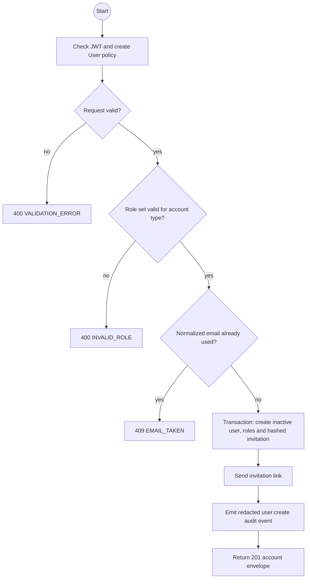
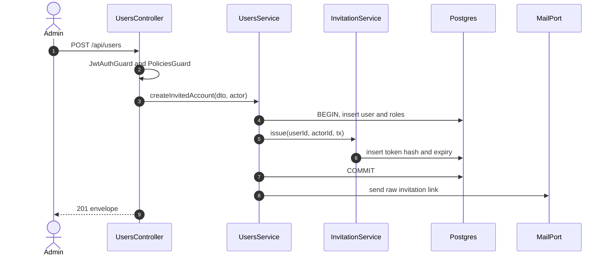

# POST /api/users: Create an invited account

> Module `auth`. Envelope: D-002. TK-22, US-009.

[TOC]

---

## Overview

Creates a Customer or Staff account in an inactive state and sends a single-use 24-hour set-password invitation. Only an Admin may call this TK-22 endpoint. The Admin never supplies or receives a password.

## API Specification

| API | URL |
|---|---|
| POST | `/api/users` |
| Permission | Authenticated Admin with `can('create', 'User', fields)` |
| Traces | US-009, REQ-EVT-05, REQ-EVT-15, REQ-ERR-05, REQ-ERR-11, REQ-ERR-16 |

## Request sample

```json
{
  "email": "tranb@mail.com",
  "fullName": "Tran Thi B",
  "phoneNumber": "0987654321",
  "accountType": "STAFF",
  "roleKeys": ["GUIDE", "OPERATOR"]
}
```

| Field | Description | Data Type | Required | Examples |
|---|---|---|---|---|
| email | Unique, case-insensitive email; normalized to lower case | string | yes | `tranb@mail.com` |
| fullName | 1 to 100 characters | string | yes | `Tran Thi B` |
| phoneNumber | Account phone number | string | yes | `0987654321` |
| accountType | `CUSTOMER` or `STAFF` | enum | yes | `STAFF` |
| roleKeys | Complete initial role set | string[] | yes | `GUIDE, OPERATOR` |

For `CUSTOMER`, `roleKeys` must be exactly `['CUSTOMER']`. For `STAFF`, it must contain one or more data-driven Staff role keys. Seeded Staff roles include `OPERATOR`, `GUIDE` and `ADMIN`.

## Response sample

```json
{
  "result": {
    "id": "5b7e2f0a-3c41-4d8e-9a12-6f0c2b9d1e01",
    "username": "tranb",
    "email": "tranb@mail.com",
    "fullName": "Tran Thi B",
    "phoneNumber": "0987654321",
    "accountType": "STAFF",
    "roles": ["GUIDE", "OPERATOR"],
    "isActive": false,
    "lastLoginAt": null,
    "createdAt": "2026-09-29T08:00:00Z",
    "updatedAt": "2026-09-29T08:00:00Z"
  },
  "isSuccess": true,
  "statusCode": 201,
  "message": "Account created and invitation sent"
}
```

## Validation

| Status | Error code | Condition |
|---|---|---|
| 400 | `VALIDATION_ERROR` | A required field is absent or malformed |
| 400 | `INVALID_ROLE` | Role set is empty, unknown, or incompatible with the account type |
| 401 | `UNAUTHENTICATED` | Access token is missing, malformed or expired |
| 403 | `FORBIDDEN` | Caller lacks the Admin create policy |
| 409 | `EMAIL_TAKEN` | Normalized email belongs to an active, inactive or soft-deleted account |

Example failure:

```json
{
  "result": {
    "errorCode": "EMAIL_TAKEN"
  },
  "isSuccess": false,
  "statusCode": 409,
  "message": "Email is already in use."
}
```

## Activity Diagram



## Sequence Diagram



The account, roles and invitation roll back together on a Prisma transaction failure. Mail is sent after commit. If delivery fails, the inactive account remains visible and the Admin may use the resend endpoint.
