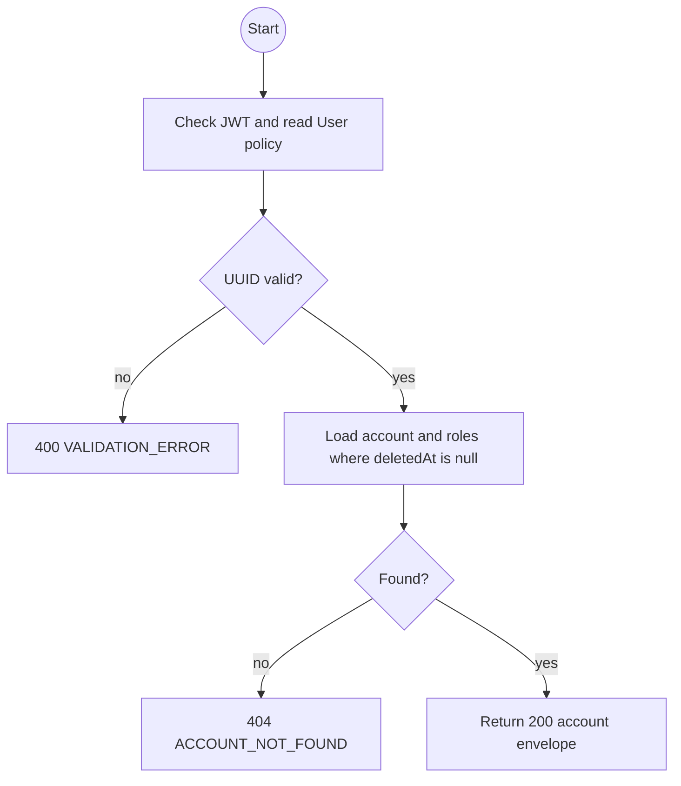
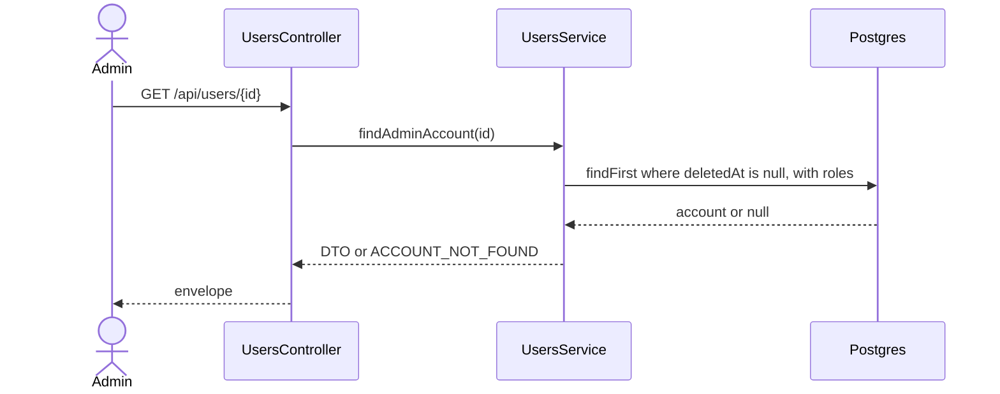

# GET /api/users/:id: Get account details

> Module `auth`. Envelope: D-002. TK-22, US-009.

[TOC]

---

## Overview

Returns one non-deleted account for the Admin user-management detail view. Active Admin accounts are readable and may be changed under the TK-22 last-Admin guard.

## API Specification

| API | URL |
|---|---|
| GET | `/api/users/:id` |
| Permission | Authenticated Admin with `can('read', 'User')` |
| Traces | US-009, REQ-EVT-14, REQ-ERR-10 |

### Path parameters

| Field | Description | Data Type | Examples |
|---|---|---|---|
| id | Account id | uuid | `5b7e2f0a-3c41-4d8e-9a12-6f0c2b9d1e01` |

## Request sample

No request body.

## Response sample

```json
{
  "result": {
    "id": "5b7e2f0a-3c41-4d8e-9a12-6f0c2b9d1e01",
    "username": "admin2",
    "email": "admin2@treklink.vn",
    "fullName": "Admin Two",
    "phoneNumber": "0901234567",
    "accountType": "STAFF",
    "roles": ["ADMIN"],
    "isActive": true,
    "lastLoginAt": "2026-09-29T07:30:00Z",
    "createdAt": "2026-09-01T08:00:00Z",
    "updatedAt": "2026-09-29T07:30:00Z"
  },
  "isSuccess": true,
  "statusCode": 200,
  "message": "Account retrieved"
}
```

## Validation

| Status | Error code | Condition |
|---|---|---|
| 400 | `VALIDATION_ERROR` | `id` is not a UUID |
| 401 | `UNAUTHENTICATED` | Access token is missing, malformed or expired |
| 403 | `FORBIDDEN` | Caller lacks the Admin read policy |
| 404 | `ACCOUNT_NOT_FOUND` | Account id does not exist or is soft-deleted |

```json
{
  "result": {
    "errorCode": "ACCOUNT_NOT_FOUND"
  },
  "isSuccess": false,
  "statusCode": 404,
  "message": "Account not found."
}
```

## Activity Diagram



## Sequence Diagram


