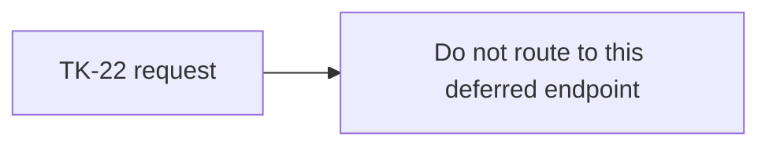
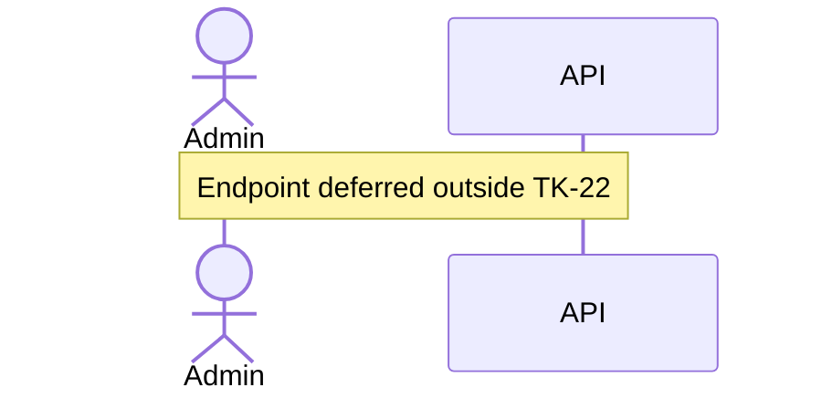

# PATCH /api/users/:id: Update account profile fields, deferred

> Module `auth`. This endpoint is outside TK-22 and is not approved for implementation by the TK-22 specification gate.

[TOC]

---

## Overview

Reserved for a future story that may define Admin-managed profile updates. TK-22 does not permit an Admin to change email, full name, phone number or password. Account status changes use the dedicated deactivate and reactivate commands. Account deletion is not supported.

## API Specification

| API | URL |
|---|---|
| PATCH | `/api/users/:id` |
| Permission | Deferred |
| Status | No implementation task may be created from this contract under TK-22 |

## Request sample

No approved request body.

## Response sample

No approved response contract.

## Validation

No approved validation contract.

## Activity Diagram

## Sequence Diagram

