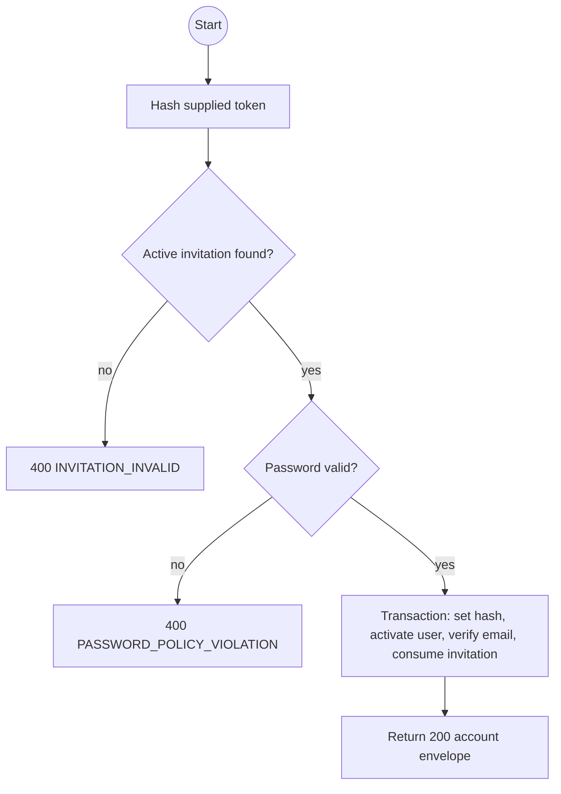
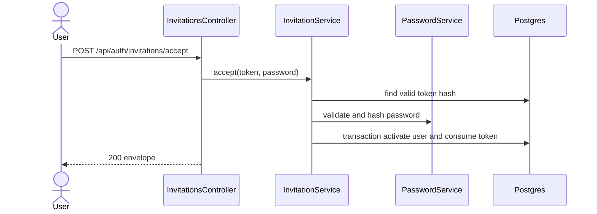

# POST /api/auth/invitations/accept: Accept an account invitation

> Module `auth`. Envelope: D-002. TK-22, US-009.

[TOC]

---

## Overview

Consumes a single-use invitation, sets the invited user's password and activates the account. The invitation proves control of the invited email, so no separate email-verification step runs.

## API Specification

| API | URL |
|---|---|
| POST | `/api/auth/invitations/accept` |
| Permission | Public with a valid invitation token |
| Traces | REQ-EVT-16, REQ-ERR-04, REQ-ERR-14 |

## Request sample

```json
{
  "token": "opaque-token-from-link",
  "password": "StrongPassword1!"
}
```

| Field | Description | Data Type | Required |
|---|---|---|---|
| token | Raw single-use token from the invitation link | string | yes |
| password | New password satisfying current policy | string | yes |

## Response sample

```json
{
  "result": {
    "id": "5b7e2f0a-3c41-4d8e-9a12-6f0c2b9d1e01",
    "username": "tranb",
    "email": "tranb@mail.com",
    "fullName": "Tran Thi B",
    "phoneNumber": "0987654321",
    "accountType": "STAFF",
    "roles": ["GUIDE"],
    "isActive": true,
    "lastLoginAt": null,
    "createdAt": "2026-09-29T08:00:00Z",
    "updatedAt": "2026-09-29T08:10:00Z"
  },
  "isSuccess": true,
  "statusCode": 200,
  "message": "Invitation accepted"
}
```

The endpoint does not issue login tokens. The user signs in after setting the password.

## Validation

| Status | Error code | Condition |
|---|---|---|
| 400 | `VALIDATION_ERROR` | Token or password is missing or malformed |
| 400 | `PASSWORD_POLICY_VIOLATION` | Password fails the current policy |
| 400 | `INVITATION_INVALID` | Token is unknown, expired, consumed or superseded |

```json
{
  "result": { "errorCode": "INVITATION_INVALID" },
  "isSuccess": false,
  "statusCode": 400,
  "message": "Invitation is invalid or has expired."
}
```

## Activity Diagram



## Sequence Diagram


