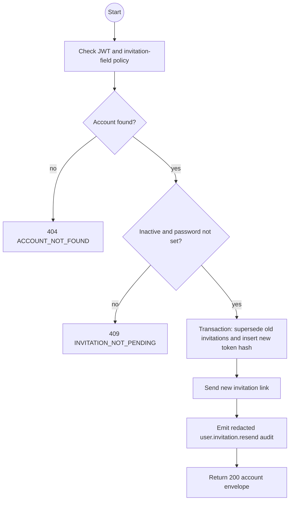
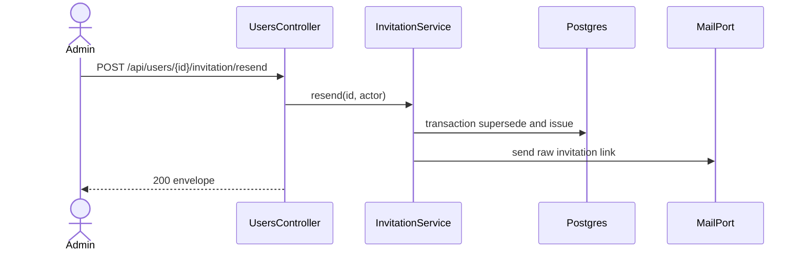

# POST /api/users/:id/invitation/resend: Resend an invitation

> Module `auth`. Envelope: D-002. TK-22, US-009.

[TOC]

---

## Overview

Supersedes every pending invitation for an invited inactive account and sends one new single-use invitation with a fresh 24-hour expiry.

## API Specification

| API | URL |
|---|---|
| POST | `/api/users/:id/invitation/resend` |
| Permission | Authenticated Admin with `can('update', 'User', ['invitation'])` |
| Traces | REQ-EVT-17, REQ-EVT-21, REQ-ERR-10 |

## Request sample

No request body.

## Response sample

```json
{
  "result": {
    "id": "5b7e2f0a-3c41-4d8e-9a12-6f0c2b9d1e01",
    "username": "tranb",
    "email": "tranb@mail.com",
    "fullName": "Tran Thi B",
    "phoneNumber": "0987654321",
    "accountType": "STAFF",
    "roles": ["GUIDE"],
    "isActive": false,
    "lastLoginAt": null,
    "createdAt": "2026-09-29T08:00:00Z",
    "updatedAt": "2026-09-29T08:00:00Z"
  },
  "isSuccess": true,
  "statusCode": 200,
  "message": "Invitation resent"
}
```

## Validation

| Status | Error code | Condition |
|---|---|---|
| 400 | `VALIDATION_ERROR` | `id` is not a UUID |
| 401 | `UNAUTHENTICATED` | Access token is missing, malformed or expired |
| 403 | `FORBIDDEN` | Caller lacks the Admin invitation policy |
| 404 | `ACCOUNT_NOT_FOUND` | Account id does not exist |
| 409 | `INVITATION_NOT_PENDING` | Account completed invitation setup or was deactivated after setup |

```json
{
  "result": { "errorCode": "INVITATION_NOT_PENDING" },
  "isSuccess": false,
  "statusCode": 409,
  "message": "This account has no pending invitation setup."
}
```

## Activity Diagram



## Sequence Diagram


