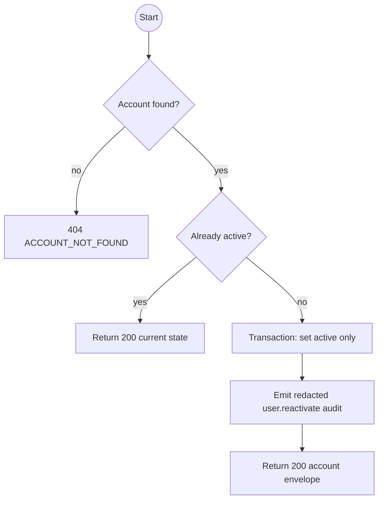
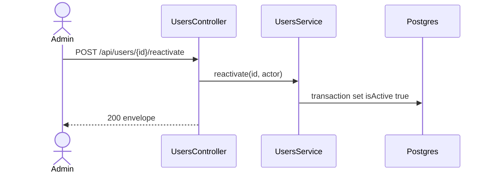

# POST /api/users/:id/reactivate: Reactivate an account

> Module `auth`. Envelope: D-002. TK-22, US-009.

[TOC]

---

## Overview

Reactivates an inactive account while preserving its account type, roles, profile and existing password. An inactive Admin may be reactivated. Repeating the request for an active account is an idempotent 200 response with no additional write.

## API Specification

| API | URL |
|---|---|
| POST | `/api/users/:id/reactivate` |
| Permission | Authenticated Admin with `can('update', 'User', ['isActive'])` |
| Traces | REQ-EVT-19, REQ-EVT-20, REQ-ERR-10 |

## Request sample

No request body.

## Response sample

```json
{
  "result": {
    "id": "5b7e2f0a-3c41-4d8e-9a12-6f0c2b9d1e01",
    "username": "admin2",
    "email": "admin2@treklink.vn",
    "fullName": "Admin Two",
    "phoneNumber": "0901234567",
    "accountType": "STAFF",
    "roles": ["ADMIN"],
    "isActive": true,
    "lastLoginAt": "2026-09-20T07:30:00Z",
    "createdAt": "2026-09-01T08:00:00Z",
    "updatedAt": "2026-09-29T08:00:00Z"
  },
  "isSuccess": true,
  "statusCode": 200,
  "message": "Account reactivated"
}
```

For an already active account, the message is `Account is already active` and the current account DTO is returned.

## Validation

| Status | Error code | Condition |
|---|---|---|
| 400 | `VALIDATION_ERROR` | `id` is not a UUID |
| 401 | `UNAUTHENTICATED` | Access token is missing, malformed or expired |
| 403 | `FORBIDDEN` | Caller lacks the Admin status policy |
| 404 | `ACCOUNT_NOT_FOUND` | Account id does not exist |

```json
{
  "result": { "errorCode": "ACCOUNT_NOT_FOUND" },
  "isSuccess": false,
  "statusCode": 404,
  "message": "Account not found."
}
```

## Activity Diagram



## Sequence Diagram


