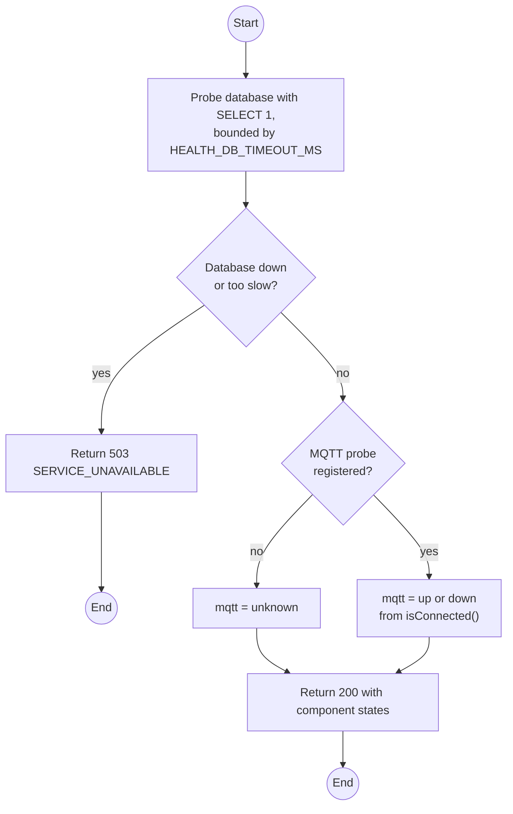
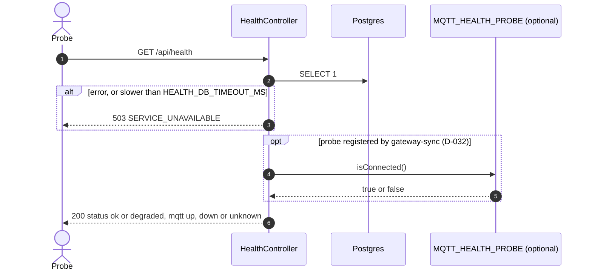

# GET /api/health: Liveness and readiness

> Module `platform`. Format: `02-templates/04-api-endpoint-template.md`, with Mermaid in place of PlantUML (D-017). Envelope: D-002.

[TOC]

---
## Overview

Reports process liveness plus database and MQTT broker reachability. Used by Docker health checks, the CD smoke test and the Admin system-health view. Public so an orchestrator can probe it without a token; it exposes no data beyond component state.

## API Specification

| API        | URL             |
| ---------- | --------------- |
| GET | /api/health |
| Permission | Public |
| Traces | US-077, FR-ADM-03, platform REQ-EVT-04 |

## Request sample

No request body.

## Response sample

```json
{
  "result": {
    "status": "ok",
    "uptimeSeconds": 5234,
    "components": {
      "database": "up",
      "mqtt": "up"
    },
    "version": "0.1.0"
  },
  "isSuccess": true,
  "statusCode": 200,
  "message": "Healthy"
}
```

| Field | Description | Data Type | Examples |
| --- | --- | --- | --- |
| status | `ok` when the database is up and MQTT is `up` or `unknown`; `degraded` when MQTT is `down`. A database that is down never reaches this field: the endpoint answers 503 instead | string | `ok` |
| uptimeSeconds | Whole seconds since the backend process started | number | `5234` |
| components.database | Result of `SELECT 1` within `HEALTH_DB_TIMEOUT_MS` (default 2000 ms, platform requirements §4). Always `up` in a 200 response | string | `up` |
| components.mqtt | Broker connection state reported by the optional `MQTT_HEALTH_PROBE` (D-032): `up`, `down`, or `unknown` while no probe is registered. `gateway-sync` registers the probe when its MQTT ingress adapter is built | string | `unknown` |
| version | Backend package version | string | `0.1.0` |

## Validation

<table>
    <th>Status code</th>
    <th>Description</th>
    <th>Examples</th>
    <tbody>
        <tr>
            <td>503</td>
            <td>Database unreachable, or slower than <code>HEALTH_DB_TIMEOUT_MS</code> (<code>SERVICE_UNAVAILABLE</code>)</td>
<td>

```json
{
  "result": {
    "errorCode": "SERVICE_UNAVAILABLE"
  },
  "isSuccess": false,
  "statusCode": 503,
  "message": "Database unreachable."
}
```
</td>
        </tr>
    </tbody>
</table>

## Activity Diagram



## Sequence Diagram


