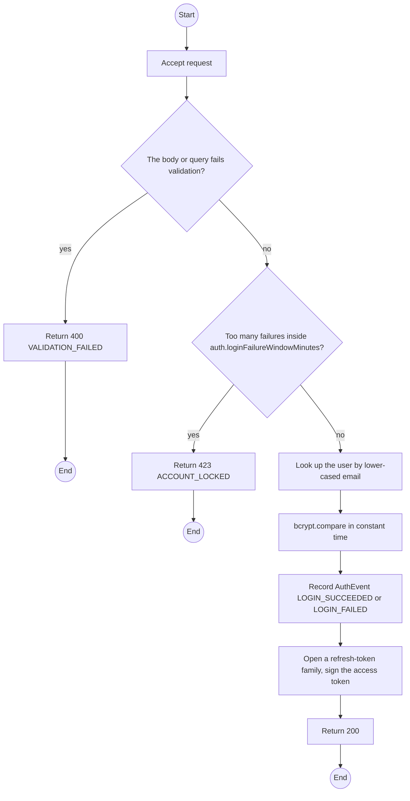
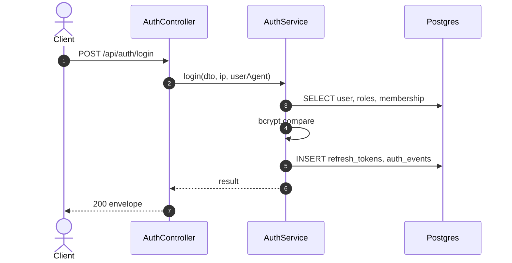

# POST /api/auth/login: Sign in

> Module `auth`. Generated from `scripts/specs/endpoints/auth.py` by `scripts/specs/build_api_design.py`; edit the catalog, not this file. Format: `02-templates/04-api-endpoint-template.md` with Mermaid (D-017). Envelope: D-002.

[TOC]

---
## Overview

Exchanges email and password for a short-lived access token and a rotating refresh token. The response never says which field was wrong (FR-AUTH-02). Repeated failures lock the account for `auth.lockoutMinutes`.

## API Specification

| API | URL |
| --- | --- |
| POST | /api/auth/login |
| Permission | Public |
| Traces | UC-08, FR-AUTH-02, FR-AUTH-08, MSG09 |

## Request sample

```json
{
  "email": "manager@acme-trek.vn",
  "password": "********"
}
```

| Field | Description | Data Type | Required | Examples |
| --- | --- | --- | --- | --- |
| email | Login email, case-insensitive | string | yes | `manager@acme-trek.vn` |
| password | Password | string | yes | `********` |

## Response sample

```json
{
  "result": {
    "accessToken": "eyJhbGciOiJIUzI1NiIs...",
    "accessTokenExpiresIn": 900,
    "refreshToken": "rt_7Zq...opaque",
    "refreshTokenExpiresIn": 1209600,
    "user": {
      "id": "3f2e1d0c-9b8a-4c7d-8e6f-5a4b3c2d1e0f",
      "email": "manager@acme-trek.vn",
      "fullName": "Nguyen Van A",
      "accountType": "ORGANIZATION",
      "roles": [
        "ORG_MANAGER"
      ],
      "organization": {
        "id": "5b1d2c0e-7f3a-4e21-9c8d-1a2b3c4d5e6f",
        "code": "ORG-0007",
        "legalName": "ACME Trek Co., Ltd.",
        "status": "ACTIVE",
        "memberRole": "MANAGER"
      }
    }
  },
  "isSuccess": true,
  "statusCode": 200,
  "message": "Signed in"
}
```

## Validation

<table>
    <th>Status code</th>
    <th>Description</th>
    <th>Examples</th>
    <tbody>
        <tr>
            <td>400</td>
            <td>The body or query fails validation (<code>VALIDATION_FAILED</code>)</td>
<td>

```json
{
  "result": {
    "errorCode": "VALIDATION_FAILED"
  },
  "isSuccess": false,
  "statusCode": 400,
  "message": "{field} is required."
}
```
</td>
        </tr>
        <tr>
            <td>401</td>
            <td>Unknown email, wrong password, or inactive account (<code>INVALID_CREDENTIALS</code>)</td>
<td>

```json
{
  "result": {
    "errorCode": "INVALID_CREDENTIALS"
  },
  "isSuccess": false,
  "statusCode": 401,
  "message": "Incorrect email or password. Please try again."
}
```
</td>
        </tr>
        <tr>
            <td>423</td>
            <td>Too many failures inside auth.loginFailureWindowMinutes (<code>ACCOUNT_LOCKED</code>)</td>
<td>

```json
{
  "result": {
    "errorCode": "ACCOUNT_LOCKED"
  },
  "isSuccess": false,
  "statusCode": 423,
  "message": "Too many attempts. Try again in 15 minutes."
}
```
</td>
        </tr>
    </tbody>
</table>

## Activity Diagram



## Sequence Diagram


