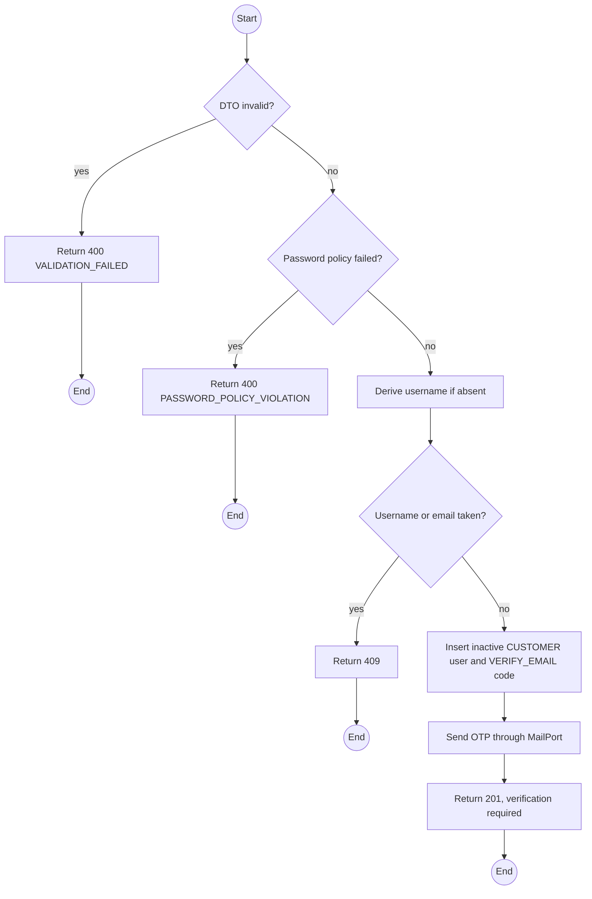
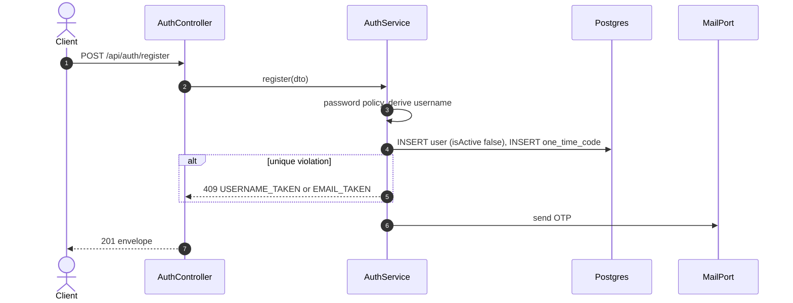

# POST /api/auth/register: Self-register a Customer account

> Module `auth`. Format: `02-templates/04-api-endpoint-template.md`, with Mermaid in place of PlantUML (D-017). Envelope: D-002.

[TOC]

---
## Overview

Flow 1 of Q31. Creates an inactive `CUSTOMER` account and emails a verification OTP. The account becomes usable only after `POST /api/auth/register/verify`. When `username` is omitted it is derived from the email local part (REQ-EVT-05).

## API Specification

| API        | URL             |
| ---------- | --------------- |
| POST | /api/auth/register |
| Permission | Public |
| Rate limit | 5 requests per IP per 10 minutes |
| Traces | UC-27 (new), FR-AUTH-04 (new), US-002, REQ-EVT-04, REQ-EVT-05, Q31, Q41 |

## Request sample

```json
{
  "username": "name123",
  "email": "name123@mail.com",
  "password": "Trek2026!",
  "fullName": "Nguyen Van A",
  "phoneNumber": "0901234567"
}
```

| Field | Description | Data Type | Required | Examples |
| --- | --- | --- | --- | --- |
| username | 3 to 32 chars `[a-z0-9._-]`; derived from email when omitted | string | no | `name123` |
| email | Valid email; receives the OTP | string | yes | `name123@mail.com` |
| password | Meets `auth.passwordMinLength` plus letter and digit | string | yes | `Trek2026!` |
| fullName | 1 to 100 chars | string | yes | `Nguyen Van A` |
| phoneNumber | Vietnamese mobile format | string | no | `0901234567` |

## Response sample

```json
{
  "result": {
    "username": "name123",
    "email": "name123@mail.com",
    "verificationRequired": true,
    "otpExpiresAt": "2026-10-01T02:08:00Z"
  },
  "isSuccess": true,
  "statusCode": 201,
  "message": "Account created. Check your email for the verification code."
}
```

## Validation

<table>
    <th>Status code</th>
    <th>Description</th>
    <th>Examples</th>
    <tbody>
        <tr>
            <td>400</td>
            <td>Field validation failed (<code>VALIDATION_FAILED</code>)</td>
<td>

```json
{
  "result": {
    "errorCode": "VALIDATION_FAILED"
  },
  "isSuccess": false,
  "statusCode": 400,
  "message": "email must be an email."
}
```
</td>
        </tr>
        <tr>
            <td>400</td>
            <td>Password policy not met (<code>PASSWORD_POLICY_VIOLATION</code>)</td>
<td>

```json
{
  "result": {
    "errorCode": "PASSWORD_POLICY_VIOLATION"
  },
  "isSuccess": false,
  "statusCode": 400,
  "message": "password must be at least 8 characters and contain a letter and a digit."
}
```
</td>
        </tr>
        <tr>
            <td>409</td>
            <td>Username already taken (<code>USERNAME_TAKEN</code>)</td>
<td>

```json
{
  "result": {
    "errorCode": "USERNAME_TAKEN"
  },
  "isSuccess": false,
  "statusCode": 409,
  "message": "Username is already taken."
}
```
</td>
        </tr>
        <tr>
            <td>409</td>
            <td>Email already registered (<code>EMAIL_TAKEN</code>)</td>
<td>

```json
{
  "result": {
    "errorCode": "EMAIL_TAKEN"
  },
  "isSuccess": false,
  "statusCode": 409,
  "message": "Email is already registered."
}
```
</td>
        </tr>
    </tbody>
</table>

## Activity Diagram



## Sequence Diagram


