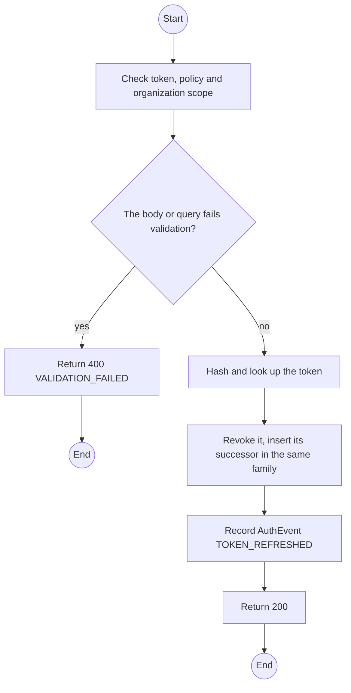
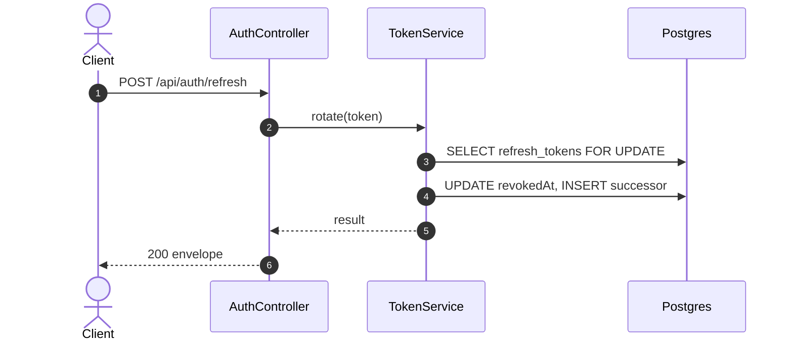

# POST /api/auth/refresh: Rotate tokens

> Module `auth`. Generated from `scripts/specs/endpoints/auth.py` by `scripts/specs/build_api_design.py`; edit the catalog, not this file. Format: `02-templates/04-api-endpoint-template.md` with Mermaid (D-017). Envelope: D-002.

[TOC]

---
## Overview

Issues a new access token and rotates the refresh token. Reusing an already rotated refresh token revokes its whole family (FR-AUTH-03). A deactivated account is refused (FR-AUTH-07).

## API Specification

| API | URL |
| --- | --- |
| POST | /api/auth/refresh |
| Permission | Public (refresh token) |
| Traces | UC-08, FR-AUTH-03, FR-AUTH-07 |

## Request sample

```json
{
  "refreshToken": "rt_7Zq...opaque"
}
```

| Field | Description | Data Type | Required | Examples |
| --- | --- | --- | --- | --- |
| refreshToken | Opaque refresh token | string | yes | `rt_7Zq...` |

## Response sample

```json
{
  "result": {
    "accessToken": "eyJhbGciOiJIUzI1NiIs...",
    "accessTokenExpiresIn": 900,
    "refreshToken": "rt_7Zq...opaque",
    "refreshTokenExpiresIn": 1209600
  },
  "isSuccess": true,
  "statusCode": 200,
  "message": "Token refreshed"
}
```

## Validation

<table>
    <th>Status code</th>
    <th>Description</th>
    <th>Examples</th>
    <tbody>
        <tr>
            <td>400</td>
            <td>The body or query fails validation (<code>VALIDATION_FAILED</code>)</td>
<td>

```json
{
  "result": {
    "errorCode": "VALIDATION_FAILED"
  },
  "isSuccess": false,
  "statusCode": 400,
  "message": "{field} is required."
}
```
</td>
        </tr>
        <tr>
            <td>401</td>
            <td>Missing, malformed or expired access token or API key (<code>UNAUTHENTICATED</code>)</td>
<td>

```json
{
  "result": {
    "errorCode": "UNAUTHENTICATED"
  },
  "isSuccess": false,
  "statusCode": 401,
  "message": "Authentication required."
}
```
</td>
        </tr>
        <tr>
            <td>403</td>
            <td>The caller's role, policy or organization does not allow this action (<code>FORBIDDEN</code>)</td>
<td>

```json
{
  "result": {
    "errorCode": "FORBIDDEN"
  },
  "isSuccess": false,
  "statusCode": 403,
  "message": "You do not have access to this."
}
```
</td>
        </tr>
        <tr>
            <td>401</td>
            <td>Unknown, expired or revoked refresh token, or inactive account (<code>REFRESH_INVALID</code>)</td>
<td>

```json
{
  "result": {
    "errorCode": "REFRESH_INVALID"
  },
  "isSuccess": false,
  "statusCode": 401,
  "message": "Your session has ended. Please sign in again."
}
```
</td>
        </tr>
        <tr>
            <td>401</td>
            <td>A rotated token was presented again; the family is revoked (<code>REFRESH_REUSED</code>)</td>
<td>

```json
{
  "result": {
    "errorCode": "REFRESH_REUSED"
  },
  "isSuccess": false,
  "statusCode": 401,
  "message": "Your session has ended. Please sign in again."
}
```
</td>
        </tr>
    </tbody>
</table>

## Activity Diagram



## Sequence Diagram


