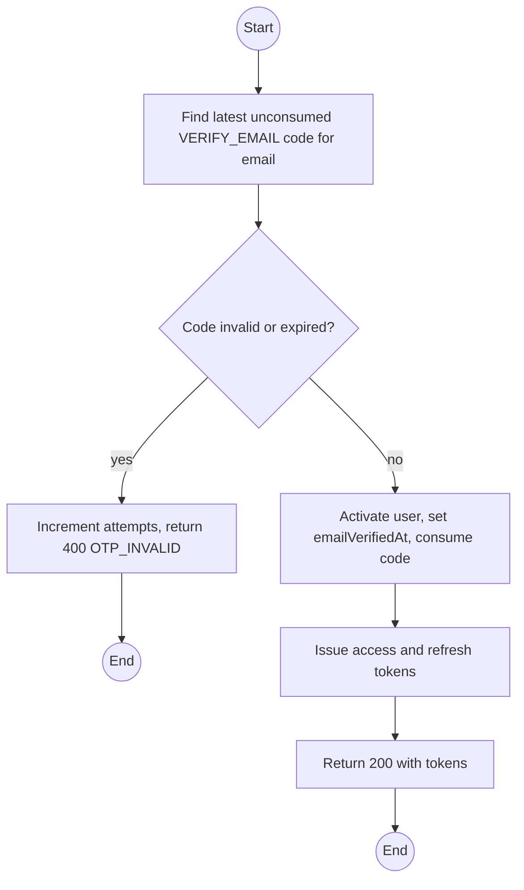
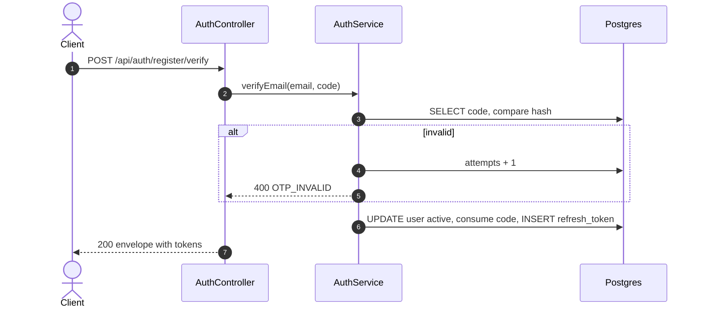

# POST /api/auth/register/verify: Verify email and activate

> Module `auth`. Format: `02-templates/04-api-endpoint-template.md`, with Mermaid in place of PlantUML (D-017). Envelope: D-002.

[TOC]

---
## Overview

Consumes the VERIFY_EMAIL OTP, activates the account, marks the email verified and signs the user in by returning a token pair.

## API Specification

| API        | URL             |
| ---------- | --------------- |
| POST | /api/auth/register/verify |
| Permission | Public |
| Traces | UC-27 (new), FR-AUTH-04, US-002, REQ-EVT-04, REQ-ERR-03 |

## Request sample

```json
{
  "email": "name123@mail.com",
  "code": "482913"
}
```

| Field | Description | Data Type | Required | Examples |
| --- | --- | --- | --- | --- |
| email | Email used at registration | string | yes | `name123@mail.com` |
| code | 6-digit OTP | string | yes | `482913` |

## Response sample

```json
{
  "result": {
    "accessToken": "eyJhbGciOiJIUzI1NiJ9...",
    "accessTokenExpiresIn": 900,
    "refreshToken": "q8Zr3...opaque",
    "refreshTokenExpiresIn": 604800,
    "user": {
      "id": "5b7e2f0a-3c41-4d8e-9a12-6f0c2b9d1e01",
      "username": "name123",
      "email": "name123@mail.com",
      "fullName": "Nguyen Van A",
      "phoneNumber": "0901234567",
      "accountType": "CUSTOMER",
      "roles": [
        "CUSTOMER"
      ],
      "isActive": true,
      "emailVerifiedAt": "2026-10-01T02:00:00Z",
      "createdAt": "2026-10-01T01:58:00Z"
    }
  },
  "isSuccess": true,
  "statusCode": 200,
  "message": "Email verified"
}
```

## Validation

<table>
    <th>Status code</th>
    <th>Description</th>
    <th>Examples</th>
    <tbody>
        <tr>
            <td>400</td>
            <td>Wrong, expired or consumed code, or attempts exhausted (<code>OTP_INVALID</code>)</td>
<td>

```json
{
  "result": {
    "errorCode": "OTP_INVALID"
  },
  "isSuccess": false,
  "statusCode": 400,
  "message": "The code is invalid or has expired."
}
```
</td>
        </tr>
    </tbody>
</table>

## Activity Diagram



## Sequence Diagram


