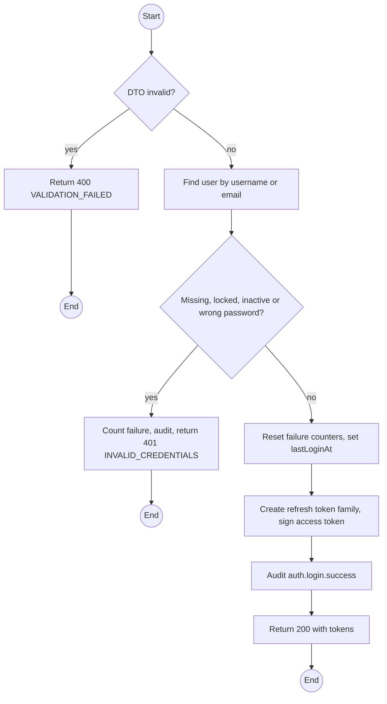
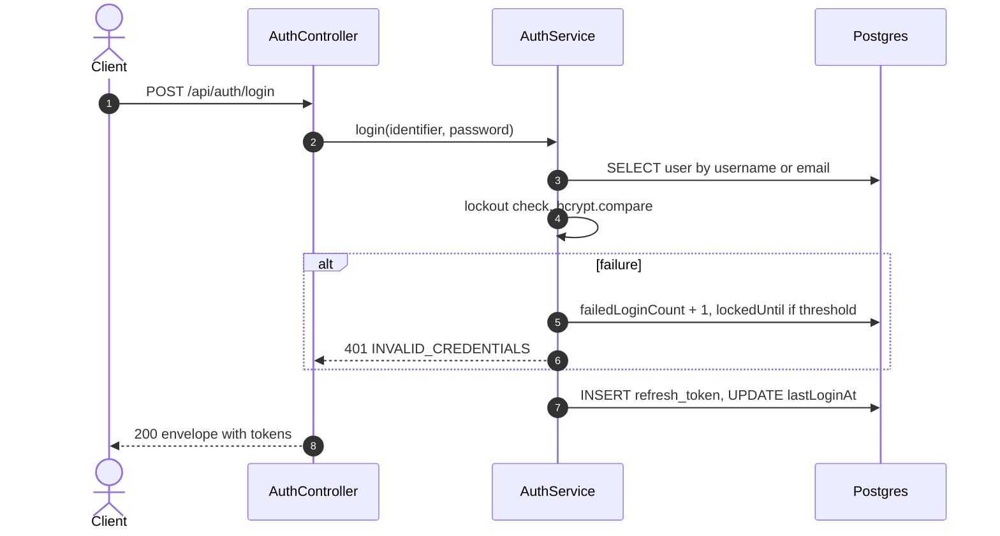

# POST /api/auth/login: Sign in

> Module `auth`. Format: `02-templates/04-api-endpoint-template.md`, with Mermaid in place of PlantUML (D-017). Envelope: D-002.

[TOC]

---
## Overview

Authenticates by username or email plus password. Unknown identifier, wrong password, lockout, inactive and unverified accounts all return the same 401 so the endpoint cannot be used to enumerate accounts.

## API Specification

| API        | URL             |
| ---------- | --------------- |
| POST | /api/auth/login |
| Permission | Public |
| Rate limit | 10 requests per IP per minute |
| Traces | UC-21, FR-AUTH-02 (new), US-003, US-004, REQ-EVT-01, REQ-STA-01, REQ-ERR-01 |

## Request sample

```json
{
  "identifier": "name123",
  "password": "Trek2026!"
}
```

| Field | Description | Data Type | Required | Examples |
| --- | --- | --- | --- | --- |
| identifier | Username or email, case-insensitive | string | yes | `name123` |
| password | Plaintext over TLS | string | yes | `Trek2026!` |

## Response sample

```json
{
  "result": {
    "accessToken": "eyJhbGciOiJIUzI1NiJ9...",
    "accessTokenExpiresIn": 900,
    "refreshToken": "q8Zr3...opaque",
    "refreshTokenExpiresIn": 604800,
    "user": {
      "id": "5b7e2f0a-3c41-4d8e-9a12-6f0c2b9d1e01",
      "username": "name123",
      "email": "name123@mail.com",
      "fullName": "Nguyen Van A",
      "phoneNumber": "0901234567",
      "accountType": "CUSTOMER",
      "roles": [
        "CUSTOMER"
      ],
      "isActive": true,
      "emailVerifiedAt": "2026-10-01T02:00:00Z",
      "createdAt": "2026-10-01T01:58:00Z"
    }
  },
  "isSuccess": true,
  "statusCode": 200,
  "message": "Sign in successfully"
}
```

| Field | Description | Data Type | Examples |
| --- | --- | --- | --- |
| accessToken | JWT, lifetime `JWT_ACCESS_TTL` | string | `eyJ...` |
| refreshToken | Opaque token, lifetime `JWT_REFRESH_TTL`; store securely, rotate on use | string | `q8Zr3...` |
| user | Profile with role keys | object | n/a |

## Validation

<table>
    <th>Status code</th>
    <th>Description</th>
    <th>Examples</th>
    <tbody>
        <tr>
            <td>400</td>
            <td>identifier or password missing (<code>VALIDATION_FAILED</code>)</td>
<td>

```json
{
  "result": {
    "errorCode": "VALIDATION_FAILED"
  },
  "isSuccess": false,
  "statusCode": 400,
  "message": "identifier should not be empty."
}
```
</td>
        </tr>
        <tr>
            <td>401</td>
            <td>Unknown identifier, wrong password, locked, inactive or unverified (<code>INVALID_CREDENTIALS</code>)</td>
<td>

```json
{
  "result": {
    "errorCode": "INVALID_CREDENTIALS"
  },
  "isSuccess": false,
  "statusCode": 401,
  "message": "Incorrect username or password. Try again."
}
```
</td>
        </tr>
    </tbody>
</table>

## Activity Diagram



## Sequence Diagram


