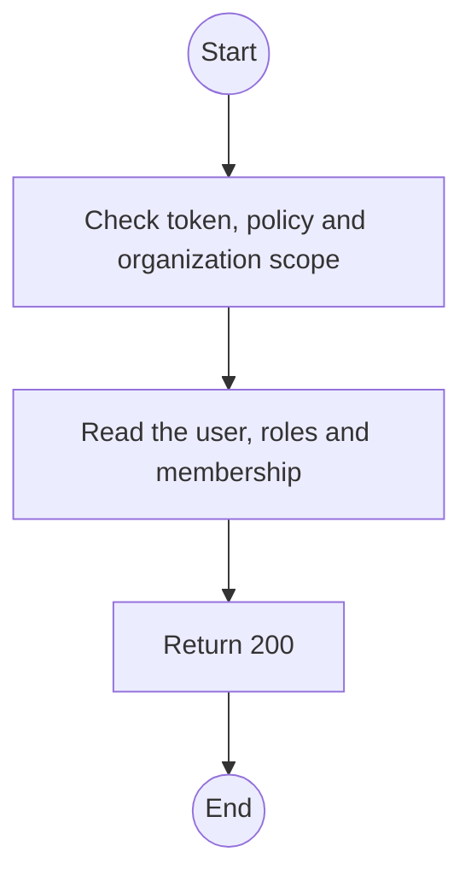
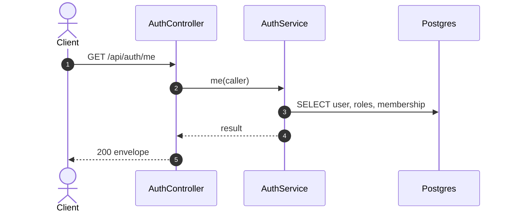

# GET /api/auth/me: Current account

> Module `auth`. Generated from `scripts/specs/endpoints/auth.py` by `scripts/specs/build_api_design.py`; edit the catalog, not this file. Format: `02-templates/04-api-endpoint-template.md` with Mermaid (D-017). Envelope: D-002.

[TOC]

---
## Overview

Returns the caller's account, roles and, for an organization account, its organization and member role. The frontend builds its navigation from this.

## API Specification

| API | URL |
| --- | --- |
| GET | /api/auth/me |
| Permission | Any signed-in user |
| Traces | UC-08, FR-AUTH-10 |

## Request sample

No body.

## Response sample

```json
{
  "result": {
    "id": "3f2e1d0c-9b8a-4c7d-8e6f-5a4b3c2d1e0f",
    "email": "manager@acme-trek.vn",
    "fullName": "Nguyen Van A",
    "accountType": "ORGANIZATION",
    "roles": [
      "ORG_MANAGER"
    ],
    "organization": {
      "id": "5b1d2c0e-7f3a-4e21-9c8d-1a2b3c4d5e6f",
      "code": "ORG-0007",
      "legalName": "ACME Trek Co., Ltd.",
      "status": "ACTIVE",
      "memberRole": "MANAGER"
    }
  },
  "isSuccess": true,
  "statusCode": 200,
  "message": "OK"
}
```

## Validation

<table>
    <th>Status code</th>
    <th>Description</th>
    <th>Examples</th>
    <tbody>
        <tr>
            <td>401</td>
            <td>Missing, malformed or expired access token or API key (<code>UNAUTHENTICATED</code>)</td>
<td>

```json
{
  "result": {
    "errorCode": "UNAUTHENTICATED"
  },
  "isSuccess": false,
  "statusCode": 401,
  "message": "Authentication required."
}
```
</td>
        </tr>
        <tr>
            <td>403</td>
            <td>The caller's role, policy or organization does not allow this action (<code>FORBIDDEN</code>)</td>
<td>

```json
{
  "result": {
    "errorCode": "FORBIDDEN"
  },
  "isSuccess": false,
  "statusCode": 403,
  "message": "You do not have access to this."
}
```
</td>
        </tr>
    </tbody>
</table>

## Activity Diagram



## Sequence Diagram


