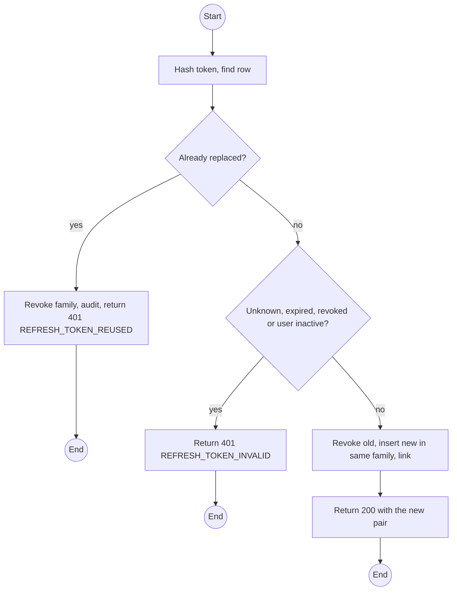
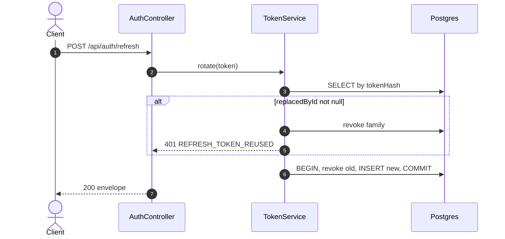

# POST /api/auth/refresh: Rotate refresh token

> Module `auth`. Format: `02-templates/04-api-endpoint-template.md`, with Mermaid in place of PlantUML (D-017). Envelope: D-002.

[TOC]

---
## Overview

Exchanges a refresh token for a new pair. The presented token is revoked and linked to its replacement. Presenting an already-rotated token revokes the whole family (theft response).

## API Specification

| API        | URL             |
| ---------- | --------------- |
| POST | /api/auth/refresh |
| Permission | Public (valid refresh token) |
| Traces | FR-AUTH-02, US-005, REQ-EVT-02, REQ-ERR-02 |

## Request sample

```json
{
  "refreshToken": "q8Zr3...opaque"
}
```

| Field | Description | Data Type | Required | Examples |
| --- | --- | --- | --- | --- |
| refreshToken | Token from login or the previous refresh | string | yes | `q8Zr3...` |

## Response sample

```json
{
  "result": {
    "accessToken": "eyJhbGciOiJIUzI1NiJ9...",
    "accessTokenExpiresIn": 900,
    "refreshToken": "q8Zr3...opaque",
    "refreshTokenExpiresIn": 604800
  },
  "isSuccess": true,
  "statusCode": 200,
  "message": "Token refreshed"
}
```

## Validation

<table>
    <th>Status code</th>
    <th>Description</th>
    <th>Examples</th>
    <tbody>
        <tr>
            <td>401</td>
            <td>Unknown, expired or revoked token, or account inactive (<code>REFRESH_TOKEN_INVALID</code>)</td>
<td>

```json
{
  "result": {
    "errorCode": "REFRESH_TOKEN_INVALID"
  },
  "isSuccess": false,
  "statusCode": 401,
  "message": "Session expired. Sign in again."
}
```
</td>
        </tr>
        <tr>
            <td>401</td>
            <td>Token already rotated; family revoked (<code>REFRESH_TOKEN_REUSED</code>)</td>
<td>

```json
{
  "result": {
    "errorCode": "REFRESH_TOKEN_REUSED"
  },
  "isSuccess": false,
  "statusCode": 401,
  "message": "Session was used elsewhere and has been ended. Sign in again."
}
```
</td>
        </tr>
    </tbody>
</table>

## Activity Diagram



## Sequence Diagram


