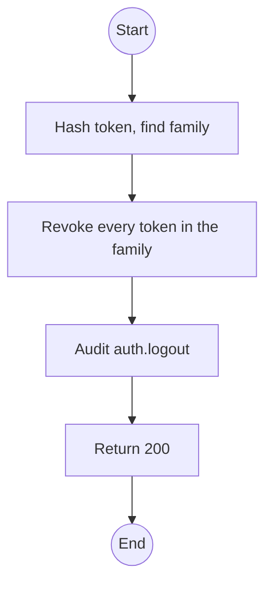
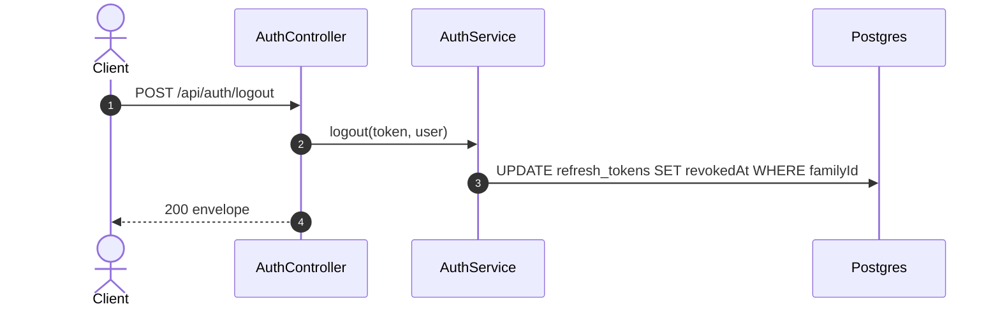

# POST /api/auth/logout: Sign out

> Module `auth`. Format: `02-templates/04-api-endpoint-template.md`, with Mermaid in place of PlantUML (D-017). Envelope: D-002.

[TOC]

---
## Overview

Revokes the refresh-token family of the presented token. Idempotent: logging out an already revoked family still returns 200.

## API Specification

| API        | URL             |
| ---------- | --------------- |
| POST | /api/auth/logout |
| Permission | Authenticated |
| Traces | FR-AUTH-02, US-006, REQ-EVT-03 |

## Request sample

```json
{
  "refreshToken": "q8Zr3...opaque"
}
```

| Field | Description | Data Type | Required | Examples |
| --- | --- | --- | --- | --- |
| refreshToken | The session to end | string | yes | `q8Zr3...` |

## Response sample

```json
{
  "result": null,
  "isSuccess": true,
  "statusCode": 200,
  "message": "Signed out"
}
```

## Validation

<table>
    <th>Status code</th>
    <th>Description</th>
    <th>Examples</th>
    <tbody>
        <tr>
            <td>401</td>
            <td>Missing, malformed or expired access token (<code>UNAUTHENTICATED</code>)</td>
<td>

```json
{
  "result": {
    "errorCode": "UNAUTHENTICATED"
  },
  "isSuccess": false,
  "statusCode": 401,
  "message": "Authentication required."
}
```
</td>
        </tr>
    </tbody>
</table>

## Activity Diagram



## Sequence Diagram


