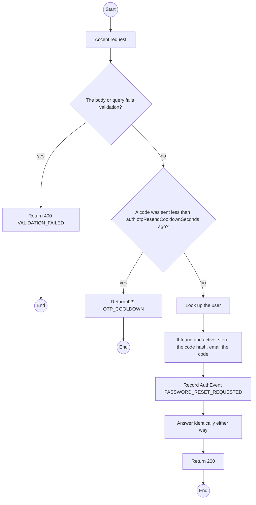
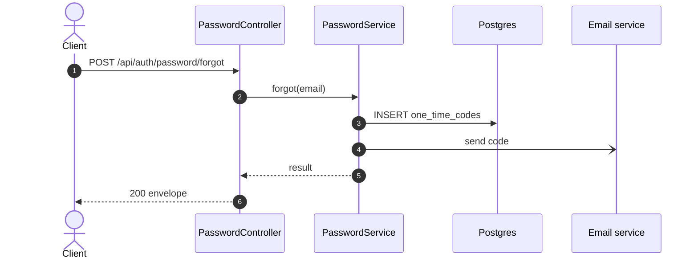

# POST /api/auth/password/forgot: Request a password reset

> Module `auth`. Generated from `scripts/specs/endpoints/auth.py` by `scripts/specs/build_api_design.py`; edit the catalog, not this file. Format: `02-templates/04-api-endpoint-template.md` with Mermaid (D-017). Envelope: D-002.

[TOC]

---
## Overview

Sends a single-use, time-limited code to the registered email. The response is identical whether or not the email exists (FR-AUTH-05).

## API Specification

| API | URL |
| --- | --- |
| POST | /api/auth/password/forgot |
| Permission | Public |
| Traces | UC-09, FR-AUTH-05, BR-35 |

## Request sample

```json
{
  "email": "manager@acme-trek.vn"
}
```

| Field | Description | Data Type | Required | Examples |
| --- | --- | --- | --- | --- |
| email | Account email | string | yes | `manager@acme-trek.vn` |

## Response sample

```json
{
  "result": null,
  "isSuccess": true,
  "statusCode": 200,
  "message": "If the email is registered, a code has been sent."
}
```

## Validation

<table>
    <th>Status code</th>
    <th>Description</th>
    <th>Examples</th>
    <tbody>
        <tr>
            <td>400</td>
            <td>The body or query fails validation (<code>VALIDATION_FAILED</code>)</td>
<td>

```json
{
  "result": {
    "errorCode": "VALIDATION_FAILED"
  },
  "isSuccess": false,
  "statusCode": 400,
  "message": "{field} is required."
}
```
</td>
        </tr>
        <tr>
            <td>429</td>
            <td>A code was sent less than auth.otpResendCooldownSeconds ago (<code>OTP_COOLDOWN</code>)</td>
<td>

```json
{
  "result": {
    "errorCode": "OTP_COOLDOWN"
  },
  "isSuccess": false,
  "statusCode": 429,
  "message": "Please wait a minute before requesting another code."
}
```
</td>
        </tr>
    </tbody>
</table>

## Activity Diagram



## Sequence Diagram


