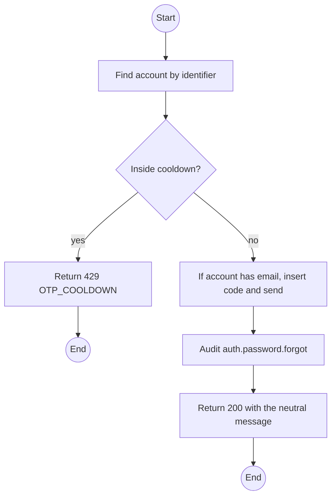
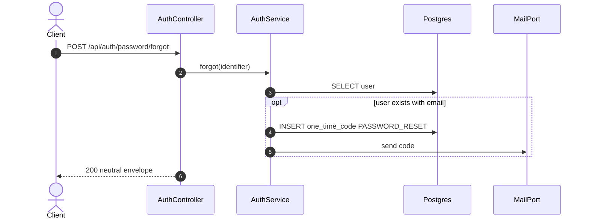

# POST /api/auth/password/forgot: Request a password reset code

> Module `auth`. Format: `02-templates/04-api-endpoint-template.md`, with Mermaid in place of PlantUML (D-017). Envelope: D-002.

[TOC]

---
## Overview

Sends a PASSWORD_RESET OTP to the registered email of the account named by `identifier`. The response is identical whether or not the account exists or has an email.

## API Specification

| API        | URL             |
| ---------- | --------------- |
| POST | /api/auth/password/forgot |
| Permission | Public |
| Rate limit | 5 requests per IP per 10 minutes |
| Traces | UC-28 (new), FR-AUTH-05 (new), US-007, REQ-EVT-07, REQ-ERR-09, Q35 |

## Request sample

```json
{
  "identifier": "name123"
}
```

| Field | Description | Data Type | Required | Examples |
| --- | --- | --- | --- | --- |
| identifier | Username or email | string | yes | `name123` |

## Response sample

```json
{
  "result": null,
  "isSuccess": true,
  "statusCode": 200,
  "message": "If the account exists, a reset code has been sent to its registered email."
}
```

## Validation

<table>
    <th>Status code</th>
    <th>Description</th>
    <th>Examples</th>
    <tbody>
        <tr>
            <td>429</td>
            <td>Requested again inside the cooldown (<code>OTP_COOLDOWN</code>)</td>
<td>

```json
{
  "result": {
    "errorCode": "OTP_COOLDOWN"
  },
  "isSuccess": false,
  "statusCode": 429,
  "message": "Please wait before requesting another code."
}
```
</td>
        </tr>
    </tbody>
</table>

## Activity Diagram



## Sequence Diagram


