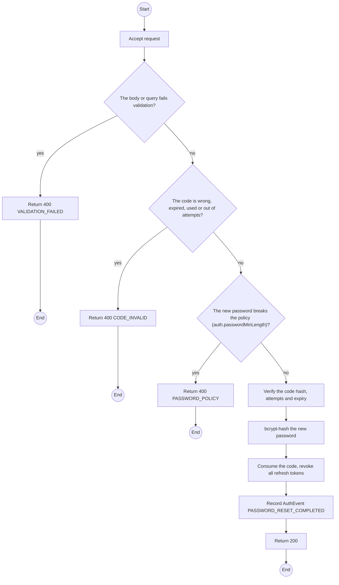
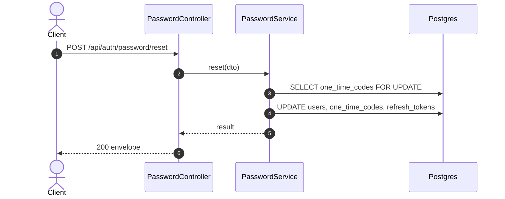

# POST /api/auth/password/reset: Reset the password with a code

> Module `auth`. Generated from `scripts/specs/endpoints/auth.py` by `scripts/specs/build_api_design.py`; edit the catalog, not this file. Format: `02-templates/04-api-endpoint-template.md` with Mermaid (D-017). Envelope: D-002.

[TOC]

---
## Overview

Sets a new password with the emailed code, then revokes every refresh-token family of the account.

## API Specification

| API | URL |
| --- | --- |
| POST | /api/auth/password/reset |
| Permission | Public |
| Traces | UC-09, FR-AUTH-05, MSG08 |

## Request sample

```json
{
  "email": "manager@acme-trek.vn",
  "code": "482913",
  "newPassword": "********"
}
```

| Field | Description | Data Type | Required | Examples |
| --- | --- | --- | --- | --- |
| email | Account email | string | yes | `manager@acme-trek.vn` |
| code | Six-digit code | string | yes | `482913` |
| newPassword | New password | string | yes | `********` |

## Response sample

```json
{
  "result": null,
  "isSuccess": true,
  "statusCode": 200,
  "message": "Password changed"
}
```

## Validation

<table>
    <th>Status code</th>
    <th>Description</th>
    <th>Examples</th>
    <tbody>
        <tr>
            <td>400</td>
            <td>The body or query fails validation (<code>VALIDATION_FAILED</code>)</td>
<td>

```json
{
  "result": {
    "errorCode": "VALIDATION_FAILED"
  },
  "isSuccess": false,
  "statusCode": 400,
  "message": "{field} is required."
}
```
</td>
        </tr>
        <tr>
            <td>400</td>
            <td>The code is wrong, expired, used or out of attempts (<code>CODE_INVALID</code>)</td>
<td>

```json
{
  "result": {
    "errorCode": "CODE_INVALID"
  },
  "isSuccess": false,
  "statusCode": 400,
  "message": "This code is invalid or has expired. Request a new one."
}
```
</td>
        </tr>
        <tr>
            <td>400</td>
            <td>The new password breaks the policy (auth.passwordMinLength) (<code>PASSWORD_POLICY</code>)</td>
<td>

```json
{
  "result": {
    "errorCode": "PASSWORD_POLICY"
  },
  "isSuccess": false,
  "statusCode": 400,
  "message": "password must be at least 8 characters."
}
```
</td>
        </tr>
    </tbody>
</table>

## Activity Diagram



## Sequence Diagram


