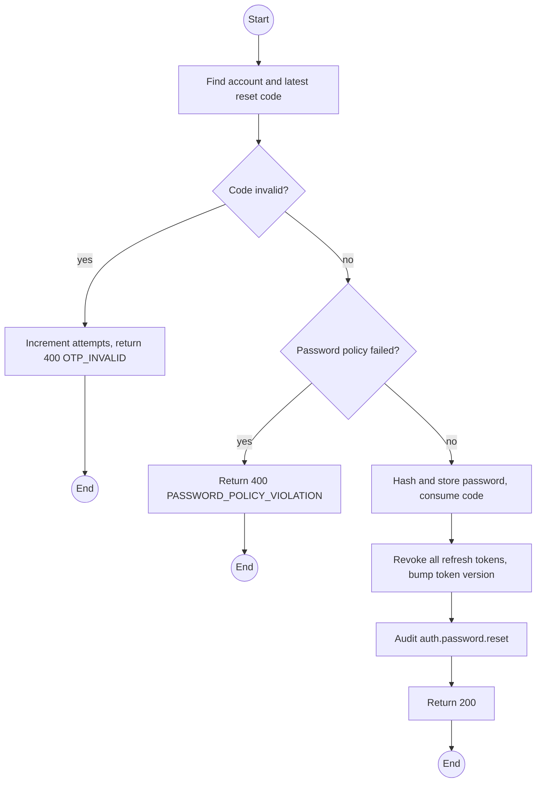
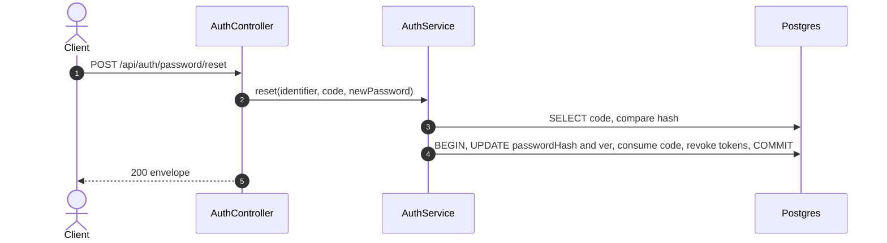

# POST /api/auth/password/reset: Reset password with a code

> Module `auth`. Format: `02-templates/04-api-endpoint-template.md`, with Mermaid in place of PlantUML (D-017). Envelope: D-002.

[TOC]

---
## Overview

Sets a new password using a PASSWORD_RESET or SET_PASSWORD OTP, then revokes every refresh token of the account.

## API Specification

| API        | URL             |
| ---------- | --------------- |
| POST | /api/auth/password/reset |
| Permission | Public (valid OTP) |
| Traces | UC-28 (new), FR-AUTH-05, US-007, REQ-EVT-08, REQ-ERR-03, REQ-ERR-04 |

## Request sample

```json
{
  "identifier": "name123",
  "code": "771204",
  "newPassword": "NewTrek2026!"
}
```

| Field | Description | Data Type | Required | Examples |
| --- | --- | --- | --- | --- |
| identifier | Username or email | string | yes | `name123` |
| code | 6-digit OTP | string | yes | `771204` |
| newPassword | Must meet policy | string | yes | `NewTrek2026!` |

## Response sample

```json
{
  "result": null,
  "isSuccess": true,
  "statusCode": 200,
  "message": "Password updated. Sign in with your new password."
}
```

## Validation

<table>
    <th>Status code</th>
    <th>Description</th>
    <th>Examples</th>
    <tbody>
        <tr>
            <td>400</td>
            <td>Code wrong, expired, consumed or attempts exhausted (<code>OTP_INVALID</code>)</td>
<td>

```json
{
  "result": {
    "errorCode": "OTP_INVALID"
  },
  "isSuccess": false,
  "statusCode": 400,
  "message": "The code is invalid or has expired."
}
```
</td>
        </tr>
        <tr>
            <td>400</td>
            <td>New password fails policy (<code>PASSWORD_POLICY_VIOLATION</code>)</td>
<td>

```json
{
  "result": {
    "errorCode": "PASSWORD_POLICY_VIOLATION"
  },
  "isSuccess": false,
  "statusCode": 400,
  "message": "password must be at least 8 characters and contain a letter and a digit."
}
```
</td>
        </tr>
    </tbody>
</table>

## Activity Diagram



## Sequence Diagram


