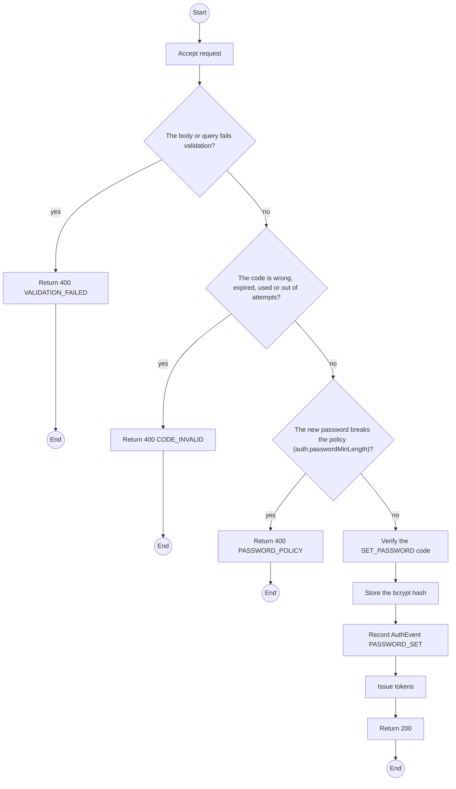
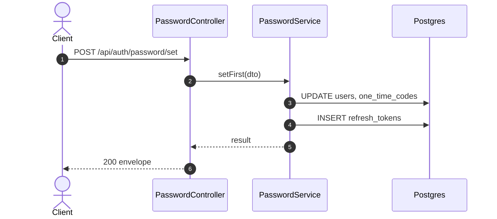

# POST /api/auth/password/set: Accept an invitation

> Module `auth`. Generated from `scripts/specs/endpoints/auth.py` by `scripts/specs/build_api_design.py`; edit the catalog, not this file. Format: `02-templates/04-api-endpoint-template.md` with Mermaid (D-017). Envelope: D-002.

[TOC]

---
## Overview

Sets the first password of an invited account (organization member, or TrekLink Staff created by an Admin) with the invitation code, and signs the user in.

## API Specification

| API | URL |
| --- | --- |
| POST | /api/auth/password/set |
| Permission | Public |
| Traces | UC-04, UC-10, FR-ORG-04, MSG08 |

## Request sample

```json
{
  "email": "operator@acme-trek.vn",
  "code": "739104",
  "password": "********"
}
```

| Field | Description | Data Type | Required | Examples |
| --- | --- | --- | --- | --- |
| email | Invited email | string | yes | `operator@acme-trek.vn` |
| code | Invitation code from the email | string | yes | `739104` |
| password | New password | string | yes | `********` |

## Response sample

```json
{
  "result": {
    "accessToken": "eyJhbGciOiJIUzI1NiIs...",
    "accessTokenExpiresIn": 900,
    "refreshToken": "rt_7Zq...opaque",
    "refreshTokenExpiresIn": 1209600,
    "user": {
      "id": "3f2e1d0c-9b8a-4c7d-8e6f-5a4b3c2d1e0f",
      "email": "manager@acme-trek.vn",
      "fullName": "Nguyen Van A",
      "accountType": "ORGANIZATION",
      "roles": [
        "ORG_OPERATOR"
      ],
      "organization": {
        "id": "5b1d2c0e-7f3a-4e21-9c8d-1a2b3c4d5e6f",
        "code": "ORG-0007",
        "legalName": "ACME Trek Co., Ltd.",
        "status": "ACTIVE",
        "memberRole": "MANAGER"
      }
    }
  },
  "isSuccess": true,
  "statusCode": 200,
  "message": "Welcome to TrekLink"
}
```

## Validation

<table>
    <th>Status code</th>
    <th>Description</th>
    <th>Examples</th>
    <tbody>
        <tr>
            <td>400</td>
            <td>The body or query fails validation (<code>VALIDATION_FAILED</code>)</td>
<td>

```json
{
  "result": {
    "errorCode": "VALIDATION_FAILED"
  },
  "isSuccess": false,
  "statusCode": 400,
  "message": "{field} is required."
}
```
</td>
        </tr>
        <tr>
            <td>400</td>
            <td>The code is wrong, expired, used or out of attempts (<code>CODE_INVALID</code>)</td>
<td>

```json
{
  "result": {
    "errorCode": "CODE_INVALID"
  },
  "isSuccess": false,
  "statusCode": 400,
  "message": "This code is invalid or has expired. Request a new one."
}
```
</td>
        </tr>
        <tr>
            <td>400</td>
            <td>The new password breaks the policy (auth.passwordMinLength) (<code>PASSWORD_POLICY</code>)</td>
<td>

```json
{
  "result": {
    "errorCode": "PASSWORD_POLICY"
  },
  "isSuccess": false,
  "statusCode": 400,
  "message": "password must be at least 8 characters."
}
```
</td>
        </tr>
    </tbody>
</table>

## Activity Diagram



## Sequence Diagram


