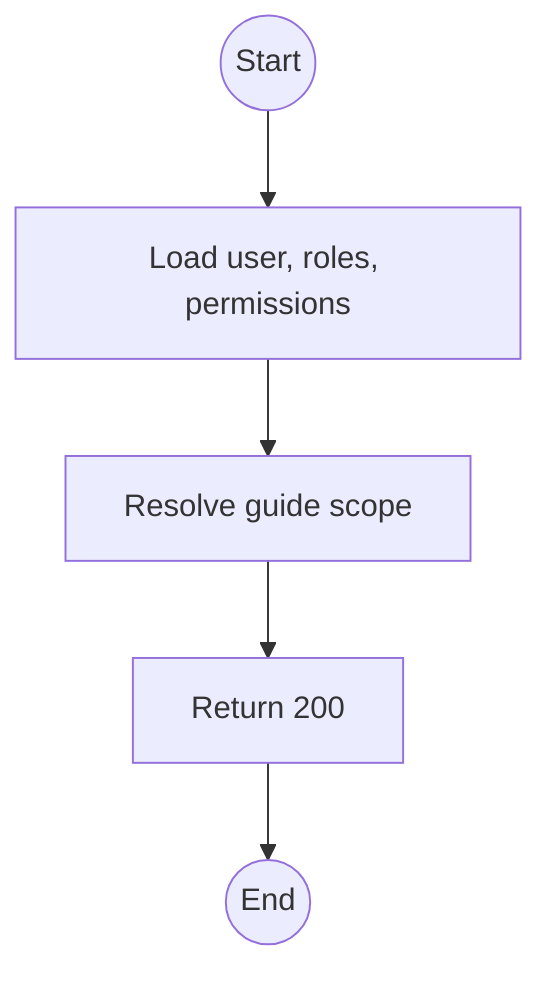
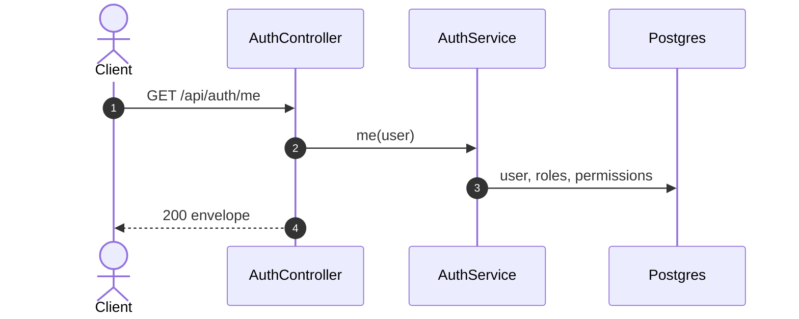

# GET /api/auth/me: Current user and permissions

> Module `auth`. Format: `02-templates/04-api-endpoint-template.md`, with Mermaid in place of PlantUML (D-017). Envelope: D-002.

[TOC]

---
## Overview

Returns the signed-in user, their roles, their serialised CASL rules and, for Guides, the trip ids in scope. The frontend uses the rules to hide controls; the server still decides every request.

## API Specification

| API        | URL             |
| ---------- | --------------- |
| GET | /api/auth/me |
| Permission | Authenticated |
| Traces | UC-21, US-008, US-010 |

## Request sample

No request body.

## Response sample

```json
{
  "result": {
    "user": {
      "id": "5b7e2f0a-3c41-4d8e-9a12-6f0c2b9d1e01",
      "username": "guide.minh",
      "email": "name123@mail.com",
      "fullName": "Nguyen Van A",
      "phoneNumber": "0901234567",
      "accountType": "STAFF",
      "roles": [
        "GUIDE"
      ],
      "isActive": true,
      "emailVerifiedAt": "2026-10-01T02:00:00Z",
      "createdAt": "2026-10-01T01:58:00Z"
    },
    "permissions": [
      {
        "action": "read",
        "subject": "Trip",
        "conditions": {
          "tripId": {
            "$in": [
              "a1c3..."
            ]
          }
        }
      }
    ],
    "scope": {
      "tripIds": [
        "a1c3..."
      ]
    },
    "guideProfile": {
      "skills": [
        "first aid"
      ],
      "certifications": [
        "WFR"
      ],
      "languages": [
        "vi",
        "en"
      ]
    }
  },
  "isSuccess": true,
  "statusCode": 200,
  "message": "Current user retrieved"
}
```

## Validation

<table>
    <th>Status code</th>
    <th>Description</th>
    <th>Examples</th>
    <tbody>
        <tr>
            <td>401</td>
            <td>Missing, malformed or expired access token (<code>UNAUTHENTICATED</code>)</td>
<td>

```json
{
  "result": {
    "errorCode": "UNAUTHENTICATED"
  },
  "isSuccess": false,
  "statusCode": 401,
  "message": "Authentication required."
}
```
</td>
        </tr>
    </tbody>
</table>

## Activity Diagram



## Sequence Diagram


