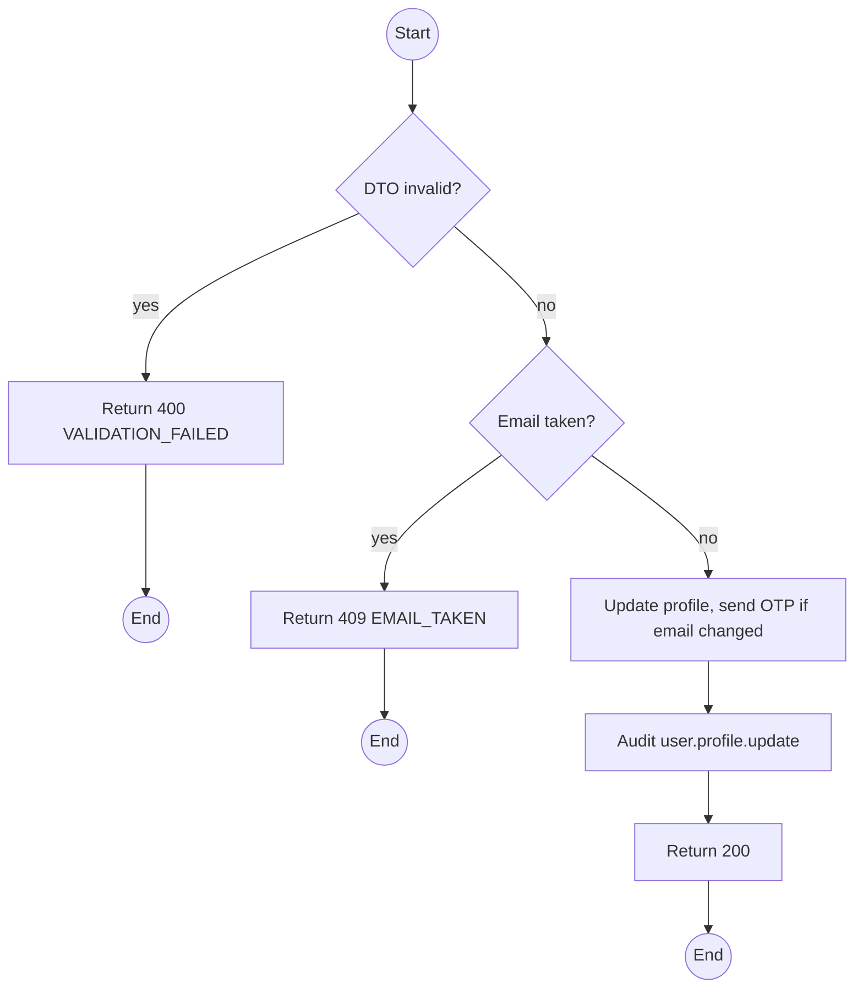
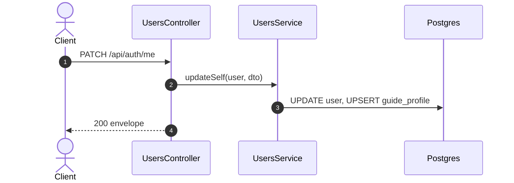

# PATCH /api/auth/me: Update own profile

> Module `auth`. Format: `02-templates/04-api-endpoint-template.md`, with Mermaid in place of PlantUML (D-017). Envelope: D-002.

[TOC]

---
## Overview

Updates the caller's own profile. Guides may also update their guide profile. Username, roles, account type and active flag are not editable here. Changing or adding an email sends a VERIFY_EMAIL OTP and the new email is unverified until confirmed.

## API Specification

| API        | URL             |
| ---------- | --------------- |
| PATCH | /api/auth/me |
| Permission | Authenticated (self) |
| Traces | US-010, FR-AUTH-09 (new) |

## Request sample

```json
{
  "fullName": "Tran Minh",
  "phoneNumber": "0912345678",
  "email": "minh@mail.com",
  "guideProfile": {
    "skills": [
      "first aid",
      "rope rescue"
    ],
    "certifications": [
      "WFR"
    ],
    "languages": [
      "vi",
      "en"
    ]
  }
}
```

| Field | Description | Data Type | Required | Examples |
| --- | --- | --- | --- | --- |
| fullName | 1 to 100 chars | string | no | `Tran Minh` |
| phoneNumber | Vietnamese mobile format | string | no | `0912345678` |
| email | Links or changes email; triggers verification | string | no | `minh@mail.com` |
| guideProfile | Guides only; ignored for others | object | no | n/a |

## Response sample

```json
{
  "result": {
    "id": "5b7e2f0a-3c41-4d8e-9a12-6f0c2b9d1e01",
    "username": "name123",
    "email": "minh@mail.com",
    "fullName": "Tran Minh",
    "phoneNumber": "0901234567",
    "accountType": "CUSTOMER",
    "roles": [
      "CUSTOMER"
    ],
    "isActive": true,
    "emailVerifiedAt": null,
    "createdAt": "2026-10-01T01:58:00Z"
  },
  "isSuccess": true,
  "statusCode": 200,
  "message": "Profile updated"
}
```

## Validation

<table>
    <th>Status code</th>
    <th>Description</th>
    <th>Examples</th>
    <tbody>
        <tr>
            <td>400</td>
            <td>Field validation failed (<code>VALIDATION_FAILED</code>)</td>
<td>

```json
{
  "result": {
    "errorCode": "VALIDATION_FAILED"
  },
  "isSuccess": false,
  "statusCode": 400,
  "message": "phoneNumber must be a valid phone number."
}
```
</td>
        </tr>
        <tr>
            <td>401</td>
            <td>Missing, malformed or expired access token (<code>UNAUTHENTICATED</code>)</td>
<td>

```json
{
  "result": {
    "errorCode": "UNAUTHENTICATED"
  },
  "isSuccess": false,
  "statusCode": 401,
  "message": "Authentication required."
}
```
</td>
        </tr>
        <tr>
            <td>409</td>
            <td>Email registered to another account (<code>EMAIL_TAKEN</code>)</td>
<td>

```json
{
  "result": {
    "errorCode": "EMAIL_TAKEN"
  },
  "isSuccess": false,
  "statusCode": 409,
  "message": "Email is already registered."
}
```
</td>
        </tr>
    </tbody>
</table>

## Activity Diagram



## Sequence Diagram


