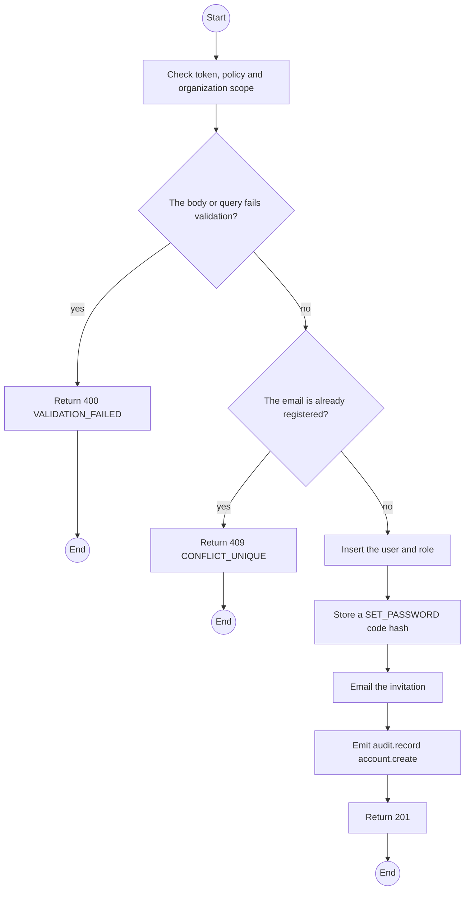
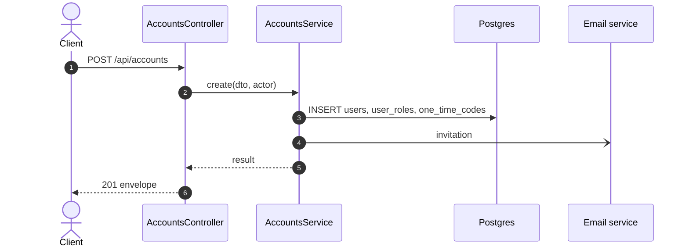

# POST /api/accounts: Create a TrekLink account

> Module `auth`. Generated from `scripts/specs/endpoints/auth.py` by `scripts/specs/build_api_design.py`; edit the catalog, not this file. Format: `02-templates/04-api-endpoint-template.md` with Mermaid (D-017). Envelope: D-002.

[TOC]

---
## Overview

Creates a TrekLink Staff or Admin account and emails an invitation code; the account has no password until the code is used (FR-AUTH-05: nobody sets another person's password).

## API Specification

| API | URL |
| --- | --- |
| POST | /api/accounts |
| Permission | TrekLink Admin |
| Traces | UC-10, FR-AUTH-06, BR-35, MSG10 |

## Request sample

```json
{
  "email": "staff2@treklink.vn",
  "fullName": "Le Van C",
  "role": "STAFF"
}
```

| Field | Description | Data Type | Required | Examples |
| --- | --- | --- | --- | --- |
| email | Work email | string | yes | `staff2@treklink.vn` |
| fullName | Full name | string | yes | `Le Van C` |
| role | `STAFF` or `ADMIN` | enum | yes | `STAFF` |

## Response sample

```json
{
  "result": {
    "id": "3f2e1d0c-9b8a-4c7d-8e6f-5a4b3c2d1e0f",
    "email": "staff2@treklink.vn",
    "fullName": "Le Van C",
    "accountType": "TREKLINK",
    "roles": [
      "STAFF"
    ],
    "isActive": true,
    "lastLoginAt": null,
    "createdAt": "2026-10-20T03:15:00.000Z"
  },
  "isSuccess": true,
  "statusCode": 201,
  "message": "Account created, invitation sent"
}
```

## Validation

<table>
    <th>Status code</th>
    <th>Description</th>
    <th>Examples</th>
    <tbody>
        <tr>
            <td>400</td>
            <td>The body or query fails validation (<code>VALIDATION_FAILED</code>)</td>
<td>

```json
{
  "result": {
    "errorCode": "VALIDATION_FAILED"
  },
  "isSuccess": false,
  "statusCode": 400,
  "message": "{field} is required."
}
```
</td>
        </tr>
        <tr>
            <td>401</td>
            <td>Missing, malformed or expired access token or API key (<code>UNAUTHENTICATED</code>)</td>
<td>

```json
{
  "result": {
    "errorCode": "UNAUTHENTICATED"
  },
  "isSuccess": false,
  "statusCode": 401,
  "message": "Authentication required."
}
```
</td>
        </tr>
        <tr>
            <td>403</td>
            <td>The caller's role, policy or organization does not allow this action (<code>FORBIDDEN</code>)</td>
<td>

```json
{
  "result": {
    "errorCode": "FORBIDDEN"
  },
  "isSuccess": false,
  "statusCode": 403,
  "message": "You do not have access to this."
}
```
</td>
        </tr>
        <tr>
            <td>409</td>
            <td>The email is already registered (<code>CONFLICT_UNIQUE</code>)</td>
<td>

```json
{
  "result": {
    "errorCode": "CONFLICT_UNIQUE"
  },
  "isSuccess": false,
  "statusCode": 409,
  "message": "staff2@treklink.vn is already registered."
}
```
</td>
        </tr>
    </tbody>
</table>

## Activity Diagram



## Sequence Diagram


