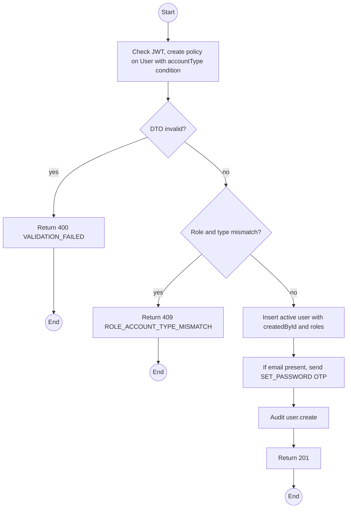
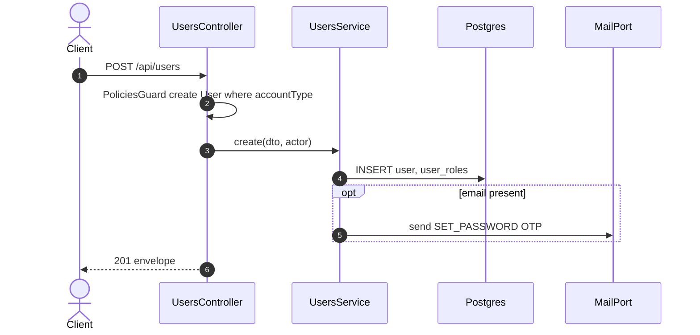

# POST /api/users: Provision an account

> Module `auth`. Format: `02-templates/04-api-endpoint-template.md`, with Mermaid in place of PlantUML (D-017). Envelope: D-002.

[TOC]

---
## Overview

Creates an account on someone's behalf. Admin creates Staff accounts with sub-roles. Operators and Guides create Customer accounts for people who contacted them by phone (Flow 2 of Q31). A provisioned account is active at once; when an email is given, a SET_PASSWORD OTP is sent so the person chooses their own password and Staff never knows it.

## API Specification

| API        | URL             |
| ---------- | --------------- |
| POST | /api/users |
| Permission | Admin (any account); Operator and Guide (Customer accounts only) |
| Traces | UC-18, FR-AUTH-06 (new), US-009, REQ-EVT-06, Q31 Flow 2, Q33 |

## Request sample

```json
{
  "username": "tran.b",
  "email": "tranb@mail.com",
  "fullName": "Tran Thi B",
  "phoneNumber": "0987654321",
  "accountType": "CUSTOMER",
  "roleKeys": [
    "CUSTOMER"
  ]
}
```

| Field | Description | Data Type | Required | Examples |
| --- | --- | --- | --- | --- |
| username | Optional; derived from email or full name when omitted | string | no | `tran.b` |
| email | Optional; required for self-service password setup | string | no | `tranb@mail.com` |
| fullName | 1 to 100 chars | string | yes | `Tran Thi B` |
| phoneNumber | Required when email is absent | string | no | `0987654321` |
| accountType | CUSTOMER or STAFF | enum | yes | `CUSTOMER` |
| roleKeys | Roles matching the account type | string[] | yes | `CUSTOMER` |

## Response sample

```json
{
  "result": {
    "id": "5b7e2f0a-3c41-4d8e-9a12-6f0c2b9d1e01",
    "username": "tran.b",
    "email": "tranb@mail.com",
    "fullName": "Tran Thi B",
    "phoneNumber": "0901234567",
    "accountType": "CUSTOMER",
    "roles": [
      "CUSTOMER"
    ],
    "isActive": true,
    "emailVerifiedAt": null,
    "createdAt": "2026-10-01T01:58:00Z",
    "setPasswordEmailSent": true
  },
  "isSuccess": true,
  "statusCode": 201,
  "message": "Account created"
}
```

### Rules

- Operators and Guides receive 403 when `accountType` is `STAFF`.
- A Customer with neither email nor phone is rejected: Staff must be able to reach the person.

## Validation

<table>
    <th>Status code</th>
    <th>Description</th>
    <th>Examples</th>
    <tbody>
        <tr>
            <td>400</td>
            <td>Field validation failed or neither email nor phone given (<code>VALIDATION_FAILED</code>)</td>
<td>

```json
{
  "result": {
    "errorCode": "VALIDATION_FAILED"
  },
  "isSuccess": false,
  "statusCode": 400,
  "message": "email or phoneNumber is required."
}
```
</td>
        </tr>
        <tr>
            <td>401</td>
            <td>Missing, malformed or expired access token (<code>UNAUTHENTICATED</code>)</td>
<td>

```json
{
  "result": {
    "errorCode": "UNAUTHENTICATED"
  },
  "isSuccess": false,
  "statusCode": 401,
  "message": "Authentication required."
}
```
</td>
        </tr>
        <tr>
            <td>403</td>
            <td>Authenticated, but the caller's role or policy does not allow this action (<code>FORBIDDEN</code>)</td>
<td>

```json
{
  "result": {
    "errorCode": "FORBIDDEN"
  },
  "isSuccess": false,
  "statusCode": 403,
  "message": "You do not have permission to perform this action."
}
```
</td>
        </tr>
        <tr>
            <td>409</td>
            <td>Username or email taken (<code>USERNAME_TAKEN</code>)</td>
<td>

```json
{
  "result": {
    "errorCode": "USERNAME_TAKEN"
  },
  "isSuccess": false,
  "statusCode": 409,
  "message": "Username is already taken."
}
```
</td>
        </tr>
        <tr>
            <td>409</td>
            <td>Role not allowed for the account type (<code>ROLE_ACCOUNT_TYPE_MISMATCH</code>)</td>
<td>

```json
{
  "result": {
    "errorCode": "ROLE_ACCOUNT_TYPE_MISMATCH"
  },
  "isSuccess": false,
  "statusCode": 409,
  "message": "Role GUIDE cannot be granted to a CUSTOMER account."
}
```
</td>
        </tr>
    </tbody>
</table>

## Activity Diagram



## Sequence Diagram


