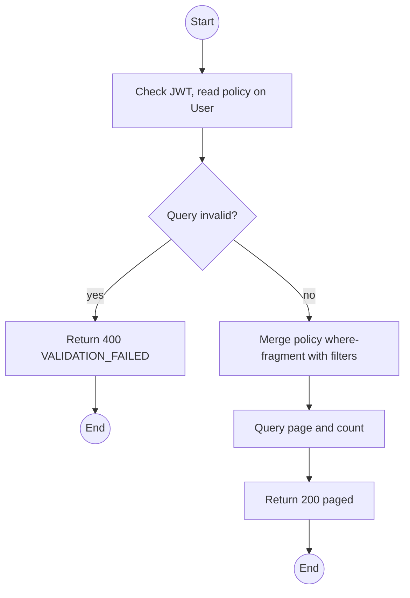
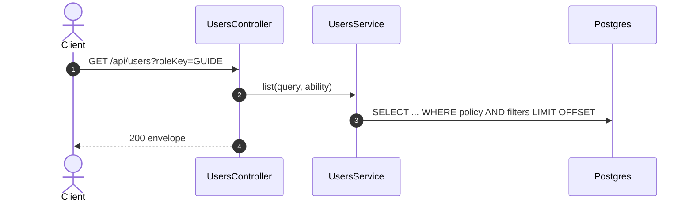

# GET /api/users: List accounts

> Module `auth`. Format: `02-templates/04-api-endpoint-template.md`, with Mermaid in place of PlantUML (D-017). Envelope: D-002.

[TOC]

---
## Overview

Paged account search. Operators see Customer accounts only (the policy condition narrows the query); Admin sees all. Soft-deleted accounts are excluded unless `includeDeleted=true` (Admin only).

## API Specification

| API        | URL             |
| ---------- | --------------- |
| GET | /api/users |
| Permission | Admin (all); Operator (Customers only) |
| Traces | UC-18, US-009 |

### Query parameters

| Field | Description | Data Type | Required | Examples |
| --- | --- | --- | --- | --- |
| search | Matches username, email, full name or phone | string | no | `tran` |
| accountType | CUSTOMER or STAFF | enum | no | `CUSTOMER` |
| roleKey | Holds this role | string | no | `GUIDE` |
| isActive | Filter by status | bool | no | `true` |
| includeDeleted | Admin only | bool | no | `false` |
| pageNumber | 1-based | int | no | `1` |
| pageSize | Default 20, max 100 | int | no | `20` |
| sort | `createdAt`, `username`, `fullName`, prefix `-` for desc | string | no | `-createdAt` |

## Request sample

No request body. Query string example:

```
GET /api/users?roleKey=GUIDE&isActive=true&pageSize=50
```

## Response sample

```json
{
  "result": {
    "items": [
      {
        "id": "5b7e2f0a-3c41-4d8e-9a12-6f0c2b9d1e01",
        "username": "name123",
        "email": "name123@mail.com",
        "fullName": "Nguyen Van A",
        "phoneNumber": "0901234567",
        "accountType": "CUSTOMER",
        "roles": [
          "CUSTOMER"
        ],
        "isActive": true,
        "emailVerifiedAt": "2026-10-01T02:00:00Z",
        "createdAt": "2026-10-01T01:58:00Z"
      }
    ],
    "pageNumber": 1,
    "pageSize": 20,
    "totalCount": 1,
    "totalPages": 1
  },
  "isSuccess": true,
  "statusCode": 200,
  "message": "Users retrieved"
}
```

## Validation

<table>
    <th>Status code</th>
    <th>Description</th>
    <th>Examples</th>
    <tbody>
        <tr>
            <td>400</td>
            <td>Unknown sort field or bad page size (<code>VALIDATION_FAILED</code>)</td>
<td>

```json
{
  "result": {
    "errorCode": "VALIDATION_FAILED"
  },
  "isSuccess": false,
  "statusCode": 400,
  "message": "pageSize must not be greater than 100."
}
```
</td>
        </tr>
        <tr>
            <td>401</td>
            <td>Missing, malformed or expired access token (<code>UNAUTHENTICATED</code>)</td>
<td>

```json
{
  "result": {
    "errorCode": "UNAUTHENTICATED"
  },
  "isSuccess": false,
  "statusCode": 401,
  "message": "Authentication required."
}
```
</td>
        </tr>
        <tr>
            <td>403</td>
            <td>Authenticated, but the caller's role or policy does not allow this action (<code>FORBIDDEN</code>)</td>
<td>

```json
{
  "result": {
    "errorCode": "FORBIDDEN"
  },
  "isSuccess": false,
  "statusCode": 403,
  "message": "You do not have permission to perform this action."
}
```
</td>
        </tr>
    </tbody>
</table>

## Activity Diagram



## Sequence Diagram


