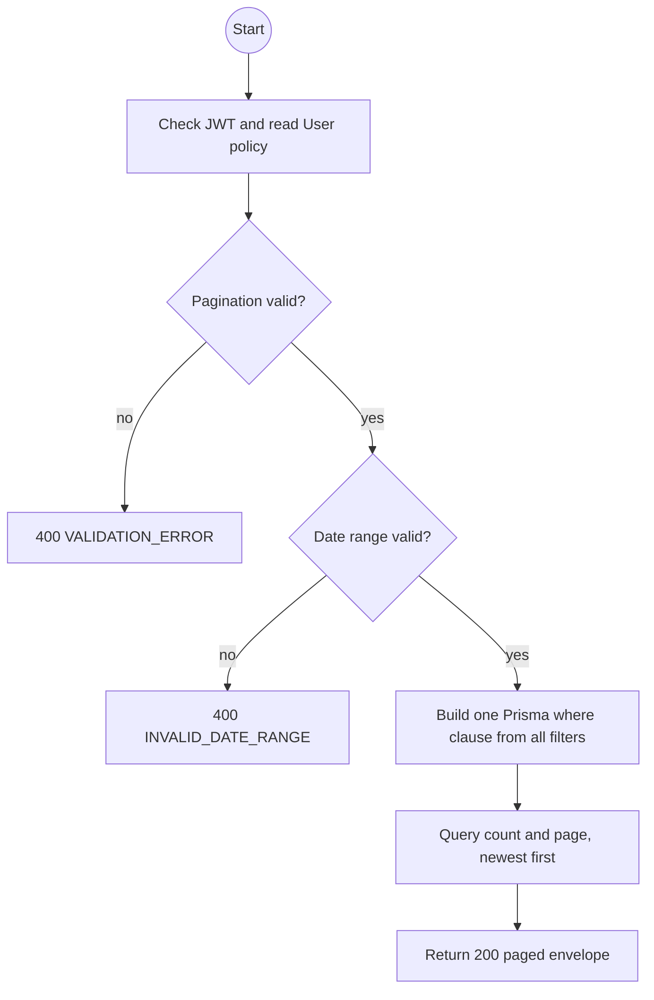
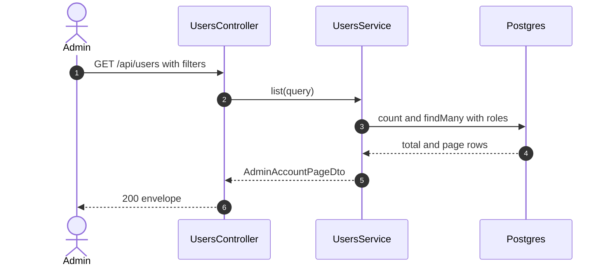

# GET /api/users: List accounts

> Module `auth`. Envelope: D-002. TK-22, US-009.

[TOC]

---

## Overview

Returns the Admin account-management list with combined filters and newest-first pagination. Only an Admin may call this TK-22 endpoint.

## API Specification

| API | URL |
|---|---|
| GET | `/api/users` |
| Permission | Authenticated Admin with `can('read', 'User')` |
| Traces | US-009, REQ-EVT-12, REQ-EVT-13, REQ-ERR-12 |

### Query parameters

| Field | Description | Data Type | Required | Examples |
|---|---|---|---|---|
| page | 1-based page, default 1 | int | no | `1` |
| limit | Default 20, maximum 100 | int | no | `20` |
| accountType | `CUSTOMER` or `STAFF` | enum | no | `STAFF` |
| role | Assigned role key | string | no | `GUIDE` |
| isActive | Account status | bool | no | `true` |
| search | Case-insensitive full-name or email substring | string | no | `tran` |
| createdFrom | Inclusive ISO-8601 UTC timestamp | timestamp | no | `2026-09-01T00:00:00Z` |
| createdTo | Inclusive ISO-8601 UTC timestamp | timestamp | no | `2026-09-30T23:59:59Z` |

```http
GET /api/users?page=1&limit=20&accountType=STAFF&role=GUIDE&isActive=true&search=tran
```

## Response sample

```json
{
  "result": {
    "items": [
      {
        "id": "5b7e2f0a-3c41-4d8e-9a12-6f0c2b9d1e01",
        "username": "tranb",
        "email": "tranb@mail.com",
        "fullName": "Tran Thi B",
        "phoneNumber": "0987654321",
        "accountType": "STAFF",
        "roles": ["GUIDE"],
        "isActive": true,
        "lastLoginAt": "2026-09-29T07:30:00Z",
        "createdAt": "2026-09-20T08:00:00Z",
        "updatedAt": "2026-09-29T07:30:00Z"
      }
    ],
    "page": 1,
    "limit": 20,
    "totalCount": 1,
    "totalPages": 1
  },
  "isSuccess": true,
  "statusCode": 200,
  "message": "Accounts retrieved"
}
```

Results are ordered by `createdAt DESC, id DESC`. All supplied filters are combined with logical AND.

## Validation

| Status | Error code | Condition |
|---|---|---|
| 400 | `VALIDATION_ERROR` | `page < 1`, `limit < 1`, `limit > 100`, or another malformed filter |
| 400 | `INVALID_DATE_RANGE` | Timestamp is invalid or `createdFrom` is after `createdTo` |
| 401 | `UNAUTHENTICATED` | Access token is missing, malformed or expired |
| 403 | `FORBIDDEN` | Caller lacks the Admin read policy |

```json
{
  "result": {
    "errorCode": "INVALID_DATE_RANGE"
  },
  "isSuccess": false,
  "statusCode": 400,
  "message": "createdFrom must be before or equal to createdTo."
}
```

## Activity Diagram


```mermaid
flowchart TB
    S((Start)) --> G[Check JWT and read User policy]
    G --> P{Pagination valid?}
    P -->|no| E1[400 VALIDATION_ERROR]
    P -->|yes| D{Date range valid?}
    D -->|no| E2[400 INVALID_DATE_RANGE]
    D -->|yes| Q[Build one Prisma where clause from all filters]
    Q --> L[Query count and page, newest first]
    L --> O[Return 200 paged envelope]
```

## Sequence Diagram


```mermaid
sequenceDiagram
    autonumber
    actor Admin
    participant Controller as UsersController
    participant Service as UsersService
    participant DB as Postgres
    Admin->>Controller: GET /api/users with filters
    Controller->>Service: list(query)
    Service->>DB: count and findMany with roles
    DB-->>Service: total and page rows
    Service-->>Controller: AdminAccountPageDto
    Controller-->>Admin: 200 envelope
```
