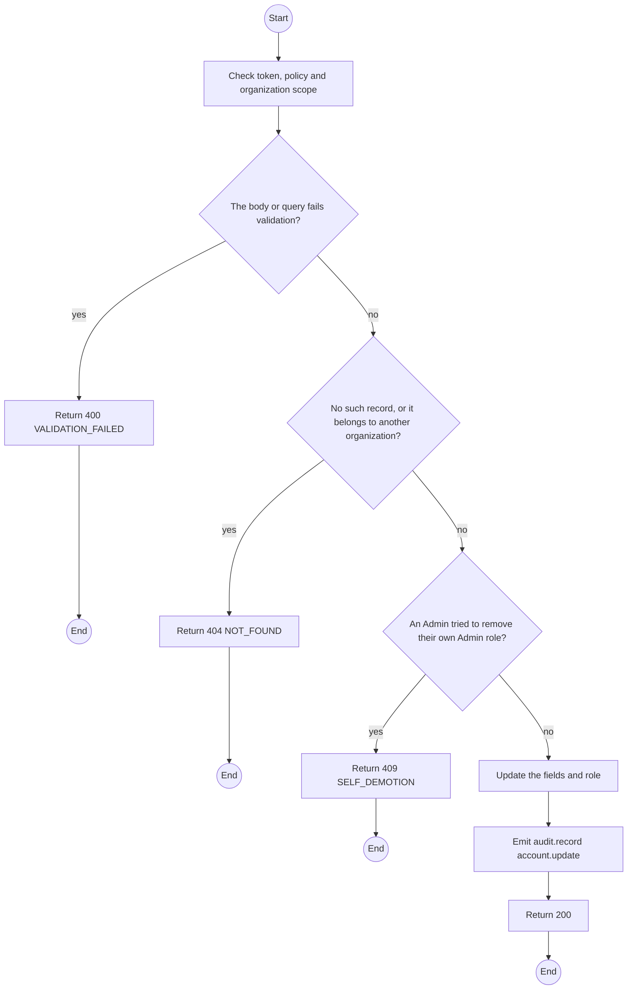
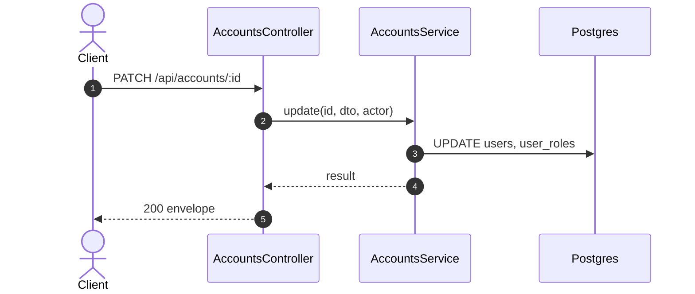

# PATCH /api/accounts/:id: Edit a TrekLink account

> Module `auth`. Generated from `scripts/specs/endpoints/auth.py` by `scripts/specs/build_api_design.py`; edit the catalog, not this file. Format: `02-templates/04-api-endpoint-template.md` with Mermaid (D-017). Envelope: D-002.

[TOC]

---
## Overview

Changes the name, phone or role of a TrekLink account. A role change takes effect on the next request (FR-AUTH-06). An Admin cannot remove their own Admin role.

## API Specification

| API | URL |
| --- | --- |
| PATCH | /api/accounts/:id |
| Permission | TrekLink Admin |
| Traces | UC-10, FR-AUTH-06 |

### Path parameters

| Field | Description | Data Type | Examples |
| --- | --- | --- | --- |
| id | Account id | uuid | `3f2e1d0c-9b8a-4c7d-8e6f-5a4b3c2d1e0f` |

## Request sample

```json
{
  "role": "ADMIN"
}
```

| Field | Description | Data Type | Required | Examples |
| --- | --- | --- | --- | --- |
| fullName | Full name | string | no | `Tran Thi B` |
| phoneNumber | Phone | string | no | `0901234567` |
| role | `STAFF` or `ADMIN` | enum | no | `ADMIN` |

## Response sample

```json
{
  "result": {
    "id": "3f2e1d0c-9b8a-4c7d-8e6f-5a4b3c2d1e0f",
    "email": "staff1@treklink.vn",
    "fullName": "Tran Thi B",
    "accountType": "TREKLINK",
    "roles": [
      "ADMIN"
    ],
    "isActive": true,
    "lastLoginAt": "2026-10-20T03:15:00.000Z",
    "createdAt": "2026-10-20T03:15:00.000Z"
  },
  "isSuccess": true,
  "statusCode": 200,
  "message": "Account updated"
}
```

## Validation

<table>
    <th>Status code</th>
    <th>Description</th>
    <th>Examples</th>
    <tbody>
        <tr>
            <td>400</td>
            <td>The body or query fails validation (<code>VALIDATION_FAILED</code>)</td>
<td>

```json
{
  "result": {
    "errorCode": "VALIDATION_FAILED"
  },
  "isSuccess": false,
  "statusCode": 400,
  "message": "{field} is required."
}
```
</td>
        </tr>
        <tr>
            <td>401</td>
            <td>Missing, malformed or expired access token or API key (<code>UNAUTHENTICATED</code>)</td>
<td>

```json
{
  "result": {
    "errorCode": "UNAUTHENTICATED"
  },
  "isSuccess": false,
  "statusCode": 401,
  "message": "Authentication required."
}
```
</td>
        </tr>
        <tr>
            <td>403</td>
            <td>The caller's role, policy or organization does not allow this action (<code>FORBIDDEN</code>)</td>
<td>

```json
{
  "result": {
    "errorCode": "FORBIDDEN"
  },
  "isSuccess": false,
  "statusCode": 403,
  "message": "You do not have access to this."
}
```
</td>
        </tr>
        <tr>
            <td>404</td>
            <td>No such record, or it belongs to another organization (<code>NOT_FOUND</code>)</td>
<td>

```json
{
  "result": {
    "errorCode": "NOT_FOUND"
  },
  "isSuccess": false,
  "statusCode": 404,
  "message": "Account not found."
}
```
</td>
        </tr>
        <tr>
            <td>409</td>
            <td>An Admin tried to remove their own Admin role (<code>SELF_DEMOTION</code>)</td>
<td>

```json
{
  "result": {
    "errorCode": "SELF_DEMOTION"
  },
  "isSuccess": false,
  "statusCode": 409,
  "message": "You cannot remove your own Admin role."
}
```
</td>
        </tr>
    </tbody>
</table>

## Activity Diagram



## Sequence Diagram


