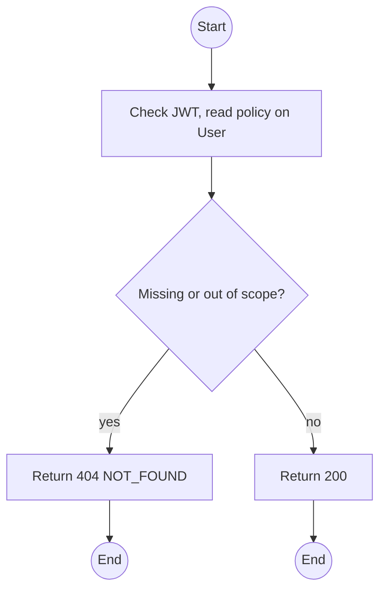
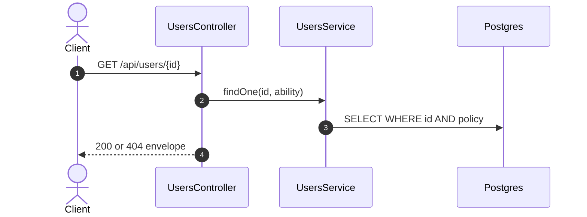

# GET /api/users/:id: Get an account

> Module `auth`. Format: `02-templates/04-api-endpoint-template.md`, with Mermaid in place of PlantUML (D-017). Envelope: D-002.

[TOC]

---
## Overview

Returns one account with roles and, for Guides, the guide profile. Out-of-scope ids return 404.

## API Specification

| API        | URL             |
| ---------- | --------------- |
| GET | /api/users/:id |
| Permission | Admin; Operator (Customers); the user themself |
| Traces | UC-18, US-009 |

### Path parameters

| Field | Description | Data Type | Examples |
| --- | --- | --- | --- |
| id | User id | uuid | `5b7e2f0a-3c41-4d8e-9a12-6f0c2b9d1e01` |

## Request sample

No request body.

## Response sample

```json
{
  "result": {
    "id": "5b7e2f0a-3c41-4d8e-9a12-6f0c2b9d1e01",
    "username": "name123",
    "email": "name123@mail.com",
    "fullName": "Nguyen Van A",
    "phoneNumber": "0901234567",
    "accountType": "CUSTOMER",
    "roles": [
      "CUSTOMER"
    ],
    "isActive": true,
    "emailVerifiedAt": "2026-10-01T02:00:00Z",
    "createdAt": "2026-10-01T01:58:00Z",
    "lastLoginAt": "2026-10-02T01:00:00Z",
    "createdBy": {
      "id": "9a1b...",
      "username": "op.lan"
    }
  },
  "isSuccess": true,
  "statusCode": 200,
  "message": "User retrieved"
}
```

## Validation

<table>
    <th>Status code</th>
    <th>Description</th>
    <th>Examples</th>
    <tbody>
        <tr>
            <td>401</td>
            <td>Missing, malformed or expired access token (<code>UNAUTHENTICATED</code>)</td>
<td>

```json
{
  "result": {
    "errorCode": "UNAUTHENTICATED"
  },
  "isSuccess": false,
  "statusCode": 401,
  "message": "Authentication required."
}
```
</td>
        </tr>
        <tr>
            <td>403</td>
            <td>Authenticated, but the caller's role or policy does not allow this action (<code>FORBIDDEN</code>)</td>
<td>

```json
{
  "result": {
    "errorCode": "FORBIDDEN"
  },
  "isSuccess": false,
  "statusCode": 403,
  "message": "You do not have permission to perform this action."
}
```
</td>
        </tr>
        <tr>
            <td>404</td>
            <td>No such user, or outside the caller's scope (<code>NOT_FOUND</code>)</td>
<td>

```json
{
  "result": {
    "errorCode": "NOT_FOUND"
  },
  "isSuccess": false,
  "statusCode": 404,
  "message": "User not found."
}
```
</td>
        </tr>
    </tbody>
</table>

## Activity Diagram



## Sequence Diagram


