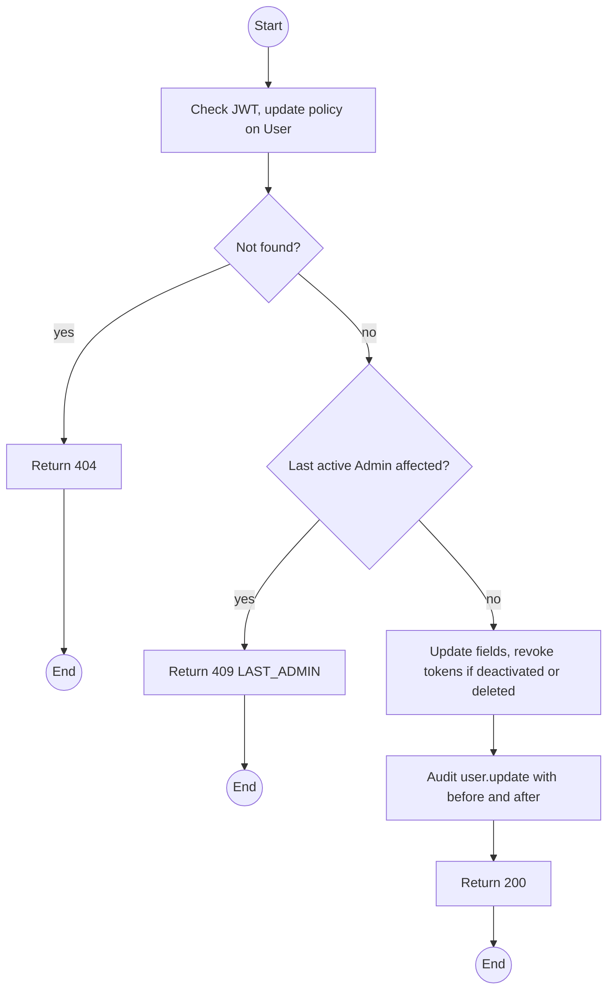
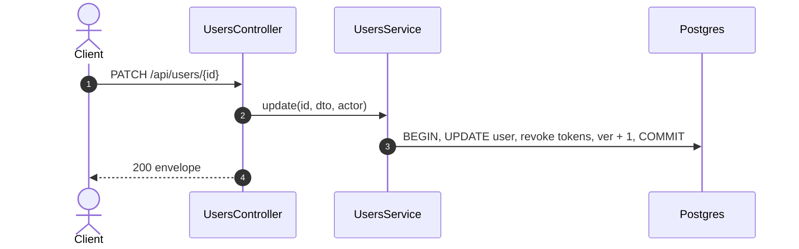

# PATCH /api/users/:id: Update, deactivate or soft-delete an account

> Module `auth`. Format: `02-templates/04-api-endpoint-template.md`, with Mermaid in place of PlantUML (D-017). Envelope: D-002.

[TOC]

---
## Overview

Admin edits an account's profile fields, `isActive`, or soft-deletes it with `deleted: true`. Deactivation and deletion revoke all refresh tokens and bump the token version so existing access tokens stop working.

## API Specification

| API        | URL             |
| ---------- | --------------- |
| PATCH | /api/users/:id |
| Permission | Admin |
| Traces | UC-18, US-009, REQ-EVT-11, REQ-UBI-09, Q36, Q45 |

### Path parameters

| Field | Description | Data Type | Examples |
| --- | --- | --- | --- |
| id | User id | uuid | `5b7e2f0a-3c41-4d8e-9a12-6f0c2b9d1e01` |

## Request sample

```json
{
  "isActive": false,
  "reason": "Left the agency"
}
```

| Field | Description | Data Type | Required | Examples |
| --- | --- | --- | --- | --- |
| fullName | Profile field | string | no | `Tran Minh` |
| phoneNumber | Profile field | string | no | `0912345678` |
| isActive | Activate or deactivate | bool | no | `false` |
| deleted | Soft delete when true; irreversible through the API | bool | no | `false` |
| reason | Required with isActive false or deleted true | string | no | `Left the agency` |

## Response sample

```json
{
  "result": {
    "id": "5b7e2f0a-3c41-4d8e-9a12-6f0c2b9d1e01",
    "username": "name123",
    "email": "name123@mail.com",
    "fullName": "Nguyen Van A",
    "phoneNumber": "0901234567",
    "accountType": "CUSTOMER",
    "roles": [
      "CUSTOMER"
    ],
    "isActive": false,
    "emailVerifiedAt": "2026-10-01T02:00:00Z",
    "createdAt": "2026-10-01T01:58:00Z"
  },
  "isSuccess": true,
  "statusCode": 200,
  "message": "User updated"
}
```

## Validation

<table>
    <th>Status code</th>
    <th>Description</th>
    <th>Examples</th>
    <tbody>
        <tr>
            <td>400</td>
            <td>Reason missing for deactivation or deletion (<code>VALIDATION_FAILED</code>)</td>
<td>

```json
{
  "result": {
    "errorCode": "VALIDATION_FAILED"
  },
  "isSuccess": false,
  "statusCode": 400,
  "message": "reason is required when deactivating an account."
}
```
</td>
        </tr>
        <tr>
            <td>401</td>
            <td>Missing, malformed or expired access token (<code>UNAUTHENTICATED</code>)</td>
<td>

```json
{
  "result": {
    "errorCode": "UNAUTHENTICATED"
  },
  "isSuccess": false,
  "statusCode": 401,
  "message": "Authentication required."
}
```
</td>
        </tr>
        <tr>
            <td>403</td>
            <td>Authenticated, but the caller's role or policy does not allow this action (<code>FORBIDDEN</code>)</td>
<td>

```json
{
  "result": {
    "errorCode": "FORBIDDEN"
  },
  "isSuccess": false,
  "statusCode": 403,
  "message": "You do not have permission to perform this action."
}
```
</td>
        </tr>
        <tr>
            <td>404</td>
            <td>No such user (<code>NOT_FOUND</code>)</td>
<td>

```json
{
  "result": {
    "errorCode": "NOT_FOUND"
  },
  "isSuccess": false,
  "statusCode": 404,
  "message": "User not found."
}
```
</td>
        </tr>
        <tr>
            <td>409</td>
            <td>Would deactivate the last active Admin (<code>LAST_ADMIN</code>)</td>
<td>

```json
{
  "result": {
    "errorCode": "LAST_ADMIN"
  },
  "isSuccess": false,
  "statusCode": 409,
  "message": "At least one active Admin must remain."
}
```
</td>
        </tr>
    </tbody>
</table>

## Activity Diagram



## Sequence Diagram


