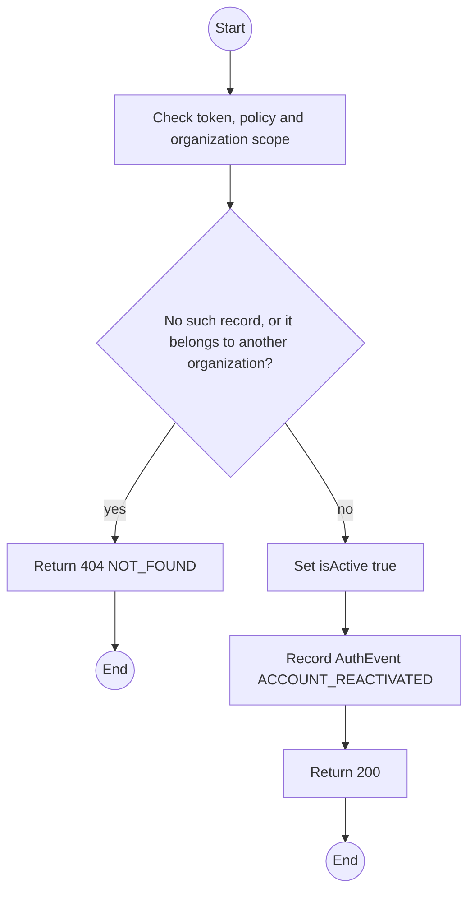
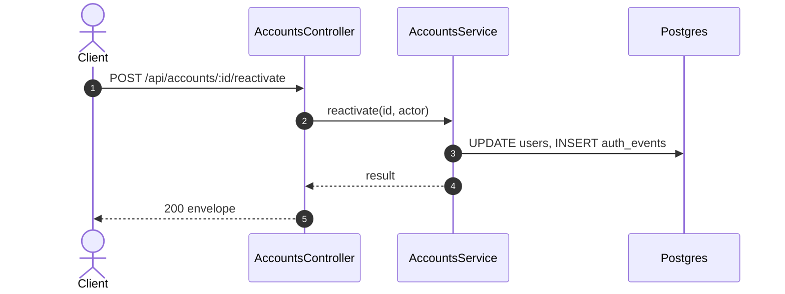

# POST /api/accounts/:id/reactivate: Reactivate a TrekLink account

> Module `auth`. Generated from `scripts/specs/endpoints/auth.py` by `scripts/specs/build_api_design.py`; edit the catalog, not this file. Format: `02-templates/04-api-endpoint-template.md` with Mermaid (D-017). Envelope: D-002.

[TOC]

---
## Overview

Reactivates a deactivated TrekLink account.

## API Specification

| API | URL |
| --- | --- |
| POST | /api/accounts/:id/reactivate |
| Permission | TrekLink Admin |
| Traces | UC-10, FR-AUTH-07 |

### Path parameters

| Field | Description | Data Type | Examples |
| --- | --- | --- | --- |
| id | Account id | uuid | `3f2e1d0c-9b8a-4c7d-8e6f-5a4b3c2d1e0f` |

## Request sample

No body.

## Response sample

```json
{
  "result": {
    "id": "3f2e1d0c-9b8a-4c7d-8e6f-5a4b3c2d1e0f",
    "email": "staff1@treklink.vn",
    "fullName": "Tran Thi B",
    "accountType": "TREKLINK",
    "roles": [
      "STAFF"
    ],
    "isActive": true,
    "lastLoginAt": "2026-10-20T03:15:00.000Z",
    "createdAt": "2026-10-20T03:15:00.000Z"
  },
  "isSuccess": true,
  "statusCode": 200,
  "message": "Account reactivated"
}
```

## Validation

<table>
    <th>Status code</th>
    <th>Description</th>
    <th>Examples</th>
    <tbody>
        <tr>
            <td>401</td>
            <td>Missing, malformed or expired access token or API key (<code>UNAUTHENTICATED</code>)</td>
<td>

```json
{
  "result": {
    "errorCode": "UNAUTHENTICATED"
  },
  "isSuccess": false,
  "statusCode": 401,
  "message": "Authentication required."
}
```
</td>
        </tr>
        <tr>
            <td>403</td>
            <td>The caller's role, policy or organization does not allow this action (<code>FORBIDDEN</code>)</td>
<td>

```json
{
  "result": {
    "errorCode": "FORBIDDEN"
  },
  "isSuccess": false,
  "statusCode": 403,
  "message": "You do not have access to this."
}
```
</td>
        </tr>
        <tr>
            <td>404</td>
            <td>No such record, or it belongs to another organization (<code>NOT_FOUND</code>)</td>
<td>

```json
{
  "result": {
    "errorCode": "NOT_FOUND"
  },
  "isSuccess": false,
  "statusCode": 404,
  "message": "Account not found."
}
```
</td>
        </tr>
    </tbody>
</table>

## Activity Diagram



## Sequence Diagram


