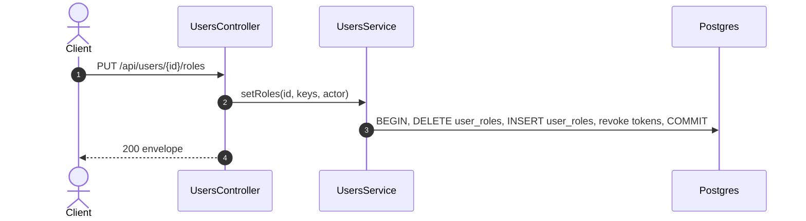

# PUT /api/users/:id/roles: Replace an account's roles

> Module `auth`. Format: `02-templates/04-api-endpoint-template.md`, with Mermaid in place of PlantUML (D-017). Envelope: D-002.

[TOC]

---
## Overview

Replaces the role set of one account. Roles must match the account type. Takes effect on the user's next request; their refresh-token families are revoked so a long-lived session cannot keep old rights.

## API Specification

| API        | URL             |
| ---------- | --------------- |
| PUT | /api/users/:id/roles |
| Permission | Admin |
| Traces | UC-18, FR-AUTH-07 (new), US-001, US-009, REQ-EVT-10, REQ-ERR-08, Q33 |

### Path parameters

| Field | Description | Data Type | Examples |
| --- | --- | --- | --- |
| id | User id | uuid | `5b7e2f0a-3c41-4d8e-9a12-6f0c2b9d1e01` |

## Request sample

```json
{
  "roleKeys": [
    "OPERATOR",
    "GUIDE"
  ]
}
```

| Field | Description | Data Type | Required | Examples |
| --- | --- | --- | --- | --- |
| roleKeys | Complete new role set, at least one | string[] | yes | `OPERATOR, GUIDE` |

## Response sample

```json
{
  "result": {
    "id": "5b7e2f0a-3c41-4d8e-9a12-6f0c2b9d1e01",
    "username": "minh",
    "roles": [
      "OPERATOR",
      "GUIDE"
    ]
  },
  "isSuccess": true,
  "statusCode": 200,
  "message": "Roles updated"
}
```

## Validation

<table>
    <th>Status code</th>
    <th>Description</th>
    <th>Examples</th>
    <tbody>
        <tr>
            <td>400</td>
            <td>Empty or unknown role key (<code>VALIDATION_FAILED</code>)</td>
<td>

```json
{
  "result": {
    "errorCode": "VALIDATION_FAILED"
  },
  "isSuccess": false,
  "statusCode": 400,
  "message": "roleKeys contains an unknown role: MANAGR."
}
```
</td>
        </tr>
        <tr>
            <td>401</td>
            <td>Missing, malformed or expired access token (<code>UNAUTHENTICATED</code>)</td>
<td>

```json
{
  "result": {
    "errorCode": "UNAUTHENTICATED"
  },
  "isSuccess": false,
  "statusCode": 401,
  "message": "Authentication required."
}
```
</td>
        </tr>
        <tr>
            <td>403</td>
            <td>Authenticated, but the caller's role or policy does not allow this action (<code>FORBIDDEN</code>)</td>
<td>

```json
{
  "result": {
    "errorCode": "FORBIDDEN"
  },
  "isSuccess": false,
  "statusCode": 403,
  "message": "You do not have permission to perform this action."
}
```
</td>
        </tr>
        <tr>
            <td>404</td>
            <td>No such user (<code>NOT_FOUND</code>)</td>
<td>

```json
{
  "result": {
    "errorCode": "NOT_FOUND"
  },
  "isSuccess": false,
  "statusCode": 404,
  "message": "User not found."
}
```
</td>
        </tr>
        <tr>
            <td>409</td>
            <td>Role not allowed for the account type (<code>ROLE_ACCOUNT_TYPE_MISMATCH</code>)</td>
<td>

```json
{
  "result": {
    "errorCode": "ROLE_ACCOUNT_TYPE_MISMATCH"
  },
  "isSuccess": false,
  "statusCode": 409,
  "message": "Role OPERATOR cannot be granted to a CUSTOMER account."
}
```
</td>
        </tr>
        <tr>
            <td>409</td>
            <td>Removes the last active Admin (<code>LAST_ADMIN</code>)</td>
<td>

```json
{
  "result": {
    "errorCode": "LAST_ADMIN"
  },
  "isSuccess": false,
  "statusCode": 409,
  "message": "At least one active Admin must remain."
}
```
</td>
        </tr>
    </tbody>
</table>

## Activity Diagram

```mermaid
flowchart TB
    S((Start))
    A1["Check JWT, update policy on Role assignment"]
    S --> A1
    D2{"Unknown role?"}
    A1 --> D2
    E2["Return 400"]
    D2 -->|yes| E2
    E2 --> X2((End))
    D3{"Type mismatch?"}
    D2 -->|no| D3
    E3["Return 409 ROLE_ACCOUNT_TYPE_MISMATCH"]
    D3 -->|yes| E3
    E3 --> X3((End))
    D4{"Last Admin removed?"}
    D3 -->|no| D4
    E4["Return 409 LAST_ADMIN"]
    D4 -->|yes| E4
    E4 --> X4((End))
    A5["Replace user_roles, revoke refresh families, bump ver"]
    D4 -->|no| A5
    A6["Invalidate permission cache, audit before and after"]
    A5 --> A6
    OK["Return 200"]
    A6 --> OK
    OK --> Z((End))
```



## Sequence Diagram


