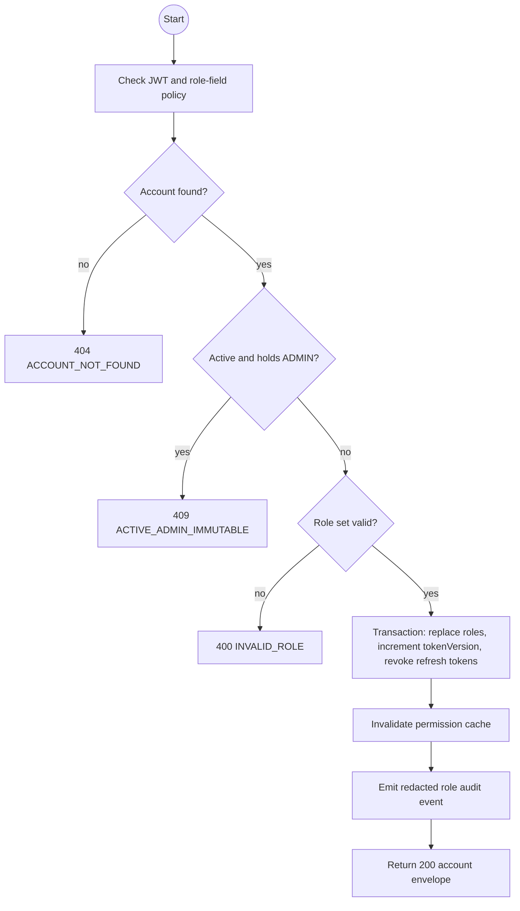
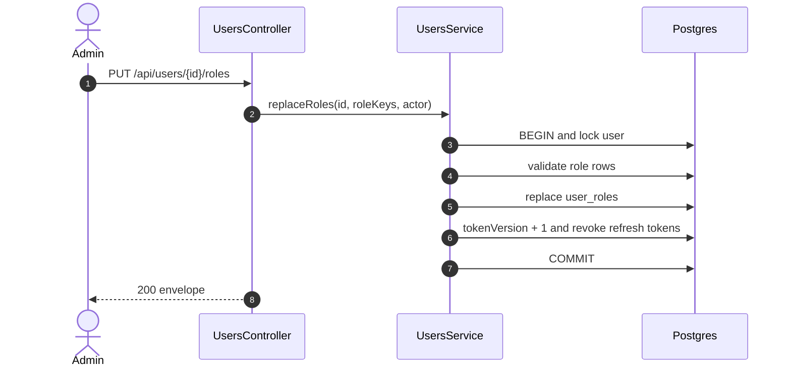

# PUT /api/users/:id/roles: Replace account roles

> Module `auth`. Envelope: D-002. TK-22, US-009.

[TOC]

---

## Overview

Replaces the complete role set of a Customer or Staff account. The service revokes all refresh tokens and invalidates all issued access tokens in the same Prisma transaction. TK-22 rejects this operation when the target is an active Admin, including the caller's own account.

## API Specification

| API | URL |
|---|---|
| PUT | `/api/users/:id/roles` |
| Permission | Authenticated Admin with `can('update', 'User', ['roles'])` |
| Traces | US-009, REQ-EVT-10, REQ-STA-04, REQ-ERR-08, REQ-ERR-10, REQ-ERR-11, REQ-ERR-13 |

## Request sample

```json
{
  "roleKeys": ["OPERATOR", "GUIDE"]
}
```

| Field | Description | Data Type | Required | Examples |
|---|---|---|---|---|
| roleKeys | Complete replacement role set | string[] | yes | `OPERATOR, GUIDE` |

## Response sample

```json
{
  "result": {
    "id": "5b7e2f0a-3c41-4d8e-9a12-6f0c2b9d1e01",
    "username": "minh",
    "email": "minh@treklink.vn",
    "fullName": "Tran Minh",
    "phoneNumber": "0912345678",
    "accountType": "STAFF",
    "roles": ["OPERATOR", "GUIDE"],
    "isActive": true,
    "lastLoginAt": "2026-09-29T07:30:00Z",
    "createdAt": "2026-09-01T08:00:00Z",
    "updatedAt": "2026-09-29T08:00:00Z"
  },
  "isSuccess": true,
  "statusCode": 200,
  "message": "Account roles updated"
}
```

## Validation

| Status | Error code | Condition |
|---|---|---|
| 400 | `VALIDATION_ERROR` | Request shape is malformed |
| 400 | `INVALID_ROLE` | Role set is empty, unknown, or incompatible with the account type |
| 401 | `UNAUTHENTICATED` | Access token is missing, malformed or expired |
| 403 | `FORBIDDEN` | Caller lacks the Admin role-update policy |
| 404 | `ACCOUNT_NOT_FOUND` | Account id does not exist |
| 409 | `ACTIVE_ADMIN_IMMUTABLE` | Target is active and currently holds `ADMIN` |
| 409 | `LAST_ADMIN` | Defensive invariant detects removal of the last active Admin through another path |

```json
{
  "result": {
    "errorCode": "ACTIVE_ADMIN_IMMUTABLE"
  },
  "isSuccess": false,
  "statusCode": 409,
  "message": "An active Admin account can only be viewed."
}
```

## Activity Diagram


```mermaid
flowchart TB
    S((Start)) --> G[Check JWT and role-field policy]
    G --> F{Account found?}
    F -->|no| E1[404 ACCOUNT_NOT_FOUND]
    F -->|yes| A{Active and holds ADMIN?}
    A -->|yes| E2[409 ACTIVE_ADMIN_IMMUTABLE]
    A -->|no| R{Role set valid?}
    R -->|no| E3[400 INVALID_ROLE]
    R -->|yes| T[Transaction: replace roles, increment tokenVersion, revoke refresh tokens]
    T --> C[Invalidate permission cache]
    C --> U[Emit redacted role audit event]
    U --> O[Return 200 account envelope]
```

## Sequence Diagram


```mermaid
sequenceDiagram
    autonumber
    actor Admin
    participant Controller as UsersController
    participant Service as UsersService
    participant DB as Postgres
    Admin->>Controller: PUT /api/users/{id}/roles
    Controller->>Service: replaceRoles(id, roleKeys, actor)
    Service->>DB: BEGIN and lock user
    Service->>DB: validate role rows
    Service->>DB: replace user_roles
    Service->>DB: tokenVersion + 1 and revoke refresh tokens
    Service->>DB: COMMIT
    Controller-->>Admin: 200 envelope
```
