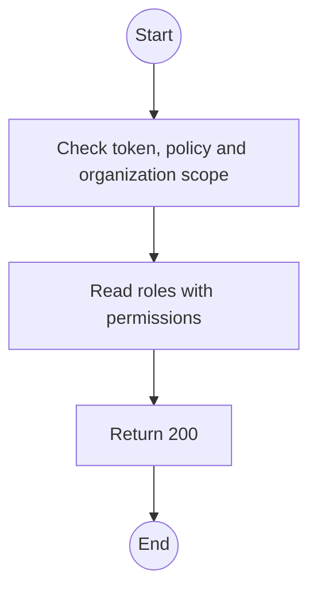
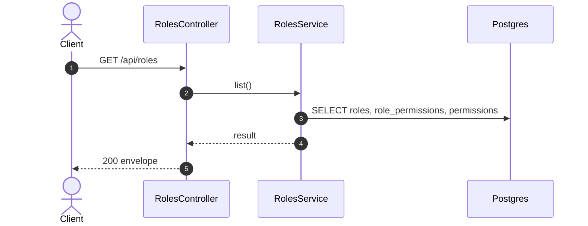

# GET /api/roles: List roles and permissions

> Module `auth`. Generated from `scripts/specs/endpoints/auth.py` by `scripts/specs/build_api_design.py`; edit the catalog, not this file. Format: `02-templates/04-api-endpoint-template.md` with Mermaid (D-017). Envelope: D-002.

[TOC]

---
## Overview

Lists the four system roles with their permissions as data (FR-AUTH-06).

## API Specification

| API | URL |
| --- | --- |
| GET | /api/roles |
| Permission | TrekLink Admin |
| Traces | UC-10, FR-AUTH-06 |

## Request sample

No body.

## Response sample

```json
{
  "result": [
    {
      "id": "r-1",
      "key": "ORG_OPERATOR",
      "accountType": "ORGANIZATION",
      "isSystem": true,
      "permissions": [
        {
          "key": "incident.acknowledge.ownOrganization",
          "action": "acknowledge",
          "subject": "Incident",
          "conditions": {
            "organizationId": "${user.organizationId}"
          }
        }
      ]
    }
  ],
  "isSuccess": true,
  "statusCode": 200,
  "message": "OK"
}
```

## Validation

<table>
    <th>Status code</th>
    <th>Description</th>
    <th>Examples</th>
    <tbody>
        <tr>
            <td>401</td>
            <td>Missing, malformed or expired access token or API key (<code>UNAUTHENTICATED</code>)</td>
<td>

```json
{
  "result": {
    "errorCode": "UNAUTHENTICATED"
  },
  "isSuccess": false,
  "statusCode": 401,
  "message": "Authentication required."
}
```
</td>
        </tr>
        <tr>
            <td>403</td>
            <td>The caller's role, policy or organization does not allow this action (<code>FORBIDDEN</code>)</td>
<td>

```json
{
  "result": {
    "errorCode": "FORBIDDEN"
  },
  "isSuccess": false,
  "statusCode": 403,
  "message": "You do not have access to this."
}
```
</td>
        </tr>
    </tbody>
</table>

## Activity Diagram



## Sequence Diagram


