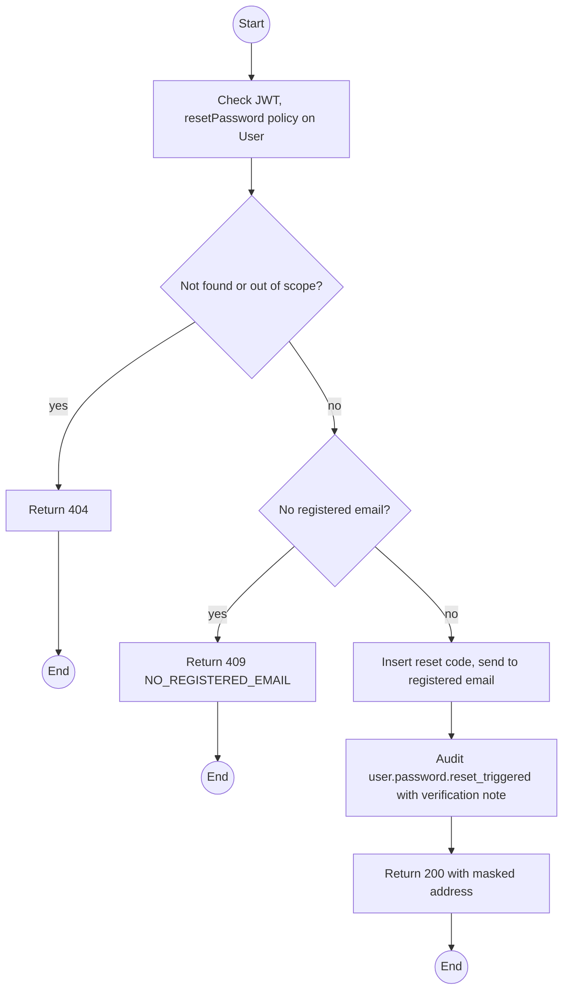
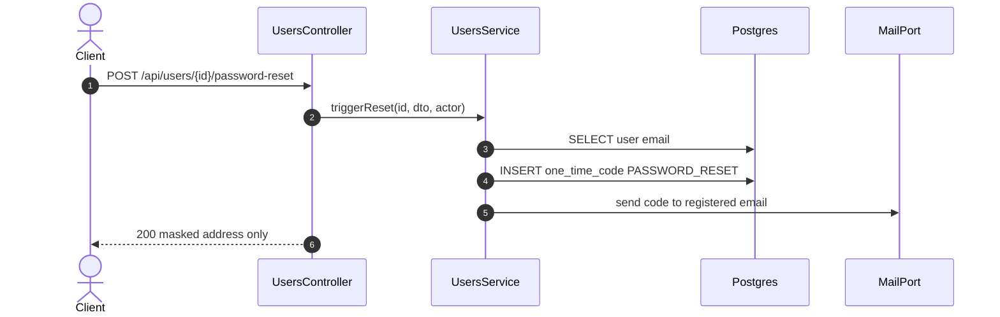

# POST /api/users/:id/password-reset: Staff-triggered password reset

> Module `auth`. Format: `02-templates/04-api-endpoint-template.md`, with Mermaid in place of PlantUML (D-017). Envelope: D-002.

[TOC]

---
## Overview

After verifying the person by phone or in person against name, phone, email or registered id (Q35), Staff triggers a reset. The system sends a PASSWORD_RESET OTP to the email already on the account. The response contains no code and no credential.

## API Specification

| API        | URL             |
| ---------- | --------------- |
| POST | /api/users/:id/password-reset |
| Permission | Operator (Customers), Admin |
| Traces | UC-28 (new), FR-AUTH-05, US-007, REQ-EVT-09, REQ-ERR-06, Q35 |

### Path parameters

| Field | Description | Data Type | Examples |
| --- | --- | --- | --- |
| id | Customer user id | uuid | `5b7e2f0a-3c41-4d8e-9a12-6f0c2b9d1e01` |

## Request sample

```json
{
  "verificationMethod": "PHONE_CALLBACK",
  "note": "Called back on 0901234567, name and email confirmed"
}
```

| Field | Description | Data Type | Required | Examples |
| --- | --- | --- | --- | --- |
| verificationMethod | How Staff verified the person: PHONE_CALLBACK, IN_PERSON | enum | yes | `PHONE_CALLBACK` |
| note | What was checked, stored in the audit log | string | yes | `Called back...` |

## Response sample

```json
{
  "result": {
    "sentTo": "n******3@mail.com"
  },
  "isSuccess": true,
  "statusCode": 200,
  "message": "A reset code has been sent to the account's registered email."
}
```

## Validation

<table>
    <th>Status code</th>
    <th>Description</th>
    <th>Examples</th>
    <tbody>
        <tr>
            <td>401</td>
            <td>Missing, malformed or expired access token (<code>UNAUTHENTICATED</code>)</td>
<td>

```json
{
  "result": {
    "errorCode": "UNAUTHENTICATED"
  },
  "isSuccess": false,
  "statusCode": 401,
  "message": "Authentication required."
}
```
</td>
        </tr>
        <tr>
            <td>403</td>
            <td>Authenticated, but the caller's role or policy does not allow this action (<code>FORBIDDEN</code>)</td>
<td>

```json
{
  "result": {
    "errorCode": "FORBIDDEN"
  },
  "isSuccess": false,
  "statusCode": 403,
  "message": "You do not have permission to perform this action."
}
```
</td>
        </tr>
        <tr>
            <td>404</td>
            <td>No such user or not a Customer the caller may manage (<code>NOT_FOUND</code>)</td>
<td>

```json
{
  "result": {
    "errorCode": "NOT_FOUND"
  },
  "isSuccess": false,
  "statusCode": 404,
  "message": "User not found."
}
```
</td>
        </tr>
        <tr>
            <td>409</td>
            <td>Account has no registered email (<code>NO_REGISTERED_EMAIL</code>)</td>
<td>

```json
{
  "result": {
    "errorCode": "NO_REGISTERED_EMAIL"
  },
  "isSuccess": false,
  "statusCode": 409,
  "message": "This account has no registered email. A reset cannot be sent."
}
```
</td>
        </tr>
        <tr>
            <td>429</td>
            <td>Inside the OTP cooldown (<code>OTP_COOLDOWN</code>)</td>
<td>

```json
{
  "result": {
    "errorCode": "OTP_COOLDOWN"
  },
  "isSuccess": false,
  "statusCode": 429,
  "message": "Please wait before requesting another code."
}
```
</td>
        </tr>
    </tbody>
</table>

## Activity Diagram



## Sequence Diagram


