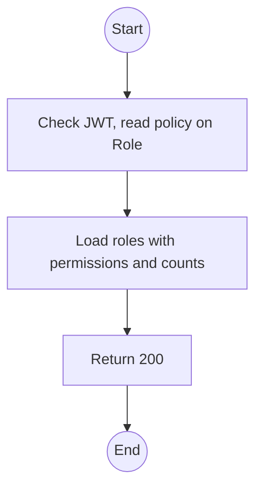
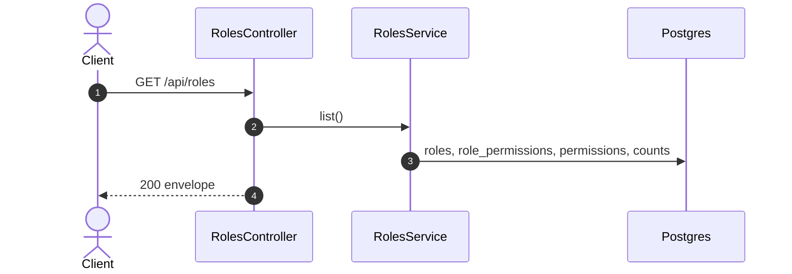

# GET /api/roles: List roles and permissions

> Module `auth`. Format: `02-templates/04-api-endpoint-template.md`, with Mermaid in place of PlantUML (D-017). Envelope: D-002.

[TOC]

---
## Overview

Lists every role with its account type, system flag, member count and permission rows. The Admin role-management screen is built from this.

## API Specification

| API        | URL             |
| ---------- | --------------- |
| GET | /api/roles |
| Permission | Admin |
| Traces | UC-18, US-001 |

## Request sample

No request body.

## Response sample

```json
{
  "result": [
    {
      "id": "r-01...",
      "key": "GUIDE",
      "name": "Guide",
      "accountType": "STAFF",
      "isSystem": true,
      "memberCount": 6,
      "permissions": [
        {
          "key": "incident.acknowledge.ownTrips",
          "action": "acknowledge",
          "subject": "Incident",
          "conditions": {
            "tripId": {
              "$in": "${user.tripIds}"
            }
          }
        }
      ]
    }
  ],
  "isSuccess": true,
  "statusCode": 200,
  "message": "Roles retrieved"
}
```

## Validation

<table>
    <th>Status code</th>
    <th>Description</th>
    <th>Examples</th>
    <tbody>
        <tr>
            <td>401</td>
            <td>Missing, malformed or expired access token (<code>UNAUTHENTICATED</code>)</td>
<td>

```json
{
  "result": {
    "errorCode": "UNAUTHENTICATED"
  },
  "isSuccess": false,
  "statusCode": 401,
  "message": "Authentication required."
}
```
</td>
        </tr>
        <tr>
            <td>403</td>
            <td>Authenticated, but the caller's role or policy does not allow this action (<code>FORBIDDEN</code>)</td>
<td>

```json
{
  "result": {
    "errorCode": "FORBIDDEN"
  },
  "isSuccess": false,
  "statusCode": 403,
  "message": "You do not have permission to perform this action."
}
```
</td>
        </tr>
    </tbody>
</table>

## Activity Diagram



## Sequence Diagram


