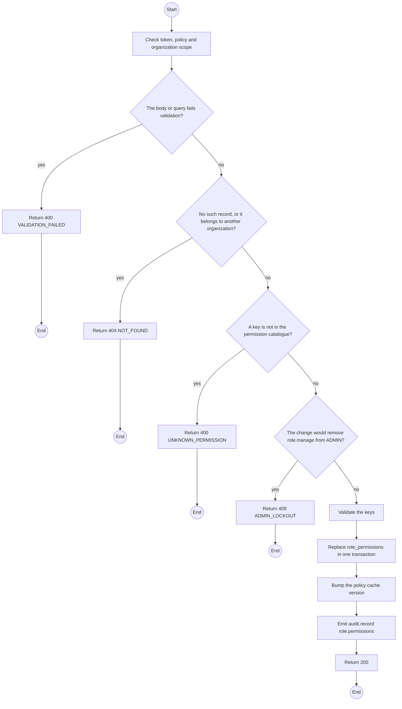
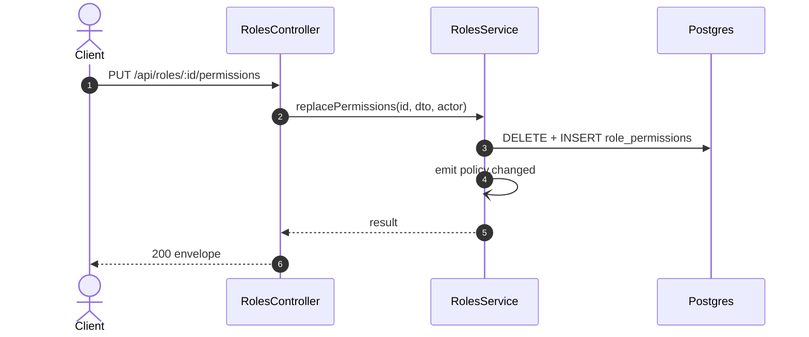

# PUT /api/roles/:id/permissions: Replace a role's permissions

> Module `auth`. Generated from `scripts/specs/endpoints/auth.py` by `scripts/specs/build_api_design.py`; edit the catalog, not this file. Format: `02-templates/04-api-endpoint-template.md` with Mermaid (D-017). Envelope: D-002.

[TOC]

---
## Overview

Replaces the permission set of a role. The change applies on the next request, without a redeploy (FR-AUTH-06). Removing `role.manage` from ADMIN is refused.

## API Specification

| API | URL |
| --- | --- |
| PUT | /api/roles/:id/permissions |
| Permission | TrekLink Admin |
| Traces | UC-10, FR-AUTH-06 |

### Path parameters

| Field | Description | Data Type | Examples |
| --- | --- | --- | --- |
| id | Role id | uuid | `r-1` |

## Request sample

```json
{
  "permissionKeys": [
    "incident.read.ownOrganization",
    "incident.acknowledge.ownOrganization"
  ]
}
```

| Field | Description | Data Type | Required | Examples |
| --- | --- | --- | --- | --- |
| permissionKeys | Full list of permission keys | string[] | yes | `["incident.acknowledge.ownOrganization"]` |

## Response sample

```json
{
  "result": {
    "id": "r-1",
    "key": "ORG_OPERATOR",
    "permissionCount": 2
  },
  "isSuccess": true,
  "statusCode": 200,
  "message": "Permissions updated"
}
```

## Validation

<table>
    <th>Status code</th>
    <th>Description</th>
    <th>Examples</th>
    <tbody>
        <tr>
            <td>400</td>
            <td>The body or query fails validation (<code>VALIDATION_FAILED</code>)</td>
<td>

```json
{
  "result": {
    "errorCode": "VALIDATION_FAILED"
  },
  "isSuccess": false,
  "statusCode": 400,
  "message": "{field} is required."
}
```
</td>
        </tr>
        <tr>
            <td>401</td>
            <td>Missing, malformed or expired access token or API key (<code>UNAUTHENTICATED</code>)</td>
<td>

```json
{
  "result": {
    "errorCode": "UNAUTHENTICATED"
  },
  "isSuccess": false,
  "statusCode": 401,
  "message": "Authentication required."
}
```
</td>
        </tr>
        <tr>
            <td>403</td>
            <td>The caller's role, policy or organization does not allow this action (<code>FORBIDDEN</code>)</td>
<td>

```json
{
  "result": {
    "errorCode": "FORBIDDEN"
  },
  "isSuccess": false,
  "statusCode": 403,
  "message": "You do not have access to this."
}
```
</td>
        </tr>
        <tr>
            <td>404</td>
            <td>No such record, or it belongs to another organization (<code>NOT_FOUND</code>)</td>
<td>

```json
{
  "result": {
    "errorCode": "NOT_FOUND"
  },
  "isSuccess": false,
  "statusCode": 404,
  "message": "Role not found."
}
```
</td>
        </tr>
        <tr>
            <td>400</td>
            <td>A key is not in the permission catalogue (<code>UNKNOWN_PERMISSION</code>)</td>
<td>

```json
{
  "result": {
    "errorCode": "UNKNOWN_PERMISSION"
  },
  "isSuccess": false,
  "statusCode": 400,
  "message": "Unknown permission: x."
}
```
</td>
        </tr>
        <tr>
            <td>409</td>
            <td>The change would remove role.manage from ADMIN (<code>ADMIN_LOCKOUT</code>)</td>
<td>

```json
{
  "result": {
    "errorCode": "ADMIN_LOCKOUT"
  },
  "isSuccess": false,
  "statusCode": 409,
  "message": "Admins must keep the right to manage roles."
}
```
</td>
        </tr>
    </tbody>
</table>

## Activity Diagram



## Sequence Diagram


