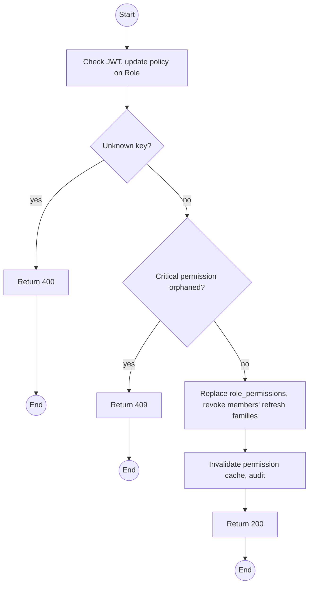
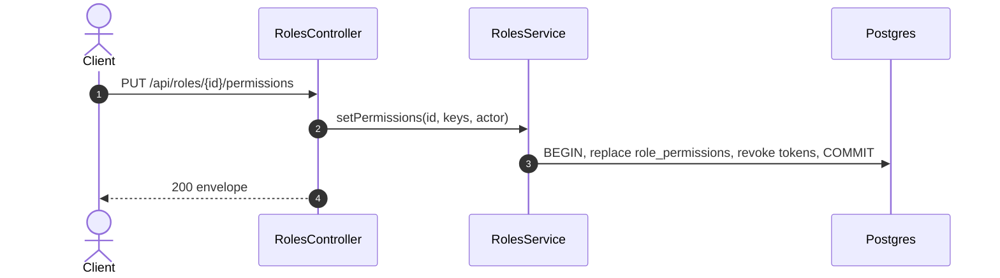

# PUT /api/roles/:id/permissions: Replace a role's permissions

> Module `auth`. Format: `02-templates/04-api-endpoint-template.md`, with Mermaid in place of PlantUML (D-017). Envelope: D-002.

[TOC]

---
## Overview

Replaces the permission set of a role, or creates a new non-system role when called on `POST /api/roles` first (see Rules). Changes take effect on each member's next request. System roles may have permissions edited but may not be deleted or renamed.

## API Specification

| API        | URL             |
| ---------- | --------------- |
| PUT | /api/roles/:id/permissions |
| Permission | Admin |
| Traces | UC-18, FR-AUTH-07, US-001, REQ-EVT-10, Q33, Q43 |

### Path parameters

| Field | Description | Data Type | Examples |
| --- | --- | --- | --- |
| id | Role id | uuid | `r-05...` |

## Request sample

```json
{
  "permissionKeys": [
    "booking.read.any",
    "rental.read.any",
    "incident.read.any"
  ]
}
```

| Field | Description | Data Type | Required | Examples |
| --- | --- | --- | --- | --- |
| permissionKeys | Complete new set of seeded permission keys | string[] | yes | `booking.read.any` |

## Response sample

```json
{
  "result": {
    "id": "r-05...",
    "key": "MANAGER",
    "permissions": [
      "booking.read.any",
      "rental.read.any",
      "incident.read.any"
    ]
  },
  "isSuccess": true,
  "statusCode": 200,
  "message": "Role permissions updated"
}
```

### Rules

- Creating a role (`POST /api/roles {key, name, accountType}`) is a thin companion call with the same guards; it is folded into this file because it has no rules of its own beyond `CONFLICT_UNIQUE` on `key`.
- Removing a permission that would leave no role able to `acknowledge` Incidents is rejected, because MF-03 would then have no human owner.

## Validation

<table>
    <th>Status code</th>
    <th>Description</th>
    <th>Examples</th>
    <tbody>
        <tr>
            <td>400</td>
            <td>Unknown permission key (<code>VALIDATION_FAILED</code>)</td>
<td>

```json
{
  "result": {
    "errorCode": "VALIDATION_FAILED"
  },
  "isSuccess": false,
  "statusCode": 400,
  "message": "permissionKeys contains an unknown key."
}
```
</td>
        </tr>
        <tr>
            <td>401</td>
            <td>Missing, malformed or expired access token (<code>UNAUTHENTICATED</code>)</td>
<td>

```json
{
  "result": {
    "errorCode": "UNAUTHENTICATED"
  },
  "isSuccess": false,
  "statusCode": 401,
  "message": "Authentication required."
}
```
</td>
        </tr>
        <tr>
            <td>403</td>
            <td>Authenticated, but the caller's role or policy does not allow this action (<code>FORBIDDEN</code>)</td>
<td>

```json
{
  "result": {
    "errorCode": "FORBIDDEN"
  },
  "isSuccess": false,
  "statusCode": 403,
  "message": "You do not have permission to perform this action."
}
```
</td>
        </tr>
        <tr>
            <td>404</td>
            <td>No such role (<code>NOT_FOUND</code>)</td>
<td>

```json
{
  "result": {
    "errorCode": "NOT_FOUND"
  },
  "isSuccess": false,
  "statusCode": 404,
  "message": "Role not found."
}
```
</td>
        </tr>
        <tr>
            <td>409</td>
            <td>No role would be able to acknowledge incidents (<code>CRITICAL_PERMISSION_ORPHANED</code>)</td>
<td>

```json
{
  "result": {
    "errorCode": "CRITICAL_PERMISSION_ORPHANED"
  },
  "isSuccess": false,
  "statusCode": 409,
  "message": "At least one role must keep incident.acknowledge."
}
```
</td>
        </tr>
    </tbody>
</table>

## Activity Diagram



## Sequence Diagram


