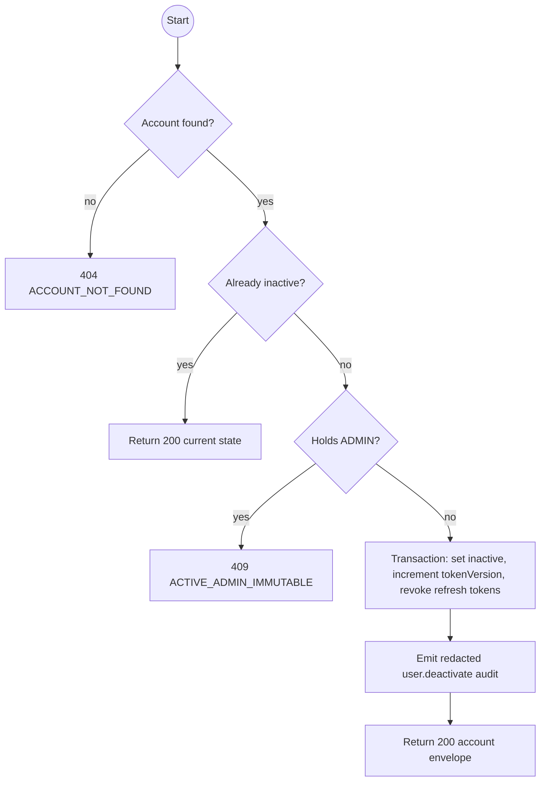
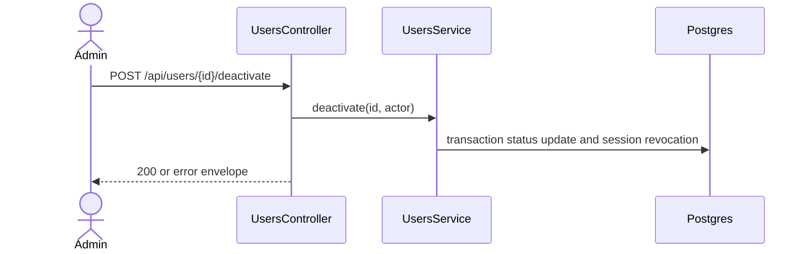

# POST /api/users/:id/deactivate: Deactivate an account

> Module `auth`. Envelope: D-002. TK-22, US-009.

[TOC]

---

## Overview

Deactivates an active non-Admin account and invalidates every current session atomically. Repeating the request for an inactive account is an idempotent 200 response with no additional write.

## API Specification

| API | URL |
|---|---|
| POST | `/api/users/:id/deactivate` |
| Permission | Authenticated Admin with `can('update', 'User', ['isActive'])` |
| Traces | REQ-EVT-18, REQ-EVT-20, REQ-STA-04, REQ-ERR-10, REQ-ERR-13 |

## Request sample

No request body.

## Response sample

```json
{
  "result": {
    "id": "5b7e2f0a-3c41-4d8e-9a12-6f0c2b9d1e01",
    "username": "tranb",
    "email": "tranb@mail.com",
    "fullName": "Tran Thi B",
    "phoneNumber": "0987654321",
    "accountType": "STAFF",
    "roles": ["GUIDE"],
    "isActive": false,
    "lastLoginAt": "2026-09-29T07:30:00Z",
    "createdAt": "2026-09-01T08:00:00Z",
    "updatedAt": "2026-09-29T08:00:00Z"
  },
  "isSuccess": true,
  "statusCode": 200,
  "message": "Account deactivated"
}
```

For an already inactive account, the message is `Account is already inactive` and the current account DTO is returned.

## Validation

| Status | Error code | Condition |
|---|---|---|
| 400 | `VALIDATION_ERROR` | `id` is not a UUID |
| 401 | `UNAUTHENTICATED` | Access token is missing, malformed or expired |
| 403 | `FORBIDDEN` | Caller lacks the Admin status policy |
| 404 | `ACCOUNT_NOT_FOUND` | Account id does not exist |
| 409 | `ACTIVE_ADMIN_IMMUTABLE` | Target is active and holds `ADMIN`, including self |
| 409 | `LAST_ADMIN` | Defensive invariant detects the last active Admin through another path |

```json
{
  "result": { "errorCode": "ACTIVE_ADMIN_IMMUTABLE" },
  "isSuccess": false,
  "statusCode": 409,
  "message": "An active Admin account can only be viewed."
}
```

## Activity Diagram



## Sequence Diagram


