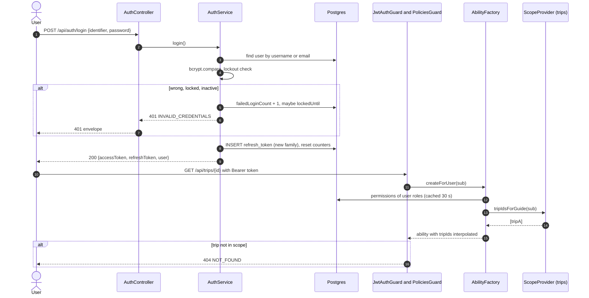
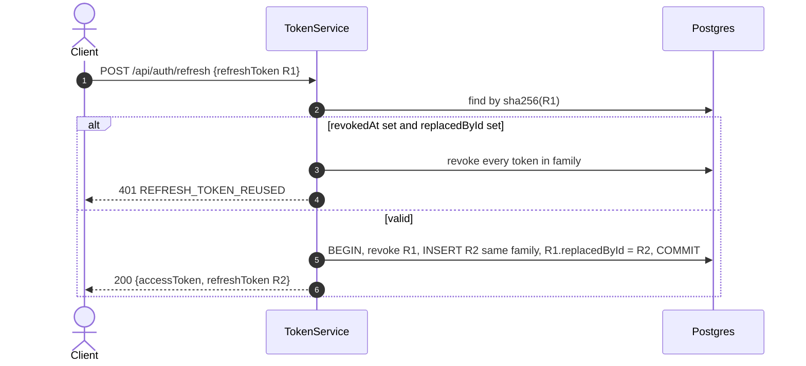
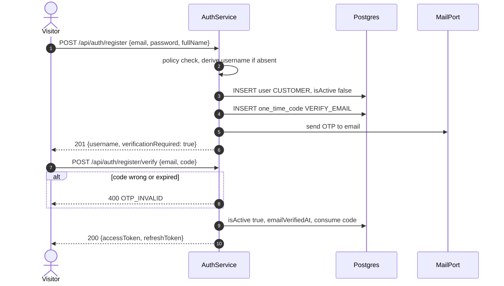

# Technical Design: auth

> Fulfills `requirements.md` in this folder. Tags `[Qnn]` mark design choices resting on a Recorded, not yet Confirmed, clarification answer.

---

## 1. Domain Model & Data Schema

ERD slice: `specs/platform/design.md` Figure 5.

```prisma
enum AccountType { CUSTOMER STAFF }
enum OtpPurpose  { VERIFY_EMAIL SET_PASSWORD PASSWORD_RESET }

model User {
  id              String    @id @default(uuid())
  username        String    @unique              // stored lower-case; REQ-UBI-01
  email           String?   @unique              // lower-case; optional [Q41]
  emailVerifiedAt DateTime?
  phoneNumber     String?
  fullName        String
  passwordHash    String?                        // null for Google-only accounts (REQ-OPT-01)
  accountType     AccountType
  isActive        Boolean   @default(true)       // [Q45]
  lastLoginAt     DateTime?
  failedLoginCount Int      @default(0)
  lockedUntil     DateTime?
  createdById     String?                        // Flow 2 provisioning [Q31]
  deletedAt       DateTime?                      // soft delete [Q36]
  createdAt       DateTime  @default(now())
  updatedAt       DateTime  @updatedAt
  roles           UserRole[]
  guideProfile    GuideProfile?
  @@index([accountType, isActive])
  @@map("users")
}

model Role {
  id          String   @id @default(uuid())
  key         String   @unique                    // ADMIN, OPERATOR, GUIDE, CUSTOMER, ...
  name        String
  accountType AccountType                         // which account type may hold it
  isSystem    Boolean  @default(false)            // system roles cannot be deleted
  permissions RolePermission[]
  users       UserRole[]
  @@map("roles")
}

model Permission {
  id         String  @id @default(uuid())
  key        String  @unique                      // stable seed key, e.g. "incident.acknowledge.ownTrips"
  action     String                               // create, read, update, confirm, acknowledge, ...
  subject    String                               // Booking, Incident, ... or 'all'
  conditions Json?                                // CASL conditions with ${user.*} placeholders
  fields     String[]                             // optional field restriction
  inverted   Boolean @default(false)              // a 'cannot' rule
  reason     String?
  roles      RolePermission[]
  @@map("permissions")
}

model UserRole {
  userId      String
  roleId      String
  grantedById String?
  createdAt   DateTime @default(now())
  @@id([userId, roleId])
  @@map("user_roles")
}

model RolePermission {
  roleId       String
  permissionId String
  @@id([roleId, permissionId])
  @@map("role_permissions")
}

model RefreshToken {
  id           String    @id @default(uuid())
  userId       String
  familyId     String                              // one per login; revoked as a unit
  tokenHash    String    @unique                   // sha256 of the opaque token
  expiresAt    DateTime
  revokedAt    DateTime?
  replacedById String?
  userAgent    String?
  ip           String?
  createdAt    DateTime  @default(now())
  @@index([userId, familyId])
  @@map("refresh_tokens")
}

model OneTimeCode {
  id         String     @id @default(uuid())
  userId     String
  purpose    OtpPurpose
  codeHash   String
  attempts   Int        @default(0)
  expiresAt  DateTime
  consumedAt DateTime?
  createdAt  DateTime   @default(now())
  @@index([userId, purpose, createdAt])
  @@map("one_time_codes")
}

model GuideProfile {
  userId         String   @id
  bio            String?
  skills         String[]                          // e.g. first aid, rope rescue [Q33]
  certifications String[]
  languages      String[]
  updatedAt      DateTime @updatedAt
  @@map("guide_profiles")
}
```

Relations (`@relation` lines) are written in the migration task; they are omitted above only for readability.

### 1.1 Why roles are rows

US-001 asks for data-driven RBAC and Q33 for an extensible sub-role list. A `Role` enum would make "add Manager" a migration and a deploy. With rows, it is an Admin action (AC-08). `Role.accountType` stops a Staff role being granted to a Customer account and the reverse (REQ-UBI-04).

### 1.2 Seeded roles and default permissions

Seeded by the platform seed migration. Actions beyond CRUD are domain verbs, so a policy reads like the use case it protects.

| Subject | ADMIN | OPERATOR | GUIDE | CUSTOMER |
|---|---|---|---|---|
| `User` | manage | read, create (Customer), resetPassword (Customer) | create (Customer, Flow 2), read (Customers on own trips) | read, update (self) |
| `Role`, `Permission` | manage | none | none | none |
| `Parameter` | read, update | read | none | none |
| `AuditLog` | read | none | none | none |
| `HardwareVariant` | manage | read | read | none |
| `Device` | read, create, update, transition | read, create, update, transition, provision | read (own trips) | none |
| `MaintenanceRecord` | read | create, update | none | none |
| `TrekPackage` | read | manage | read | read (PUBLISHED) |
| `Trip` | read | manage, transition, assignGuide | read (own), transition (own: start, finish) | read (BOOKING_OPEN or own bookings) |
| `TripRequest` | read | read, update | create, read (own) | none |
| `Booking` | read | manage, confirm, reject, cancel, extendHold | create (own trips), read (own trips), reserve (own trips) | create, read (own), reserve (own), cancel (own) |
| `Rental` | read | manage, allocate, checkout, checkin, inspect, cancel, close | read (custody), handover (custody) | read (own) |
| `RentalAgreement` | read | generate, sign | none | read (own), sign (own) |
| `Invoice` | read | read, settle | none | read (own) |
| `Payment` | read | create | none | create (own invoice) |
| `PricingRule`, `DamageFeeRule` | manage | read | none | none |
| `FeeWaiver` | read | request, approve (not own inspection) | none | none |
| `Incident` | read | read, create, acknowledge, transition, note, dismiss | read (own trips), acknowledge (own trips), note (own trips) | none |
| `GatewayEvent` | read | read | read (own trips) | none |
| `SyncAudit` | read, replay | none | none | none |
| `Monitoring` | read | read | read (own trips) | none |

"(own trips)" compiles to the CASL condition `{ "tripId": { "$in": "${user.tripIds}" } }`. `Admin` has **no** operational verbs (REQ-UBI-08); a person who needs both holds both roles.

---

## 2. Service / Business Logic Design

### 2.1 Services

| Service | Responsibility |
|---|---|
| `AuthService` | login, refresh, logout, register, verify, forgot and reset password |
| `TokenService` | sign and verify JWTs; issue, rotate and revoke refresh tokens |
| `OtpService` | issue, hash, verify and expire codes; cooldown |
| `PasswordService` | policy check against parameters, bcrypt hash and compare |
| `UsersService` (exported) | user CRUD, role assignment, `findById`, `findGuideById`, `assertGuide(ids)` |
| `AbilityFactory` (exported) | builds a CASL `PureAbility` per request from the user's permission rows plus scope |
| `RolesService` | role and permission administration |

Exported to other modules: `JwtAuthGuard`, `PoliciesGuard`, `@CheckPolicies()`, `@CurrentUser()`, `UsersService`, `AbilityFactory`, and the `accessibleWhere(ability, action, subject)` helper that turns an ability into a Prisma `where` fragment for list queries.

### 2.2 Access token claims

`{ sub, username, accountType, roles: string[], ver }`. Permissions are **not** in the token: they are loaded per request (cached per user for 30 s, invalidated on role change) so REQ-EVT-10 holds without waiting for token expiry. `ver` is a per-user counter bumped on deactivation, role change and password reset; the JWT strategy rejects a token whose `ver` is behind the stored one, which is how REQ-EVT-11 is met inside the access-token lifetime.

### 2.3 Guide scope without a module cycle

A Guide's scope is the set of trip ids with an active assignment, which `trips` owns. `trips` imports `auth` for its guards, so `auth` cannot import `trips`. Resolution:

- `auth` declares an injection token `SCOPE_PROVIDER` and an interface `ScopeProvider { tripIdsForGuide(userId): Promise<string[]> }`.
- `trips` provides the implementation under that token.
- `AbilityFactory` resolves it lazily with `ModuleRef.get(SCOPE_PROVIDER, { strict: false })` on first use.

No static import from `auth` to `trips` exists, so the graph in `platform/design.md` Figure 3 stays acyclic. REQ-STA-03 holds because the provider is called per request (cached for the request only).

### 2.4 Refresh rotation

Opaque 256-bit random token, returned once, stored as `sha256`. Rotation per REQ-EVT-02; reuse per REQ-ERR-02. Families let logout and theft response revoke every descendant of one login without touching the user's other devices.

### 2.5 Lockout

`failedLoginCount` and `lockedUntil` on `User`, updated in one `UPDATE ... RETURNING` so concurrent wrong guesses cannot race past the threshold. A correct password during lockout still returns `INVALID_CREDENTIALS` (REQ-STA-01), so lockout does not become an oracle.

### 2.6 Email

`MailPort` interface with `console` and `smtp` adapters (REQ-OPT-02). OTP bodies are templated in English; Vietnamese templates follow when the locale system exists (Q9 applies to the landing page; the web app has no locale requirement yet).

### 2.7 Error catalogue

| Code | HTTP | Raised when |
|---|---|---|
| `INVALID_CREDENTIALS` | 401 | unknown identifier, wrong password, locked, inactive, unverified |
| `REFRESH_TOKEN_INVALID` | 401 | unknown, expired or revoked refresh token |
| `REFRESH_TOKEN_REUSED` | 401 | rotated token presented again |
| `OTP_INVALID` | 400 | wrong, expired or consumed code |
| `OTP_COOLDOWN` | 429 | resend inside cooldown |
| `PASSWORD_POLICY_VIOLATION` | 400 | policy failure |
| `USERNAME_TAKEN`, `EMAIL_TAKEN` | 409 | uniqueness |
| `NO_REGISTERED_EMAIL` | 409 | Staff reset on an account without email |
| `LAST_ADMIN` | 409 | removing the last Admin |
| `ROLE_ACCOUNT_TYPE_MISMATCH` | 409 | Staff role on a Customer account or the reverse |
| `SYSTEM_ROLE_IMMUTABLE` | 409 | deleting or renaming a system role |

Login deliberately collapses locked, inactive and unverified into `INVALID_CREDENTIALS` (enumeration resistance, NFR table). The UI shows one message.

---

## 3. Sequence Flows

### 3.1 Login and first authorised call

See **Figure 1**.



***Figure 1***: Login, then a scoped read. The scope is fetched per request, so an unassignment takes effect on the next call (REQ-STA-03).

### 3.2 Refresh rotation and reuse detection

See **Figure 2**.



***Figure 2***: A rotated token presented a second time means two holders of one token; the family is revoked so both are logged out.

### 3.3 Self-registration (Flow 1)

See **Figure 3**.



***Figure 3***: Registration completes only on OTP verification, so an unverified email never owns an active account.

---

## 4. API Endpoints in this module

| # | Method | Route | Permission | Spec |
|---|---|---|---|---|
| 01 | POST | `/api/auth/register` | Public | `api-design/01-post-auth-register.md` |
| 02 | POST | `/api/auth/register/verify` | Public | `api-design/02-post-auth-register-verify.md` |
| 03 | POST | `/api/auth/login` | Public | `api-design/03-post-auth-login.md` |
| 04 | POST | `/api/auth/refresh` | Public (refresh token) | `api-design/04-post-auth-refresh.md` |
| 05 | POST | `/api/auth/logout` | Authenticated | `api-design/05-post-auth-logout.md` |
| 06 | POST | `/api/auth/password/forgot` | Public | `api-design/06-post-auth-password-forgot.md` |
| 07 | POST | `/api/auth/password/reset` | Public (OTP) | `api-design/07-post-auth-password-reset.md` |
| 08 | GET | `/api/auth/me` | Authenticated | `api-design/08-get-auth-me.md` |
| 09 | PATCH | `/api/auth/me` | Authenticated | `api-design/09-patch-auth-me.md` |
| 10 | POST | `/api/users` | Admin; Operator and Guide for Customer accounts | `api-design/10-post-users-create.md` |
| 11 | GET | `/api/users` | Admin; Operator (Customers) | `api-design/11-get-users-list.md` |
| 12 | GET | `/api/users/:id` | Admin; Operator (Customers); self | `api-design/12-get-users-detail.md` |
| 13 | PATCH | `/api/users/:id` | Admin | `api-design/13-patch-users-update.md` |
| 14 | PUT | `/api/users/:id/roles` | Admin | `api-design/14-put-users-roles.md` |
| 15 | POST | `/api/users/:id/password-reset` | Operator, Admin | `api-design/15-post-users-password-reset.md` |
| 16 | GET | `/api/roles` | Admin | `api-design/16-get-roles-list.md` |
| 17 | PUT | `/api/roles/:id/permissions` | Admin | `api-design/17-put-roles-permissions.md` |

Google OAuth routes (`GET /api/auth/google`, `GET /api/auth/google/callback`) are specified by REQ-OPT-01 and get api-design files only if the approval puts them in Phase B.

---

## 5. Frontend impact

- `features/auth`: login form (identifier, password), registration (4 fields, then OTP step), forgot and reset password (2 steps).
- `shared/api/apiClient.ts` silent refresh: on 401 `UNAUTHENTICATED`, call `/api/auth/refresh` once, replay; on `REFRESH_TOKEN_*` clear the session.
- `app/providers/AuthProvider` exposes the user and a client-side CASL ability built from `GET /api/auth/me` (`permissions` field) for **display only**; the server decides.
- Zod schemas mirror `RegisterDto`, `LoginDto`, `ResetPasswordDto` exactly.
