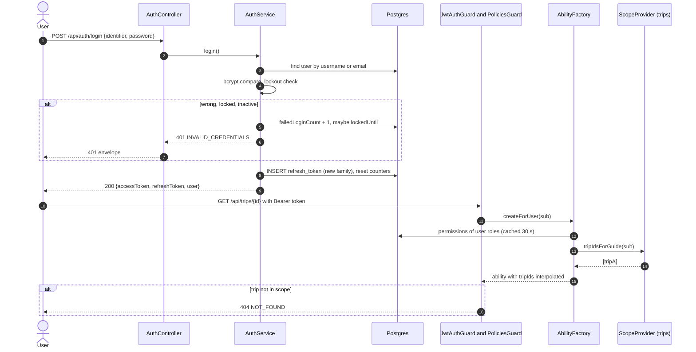
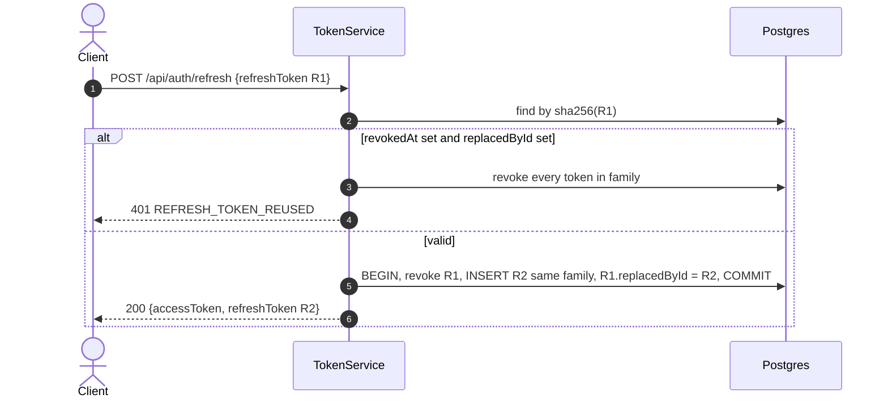
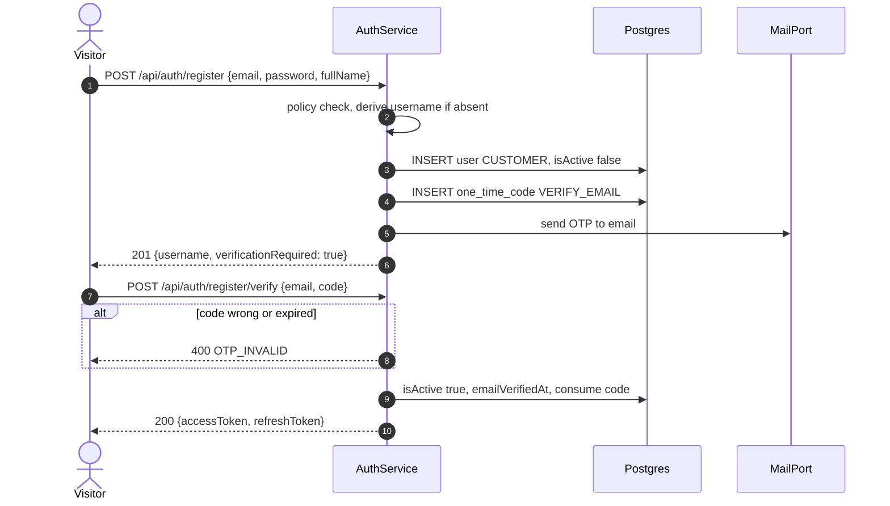
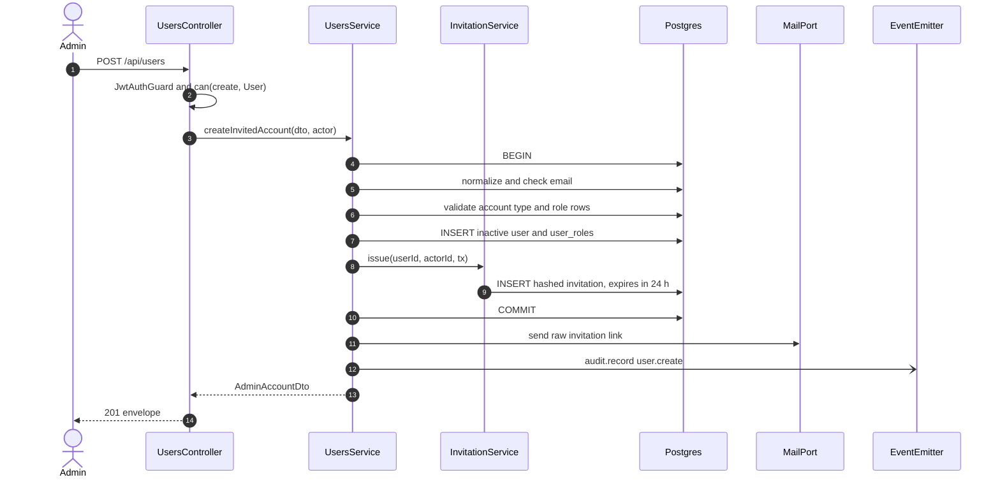
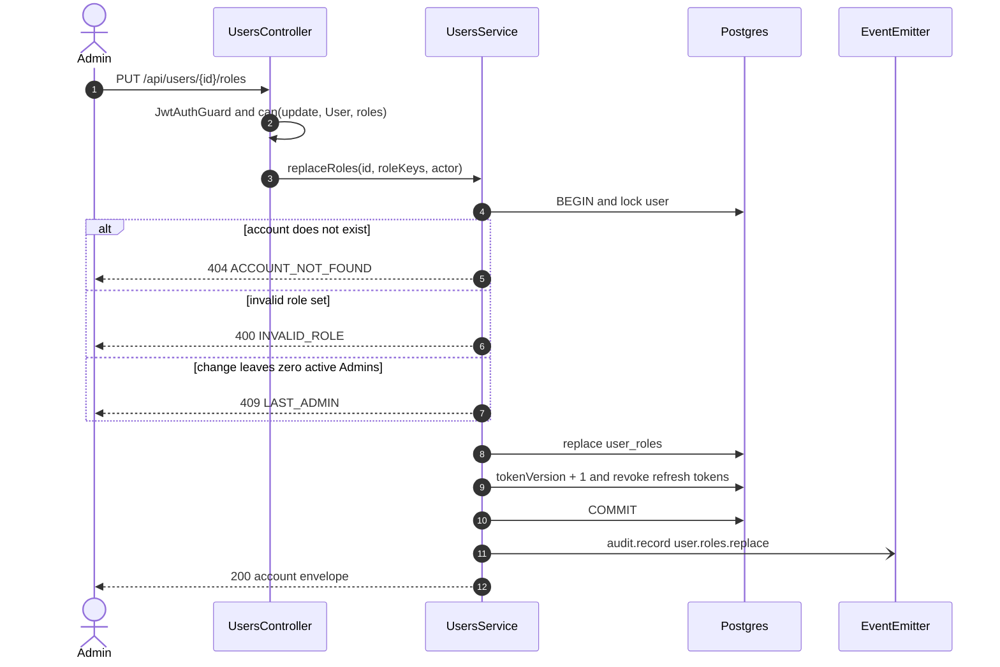
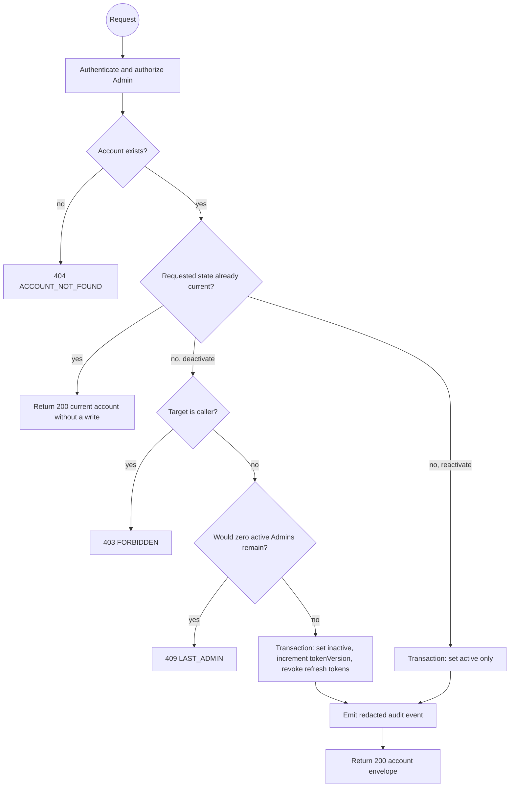

# Technical Design: auth

> Fulfills `requirements.md` in this folder. Tags `[Qnn]` mark design choices resting on a Recorded, not yet Confirmed, clarification answer.
> TK-22 requirements, design, endpoint contracts and task checklist are under leader review. Implementation remains blocked until KhoaDD or the designated lead approves the specification PR.

---

## 1. Domain Model & Data Schema

ERD slice: `specs/platform/design.md` Figure 5.

```prisma
enum AccountType { CUSTOMER STAFF }
enum OtpPurpose  { VERIFY_EMAIL SET_PASSWORD PASSWORD_RESET }

model User {
  id              String    @id @default(uuid())
  username        String    @unique              // stored lower-case; REQ-UBI-01
  email           String?   @unique              // lower-case; optional [Q41]
  emailVerifiedAt DateTime?
  phoneNumber     String?
  fullName        String
  passwordHash    String?                        // null before invitation setup or for Google-only accounts
  accountType     AccountType
  isActive        Boolean   @default(true)       // [Q45]
  tokenVersion    Int       @default(0)           // invalidates issued access tokens
  lastLoginAt     DateTime?
  failedLoginCount Int      @default(0)
  lockedUntil     DateTime?
  createdById     String?                        // Flow 2 provisioning [Q31]
  deletedAt       DateTime?                      // soft deletion retained for audit [Q36]
  createdAt       DateTime  @default(now())
  updatedAt       DateTime  @updatedAt
  roles           UserRole[]
  invitations     InvitationToken[]              // TK-22 set-password invitations
  guideProfile    GuideProfile?
  @@index([accountType, isActive])
  @@map("users")
}

model Role {
  id          String   @id @default(uuid())
  key         String   @unique                    // ADMIN, OPERATOR, GUIDE, CUSTOMER, ...
  name        String
  accountType AccountType                         // which account type may hold it
  isSystem    Boolean  @default(false)            // system roles cannot be deleted
  permissions RolePermission[]
  users       UserRole[]
  @@map("roles")
}

model Permission {
  id         String  @id @default(uuid())
  key        String  @unique                      // stable seed key, e.g. "incident.acknowledge.ownTrips"
  action     String                               // create, read, update, confirm, acknowledge, ...
  subject    String                               // Booking, Incident, ... or 'all'
  conditions Json?                                // CASL conditions with ${user.*} placeholders
  fields     String[]                             // optional field restriction
  inverted   Boolean @default(false)              // a 'cannot' rule
  reason     String?
  roles      RolePermission[]
  @@map("permissions")
}

model UserRole {
  userId      String
  roleId      String
  grantedById String?
  createdAt   DateTime @default(now())
  @@id([userId, roleId])
  @@map("user_roles")
}

model RolePermission {
  roleId       String
  permissionId String
  @@id([roleId, permissionId])
  @@map("role_permissions")
}

model RefreshToken {
  id           String    @id @default(uuid())
  userId       String
  familyId     String                              // one per login; revoked as a unit
  tokenHash    String    @unique                   // sha256 of the opaque token
  expiresAt    DateTime
  revokedAt    DateTime?
  replacedById String?
  userAgent    String?
  ip           String?
  createdAt    DateTime  @default(now())
  @@index([userId, familyId])
  @@map("refresh_tokens")
}

model OneTimeCode {
  id         String     @id @default(uuid())
  userId     String
  purpose    OtpPurpose
  codeHash   String
  attempts   Int        @default(0)
  expiresAt  DateTime
  consumedAt DateTime?
  createdAt  DateTime   @default(now())
  @@index([userId, purpose, createdAt])
  @@map("one_time_codes")
}

model InvitationToken {
  id             String    @id @default(uuid())
  userId         String
  tokenHash      String    @unique                // sha256 of a 256-bit opaque token
  expiresAt      DateTime
  consumedAt     DateTime?
  supersededAt   DateTime?
  createdById    String
  createdAt      DateTime  @default(now())
  @@index([userId, createdAt])
  @@map("invitation_tokens")
}

model GuideProfile {
  userId         String   @id
  bio            String?
  skills         String[]                          // e.g. first aid, rope rescue [Q33]
  certifications String[]
  languages      String[]
  updatedAt      DateTime @updatedAt
  @@map("guide_profiles")
}
```

Relations (`@relation` lines) are written in the migration task; they are omitted above only for readability.

`InvitationToken` is separate from `OneTimeCode`. Registration and password reset use short-lived OTP codes with attempt counters. TK-22 invitations use high-entropy link tokens, can be superseded explicitly, and expire after `auth.invitationTtlHours`, which defaults to 24 hours. Only each token's SHA-256 hash is persisted. The raw token exists only in the generated link sent through `MailPort`.

### 1.1 Why roles are rows

US-001 asks for data-driven RBAC and Q33 for an extensible sub-role list. A `Role` enum would make "add Manager" a migration and a deploy. With rows, it is an Admin action (AC-08). `Role.accountType` stops a Staff role being granted to a Customer account and the reverse (REQ-UBI-04).

### 1.2 Seeded roles and default permissions

Seeded by the platform seed migration. Actions beyond CRUD are domain verbs, so a policy reads like the use case it protects.

| Subject | ADMIN | OPERATOR | GUIDE | CUSTOMER |
|---|---|---|---|---|
| `User` | manage | read, create (Customer), resetPassword (Customer) | create (Customer, Flow 2), read (Customers on own trips) | read, update (self) |
| `Role`, `Permission` | manage | none | none | none |
| `Parameter` | read, update | read | none | none |
| `AuditLog` | read | none | none | none |
| `HardwareVariant` | manage | read | read | none |
| `Device` | read, create, update, transition | read, create, update, transition, provision | read (own trips) | none |
| `MaintenanceRecord` | read | create, update | none | none |
| `TrekPackage` | read | manage | read | read (PUBLISHED) |
| `Trip` | read | manage, transition, assignGuide | read (own), transition (own: start, finish) | read (BOOKING_OPEN or own bookings) |
| `TripRequest` | read | read, update | create, read (own) | none |
| `Booking` | read | manage, confirm, reject, cancel, extendHold | create (own trips), read (own trips), reserve (own trips) | create, read (own), reserve (own), cancel (own) |
| `Rental` | read | manage, allocate, checkout, checkin, inspect, cancel, close | read (custody), handover (custody) | read (own) |
| `RentalAgreement` | read | generate, sign | none | read (own), sign (own) |
| `Invoice` | read | read, settle | none | read (own) |
| `Payment` | read | create | none | create (own invoice) |
| `PricingRule`, `DamageFeeRule` | manage | read | none | none |
| `FeeWaiver` | read | request, approve (not own inspection) | none | none |
| `Incident` | read | read, create, acknowledge, transition, note, dismiss | read (own trips), acknowledge (own trips), note (own trips) | none |
| `GatewayEvent` | read | read | read (own trips) | none |
| `SyncAudit` | read, replay | none | none | none |
| `Monitoring` | read | read | read (own trips) | none |

"(own trips)" compiles to the CASL condition `{ "tripId": { "$in": "${user.tripIds}" } }`. `Admin` has **no** operational verbs (REQ-UBI-08); a person who needs both holds both roles.

---

## 2. Service / Business Logic Design

### 2.1 Services

| Service | Responsibility |
|---|---|
| `AuthService` | login, refresh, logout, register, verify, forgot and reset password |
| `TokenService` | sign and verify JWTs; issue, rotate and revoke refresh tokens |
| `OtpService` | issue, hash, verify and expire codes; cooldown |
| `PasswordService` | policy check against parameters, bcrypt hash and compare |
| `UsersService` (exported) | account lookup plus TK-22 list, detail, invitation-based creation, role replacement, deactivation and reactivation |
| `InvitationService` | issue, hash, supersede, consume and resend set-password invitations |
| `RoleAssignmentPolicy` | enforce Customer and Staff role-set invariants using `Role` rows |
| `AbilityFactory` (exported) | builds a CASL `PureAbility` per request from the user's permission rows plus scope |
| `RolesService` | role and permission administration |

Exported to other modules: `JwtAuthGuard`, `PoliciesGuard`, `@CheckPolicies()`, `@CurrentUser()`, `UsersService`, `AbilityFactory`, and the `accessibleWhere(ability, action, subject)` helper that turns an ability into a Prisma `where` fragment for list queries.

### 2.2 Access token claims

`{ sub, username, accountType, roles: string[], ver }`. Permissions are **not** in the token: they are loaded per request (cached per user for 30 s, invalidated on role change) so REQ-EVT-10 holds without waiting for token expiry. `ver` is copied from `User.tokenVersion`. TK-22 role replacement and deactivation increment `tokenVersion` in the same Prisma transaction that revokes refresh tokens. The JWT strategy rejects a token whose `ver` differs from the stored value.

### 2.3 Guide scope without a module cycle

A Guide's scope is the set of trip ids with an active assignment, which `trips` owns. `trips` imports `auth` for its guards, so `auth` cannot import `trips`. Resolution:

- `auth` declares an injection token `SCOPE_PROVIDER` and an interface `ScopeProvider { tripIdsForGuide(userId): Promise<string[]> }`.
- `trips` provides the implementation under that token.
- `AbilityFactory` resolves it lazily with `ModuleRef.get(SCOPE_PROVIDER, { strict: false })` on first use.

No static import from `auth` to `trips` exists, so the graph in `platform/design.md` Figure 3 stays acyclic. REQ-STA-03 holds because the provider is called per request (cached for the request only).

### 2.4 Refresh rotation

Opaque 256-bit random token, returned once, stored as `sha256`. Rotation per REQ-EVT-02; reuse per REQ-ERR-02. Families let logout and theft response revoke every descendant of one login without touching the user's other devices.

### 2.5 Lockout

`failedLoginCount` and `lockedUntil` on `User`, updated in one `UPDATE ... RETURNING` so concurrent wrong guesses cannot race past the threshold. A correct password during lockout still returns `INVALID_CREDENTIALS` (REQ-STA-01), so lockout does not become an oracle.

### 2.6 Email

`MailPort` interface with `console` and `smtp` adapters (REQ-OPT-02). OTP bodies are templated in English; Vietnamese templates follow when the locale system exists (Q9 applies to the landing page; the web app has no locale requirement yet).

### 2.7 Error catalogue

| Code | HTTP | Raised when |
|---|---|---|
| `INVALID_CREDENTIALS` | 401 | unknown identifier, wrong password, locked, inactive, unverified |
| `REFRESH_TOKEN_INVALID` | 401 | unknown, expired or revoked refresh token |
| `REFRESH_TOKEN_REUSED` | 401 | rotated token presented again |
| `OTP_INVALID` | 400 | wrong, expired or consumed code |
| `OTP_COOLDOWN` | 429 | resend inside cooldown |
| `PASSWORD_POLICY_VIOLATION` | 400 | policy failure |
| `USERNAME_TAKEN`, `EMAIL_TAKEN` | 409 | uniqueness |
| `VALIDATION_ERROR` | 400 | malformed or missing TK-22 request field |
| `INVALID_ROLE` | 400 | unknown, empty or account-type-incompatible role set |
| `INVALID_DATE_RANGE` | 400 | malformed creation date or `createdFrom` after `createdTo` |
| `INVITATION_INVALID` | 400 | unknown, expired, consumed or superseded invitation |
| `NO_REGISTERED_EMAIL` | 409 | Staff reset on an account without email |
| `ACCOUNT_NOT_FOUND` | 404 | TK-22 account id does not exist or is soft-deleted |
| `LAST_ADMIN` | 409 | role change or deactivation would leave zero active Admins |
| `INVITATION_NOT_PENDING` | 409 | invitation resend targets an account that completed setup or was deactivated after setup |
| `ROLE_ACCOUNT_TYPE_MISMATCH` | 409 | Staff role on a Customer account or the reverse |
| `SYSTEM_ROLE_IMMUTABLE` | 409 | deleting or renaming a system role |

Login deliberately collapses locked, inactive and unverified into `INVALID_CREDENTIALS` (enumeration resistance, NFR table). The UI shows one message.

### 2.8 TK-22 invariants and transactions

All TK-22 queries and writes stay inside `auth` and use Prisma. Controllers call `UsersService`; they never access Prisma directly. Other modules may use only the exported auth services and authorization contracts.

Account-type and role validation is centralized in `RoleAssignmentPolicy`:

- `CUSTOMER` requires the complete role set `['CUSTOMER']`.
- `STAFF` requires one or more roles whose `Role.accountType` is `STAFF`.
- Role keys are rows, not a TypeScript enum. `OPERATOR`, `GUIDE` and `ADMIN` are seeded rows, and later Staff roles require no schema change.
- Duplicate role keys are normalized before comparison. An empty, unknown or incompatible set returns 400 `INVALID_ROLE`.

Mutation boundaries:

| Operation | Single Prisma transaction |
|---|---|
| Create | normalize email, assert uniqueness, insert inactive user, insert role rows, insert invitation |
| Accept invitation | lock valid invitation, hash password, activate user, set `emailVerifiedAt`, consume invitation |
| Replace roles | lock user, validate the post-write active Admin count, replace all `UserRole` rows, increment `tokenVersion`, revoke every refresh token |
| Deactivate | lock user, reject self-deactivation, validate the post-write active Admin count, set `isActive=false`, increment `tokenVersion`, revoke every refresh token |
| Reactivate | lock user and set `isActive=true`; roles, profile and password are not written |

Repeated deactivation of an inactive account and repeated reactivation of an active account return the current account DTO without writing or emitting a second mutation audit. An Admin may change their own role or change or deactivate another Admin when the result retains at least one active Admin. Self-deactivation returns 403 `FORBIDDEN`. The `LAST_ADMIN` count check and the guarded write share one Prisma transaction.

After a successful commit, `UsersService` emits `audit.record` with `actorId`, action, `subjectType: 'User'`, `subjectId`, and redacted before and after objects. The platform listener owns audit persistence. Listener failure is logged with the event and correlation id and does not change the already committed account result. Invitation secrets, password hashes and token hashes are never included.

Invitation email delivery occurs after the account and invitation transaction commits. If the mail adapter fails, the account remains inactive and the invitation remains pending; the failure is logged and the Admin can retry through the resend endpoint. The endpoint maps that delivery failure through the platform exception contract, and the UI refreshes the list so the persisted account is visible.

### 2.9 TK-22 account DTO and list query

Every TK-22 account response uses one projection:

```ts
interface AdminAccountDto {
  id: string;
  username: string;
  email: string | null;
  fullName: string;
  phoneNumber: string | null;
  accountType: 'CUSTOMER' | 'STAFF';
  roles: string[];
  isActive: boolean;
  lastLoginAt: string | null;
  createdAt: string;
  updatedAt: string;
}
```

`AdminAccountListQuery` accepts `page`, `limit`, `accountType`, `role`, `isActive`, `search`, `createdFrom` and `createdTo`. `page` is 1-based. `limit` defaults to 20 and cannot exceed 100. Prisma always includes `deletedAt: null`, combines all supplied filters, uses case-insensitive matching for email and full name, orders by `createdAt DESC, id DESC`, and applies `skip` and `take`. Detail lookup also requires `deletedAt: null`, so a soft-deleted account returns `ACCOUNT_NOT_FOUND`. The result metadata uses `{ page, limit, totalCount, totalPages }`.

---

## 3. Sequence Flows

### 3.1 Login and first authorised call

See **Figure 1**.


```mermaid
sequenceDiagram
    autonumber
    actor U as User
    participant AC as AuthController
    participant AS as AuthService
    participant DB as Postgres
    participant G as JwtAuthGuard and PoliciesGuard
    participant AF as AbilityFactory
    participant SP as ScopeProvider (trips)
    U->>AC: POST /api/auth/login {identifier, password}
    AC->>AS: login()
    AS->>DB: find user by username or email
    AS->>AS: bcrypt.compare, lockout check
    alt wrong, locked, inactive
        AS->>DB: failedLoginCount + 1, maybe lockedUntil
        AS-->>AC: 401 INVALID_CREDENTIALS
        AC-->>U: 401 envelope
    end
    AS->>DB: INSERT refresh_token (new family), reset counters
    AS-->>U: 200 {accessToken, refreshToken, user}
    U->>G: GET /api/trips/{id} with Bearer token
    G->>AF: createForUser(sub)
    AF->>DB: permissions of user roles (cached 30 s)
    AF->>SP: tripIdsForGuide(sub)
    SP-->>AF: [tripA]
    AF-->>G: ability with tripIds interpolated
    alt trip not in scope
        G-->>U: 404 NOT_FOUND
    end
```

***Figure 1***: Login, then a scoped read. The scope is fetched per request, so an unassignment takes effect on the next call (REQ-STA-03).

### 3.2 Refresh rotation and reuse detection

See **Figure 2**.


```mermaid
sequenceDiagram
    autonumber
    actor U as Client
    participant TS as TokenService
    participant DB as Postgres
    U->>TS: POST /api/auth/refresh {refreshToken R1}
    TS->>DB: find by sha256(R1)
    alt revokedAt set and replacedById set
        TS->>DB: revoke every token in family
        TS-->>U: 401 REFRESH_TOKEN_REUSED
    else valid
        TS->>DB: BEGIN, revoke R1, INSERT R2 same family, R1.replacedById = R2, COMMIT
        TS-->>U: 200 {accessToken, refreshToken R2}
    end
```

***Figure 2***: A rotated token presented a second time means two holders of one token; the family is revoked so both are logged out.

### 3.3 Self-registration (Flow 1)

See **Figure 3**.


```mermaid
sequenceDiagram
    autonumber
    actor V as Visitor
    participant AS as AuthService
    participant DB as Postgres
    participant M as MailPort
    V->>AS: POST /api/auth/register {email, password, fullName}
    AS->>AS: policy check, derive username if absent
    AS->>DB: INSERT user CUSTOMER, isActive false
    AS->>DB: INSERT one_time_code VERIFY_EMAIL
    AS->>M: send OTP to email
    AS-->>V: 201 {username, verificationRequired: true}
    V->>AS: POST /api/auth/register/verify {email, code}
    alt code wrong or expired
        AS-->>V: 400 OTP_INVALID
    end
    AS->>DB: isActive true, emailVerifiedAt, consume code
    AS-->>V: 200 {accessToken, refreshToken}
```

***Figure 3***: Registration completes only on OTP verification, so an unverified email never owns an active account.

### 3.4 Admin creates an invited account

See **Figure 4**.


```mermaid
sequenceDiagram
    autonumber
    actor A as Admin
    participant C as UsersController
    participant U as UsersService
    participant I as InvitationService
    participant DB as Postgres
    participant M as MailPort
    participant E as EventEmitter
    A->>C: POST /api/users
    C->>C: JwtAuthGuard and can(create, User)
    C->>U: createInvitedAccount(dto, actor)
    U->>DB: BEGIN
    U->>DB: normalize and check email
    U->>DB: validate account type and role rows
    U->>DB: INSERT inactive user and user_roles
    U->>I: issue(userId, actorId, tx)
    I->>DB: INSERT hashed invitation, expires in 24 h
    U->>DB: COMMIT
    U->>M: send raw invitation link
    U-)E: audit.record user.create
    U-->>C: AdminAccountDto
    C-->>A: 201 envelope
```

***Figure 4***: User, roles and invitation commit together. The raw invitation token is sent once and is not stored.

### 3.5 Role replacement and session invalidation

See **Figure 5**.


```mermaid
sequenceDiagram
    autonumber
    actor A as Admin
    participant C as UsersController
    participant U as UsersService
    participant DB as Postgres
    participant E as EventEmitter
    A->>C: PUT /api/users/{id}/roles
    C->>C: JwtAuthGuard and can(update, User, roles)
    C->>U: replaceRoles(id, roleKeys, actor)
    U->>DB: BEGIN and lock user
    alt account does not exist
        U-->>A: 404 ACCOUNT_NOT_FOUND
    else invalid role set
        U-->>A: 400 INVALID_ROLE
    else change leaves zero active Admins
        U-->>A: 409 LAST_ADMIN
    end
    U->>DB: replace user_roles
    U->>DB: tokenVersion + 1 and revoke refresh tokens
    U->>DB: COMMIT
    U-)E: audit.record user.roles.replace
    U-->>A: 200 account envelope
```

***Figure 5***: The role set and both session invalidation mechanisms change atomically. The audit event is emitted only after commit.

### 3.6 Deactivate and reactivate

See **Figure 6**.


```mermaid
flowchart TB
    S((Request)) --> A[Authenticate and authorize Admin]
    A --> B{Account exists?}
    B -->|no| N[404 ACCOUNT_NOT_FOUND]
    B -->|yes| C{Requested state already current?}
    C -->|yes| I[Return 200 current account without a write]
    C -->|no, deactivate| D{Target is caller?}
    D -->|yes| X[403 FORBIDDEN]
    D -->|no| L{Would zero active Admins remain?}
    L -->|yes| Z[409 LAST_ADMIN]
    L -->|no| E[Transaction: set inactive, increment tokenVersion, revoke refresh tokens]
    C -->|no, reactivate| R[Transaction: set active only]
    E --> AU[Emit redacted audit event]
    R --> AU
    AU --> O[Return 200 account envelope]
```

***Figure 6***: Reactivation may target an inactive Admin. Neither status operation rewrites roles, profile fields or the existing password.

---

## 4. API Endpoints in this module

| # | Method | Route | Permission | Spec |
|---|---|---|---|---|
| 01 | POST | `/api/auth/register` | Public | `api-design/01-post-auth-register.md` |
| 02 | POST | `/api/auth/register/verify` | Public | `api-design/02-post-auth-register-verify.md` |
| 03 | POST | `/api/auth/login` | Public | `api-design/03-post-auth-login.md` |
| 04 | POST | `/api/auth/refresh` | Public (refresh token) | `api-design/04-post-auth-refresh.md` |
| 05 | POST | `/api/auth/logout` | Authenticated | `api-design/05-post-auth-logout.md` |
| 06 | POST | `/api/auth/password/forgot` | Public | `api-design/06-post-auth-password-forgot.md` |
| 07 | POST | `/api/auth/password/reset` | Public (OTP) | `api-design/07-post-auth-password-reset.md` |
| 08 | GET | `/api/auth/me` | Authenticated | `api-design/08-get-auth-me.md` |
| 09 | PATCH | `/api/auth/me` | Authenticated | `api-design/09-patch-auth-me.md` |
| 10 | POST | `/api/users` | Admin | `api-design/10-post-users-create.md` |
| 11 | GET | `/api/users` | Admin | `api-design/11-get-users-list.md` |
| 12 | GET | `/api/users/:id` | Admin | `api-design/12-get-users-detail.md` |
| 13 | PATCH | `/api/users/:id` | Deferred, outside TK-22 | `api-design/13-patch-users-update.md` |
| 14 | PUT | `/api/users/:id/roles` | Admin | `api-design/14-put-users-roles.md` |
| 15 | POST | `/api/users/:id/password-reset` | Operator, Admin | `api-design/15-post-users-password-reset.md` |
| 16 | GET | `/api/roles` | Admin | `api-design/16-get-roles-list.md` |
| 17 | PUT | `/api/roles/:id/permissions` | Admin | `api-design/17-put-roles-permissions.md` |
| 18 | POST | `/api/auth/invitations/accept` | Public with valid invitation | `api-design/18-post-auth-invitations-accept.md` |
| 19 | POST | `/api/users/:id/invitation/resend` | Admin | `api-design/19-post-users-invitation-resend.md` |
| 20 | POST | `/api/users/:id/deactivate` | Admin | `api-design/20-post-users-deactivate.md` |
| 21 | POST | `/api/users/:id/reactivate` | Admin | `api-design/21-post-users-reactivate.md` |

Google OAuth routes (`GET /api/auth/google`, `GET /api/auth/google/callback`) are specified by REQ-OPT-01 and get api-design files only if the approval puts them in Phase B.

---

## 5. Frontend impact

- `features/auth`: login form (identifier, password), registration (4 fields, then OTP step), forgot and reset password (2 steps).
- `shared/api/apiClient.ts` silent refresh: on 401 `UNAUTHENTICATED`, call `/api/auth/refresh` once, replay; on `REFRESH_TOKEN_*` clear the session.
- `app/providers/AuthProvider` exposes the user and a client-side CASL ability built from `GET /api/auth/me` (`permissions` field) for **display only**; the server decides.
- Zod schemas mirror `RegisterDto`, `LoginDto`, `ResetPasswordDto` exactly.
- TK-22 follows Feature-Sliced Design: `entities/user` owns `AdminAccount` types and query keys; `features/admin-user-create`, `features/admin-user-role-change`, `features/admin-user-deactivate` and `features/admin-user-reactivate` own mutation UI; `widgets/AdminUserTable` owns filters and pagination; `pages/AdminUsersPage` composes the screen.
- The list uses URL search parameters for `page`, `limit`, account type, role, status, search and creation dates. Successful mutations invalidate both `['admin-users']` and `['admin-user', id]` TanStack Query keys.
- Account detail is a route-addressable drawer or page so refresh and browser history preserve the selected account. It displays all `AdminAccountDto` fields and never receives sensitive fields.
- The create form requires email, full name, phone number, account type and roles. Selecting `CUSTOMER` fixes the role set to `CUSTOMER`. Selecting `STAFF` loads data-driven Staff roles from `GET /api/roles` and requires at least one.
- The current Admin's own row disables Deactivate with an explanation. Role changes remain available for self and other Admin accounts, and another Admin may be deactivated. The UI surfaces `LAST_ADMIN` when the server rejects a change that would leave zero active Admins. An inactive Admin shows Reactivate. The backend remains authoritative.
- Dialogs return focus to their trigger, destructive actions require confirmation, validation errors are associated with their controls, async status is announced, and all controls are keyboard operable with visible focus and WCAG 2.1 AA contrast.

---

## 6. Testing strategy

TK-22 requires unit tests before its implementation PR opens.

| Unit | Required coverage |
|---|---|
| `RoleAssignmentPolicy` | Customer exact role, Staff one or more roles, multiple Staff roles, unknown role, incompatible role, empty role set |
| `UsersService.list` | every filter, combined filters, case-insensitive search, default and maximum pagination, invalid range, newest-first tie-break, soft-deleted exclusion |
| `UsersService.createInvitedAccount` | Customer and Staff success, Admin creation, derived username, duplicate mixed-case email, validation failure, transaction rollback |
| `InvitationService` | hash-only persistence, 24-hour expiry, consume once, expired, superseded, resend invalidation, non-pending resend |
| `UsersService.replaceRoles` | full replacement, multi-role union input, self and other Admin success, last-Admin rejection, unknown or soft-deleted account, invalid role, token revocation and rollback |
| `UsersService.deactivate` | success, self-deactivation rejection, other Admin success, last-Admin rejection, unknown or soft-deleted account, idempotent inactive response, atomic status and session revocation |
| `UsersService.reactivate` | normal account, inactive Admin, unknown account, idempotent active response, profile and password preservation |
| JWT strategy | stale `ver` rejected on the next authenticated request |
| Audit emission | redacted after-commit event per successful mutation, no duplicate event for idempotent no-op, sink failure does not alter result |
| Frontend hooks and components | query serialization, cache invalidation, server error display, self-deactivation control, `LAST_ADMIN` feedback, loading, empty, success and failure states, keyboard interaction |

Prisma is mocked at the service boundary for branch-focused unit tests. Transaction tests assert that the callback receives one transaction client and that every write and token revocation uses it. Controller tests assert both guards and policy metadata on every TK-22 mutating handler. Integration and end-to-end coverage may be added later, but it does not replace the required unit suite.
