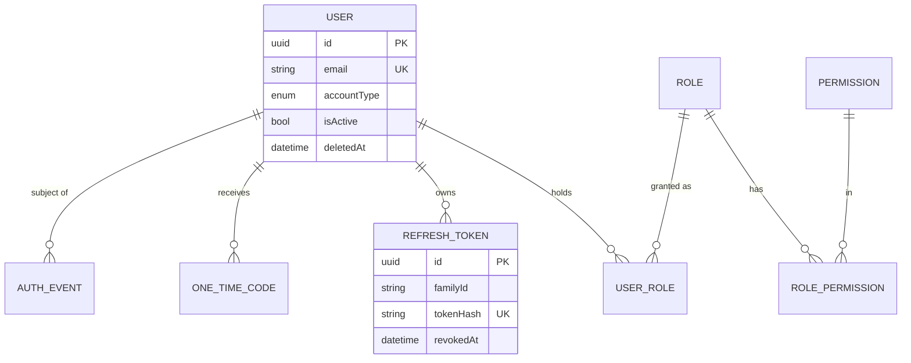
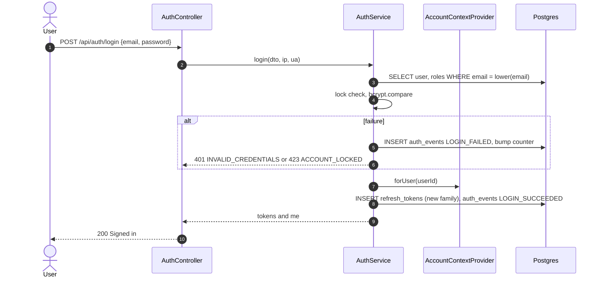

# Technical Design: auth

> Fulfills `requirements.md` in this folder. Rewritten 2026-10-04 (D-036). Schema: the `// @module auth`
> block of `backend/prisma/schema.prisma` is authoritative; this document explains it.

---

## 1. Data model


```mermaid
erDiagram
    USER ||--o{ USER_ROLE : "holds"
    ROLE ||--o{ USER_ROLE : "granted as"
    ROLE ||--o{ ROLE_PERMISSION : "has"
    PERMISSION ||--o{ ROLE_PERMISSION : "in"
    USER ||--o{ REFRESH_TOKEN : "owns"
    USER ||--o{ ONE_TIME_CODE : "receives"
    USER ||--o{ AUTH_EVENT : "subject of"
    USER {
        uuid id PK
        string email UK
        enum accountType
        bool isActive
        datetime deletedAt
    }
    REFRESH_TOKEN {
        uuid id PK
        string familyId
        string tokenHash UK
        datetime revokedAt
    }
```

***Figure 1***: auth slice. Membership (`OrganizationMember`) belongs to `organizations`.

| Model | Notes |
|---|---|
| `User` | Email is the login key, lower-case, unique across all accounts ever created. `passwordHash` is null until the invitation code is used. Soft delete by `deletedAt`. |
| `Role`, `Permission`, `RolePermission`, `UserRole` | Seeded by `20261004120100_seed` from `scripts/specs/catalog.py`; see the [Permission Matrix](permission-matrix.md). |
| `RefreshToken` | One family per sign-in; `replacedById` chains rotations so reuse is detectable. |
| `OneTimeCode` | `SET_PASSWORD` (invitation) or `PASSWORD_RESET`; SHA-256 of a six-digit code; attempts counted. |
| `AuthEvent` | Append-only (trigger); `userId` null when the email matched nothing. |

---

## 2. Tokens and the request context

Access token (HS256, `JWT_ACCESS_SECRET`): `{ sub, accountType, roles, organizationId?, memberRole?, pv }`
where `pv` is the policy version at issue. The `JwtStrategy` rebuilds the request context on every
request: the user row (active, not deleted), the role permissions from the CASL cache, and, for an
organization account, membership through `ACCOUNT_CONTEXT_PROVIDER`:

```typescript
export const ACCOUNT_CONTEXT_PROVIDER = Symbol('ACCOUNT_CONTEXT_PROVIDER');
export interface AccountContextProvider {
  // null for a TrekLink account or a deactivated member
  forUser(userId: string): Promise<{ organizationId: string; memberRole: 'MANAGER' | 'OPERATOR';
                                     organizationStatus: string } | null>;
}

export const API_KEY_RESOLVER = Symbol('API_KEY_RESOLVER');
export interface ApiKeyResolver {
  // null for an unknown or revoked key; touches lastUsedAt at most once a minute
  resolve(keyHash: string): Promise<{ apiKeyId: string; organizationId: string } | null>;
}
```

Re-reading membership per request (cached 30 s, invalidated by `member.deactivated`) is what makes
REQ-EVT-07 and REQ-STA-03 hold without waiting for the access token to expire.

`ApiKeyGuard` authenticates `X-Api-Key` into a context `{ kind: 'API_KEY', organizationId }` whose
ability is the fixed read-only set `liveMap.read.own`, `telemetryHistory.read.own`, `incident.read.own`
(BR-20). Controllers that serve the organization API accept either guard via `@AuthOneOf('jwt', 'apiKey')`.

---

## 3. Authorization

`PoliciesGuard` evaluates the handler's `@CheckPolicies((ability) => ability.can(action, subject))`.
The ability is built from the permission rows: `conditions` placeholders `${user.organizationId}` are
interpolated from the request context, never from the request. Record-level checks use
`ability.can('read', subject('Incident', row))` after loading the row; a mismatch on an `own`
condition answers 404 (scoped 404 rule, `platform` design §4.2), a missing permission 403.

Scoping helper for queries: `scopeWhere(ctx)` returns `{}` for TrekLink accounts and
`{ organizationId: ctx.organizationId }` for members and keys; every repository method that serves an
organization takes it. The cross-organization e2e test per module (NFR-SEC-04) exercises it.

The CASL cache is keyed by role and invalidated on `policy.changed`, so a permission edit applies on the
next request (FR-AUTH-06).

---

## 4. Error catalogue

| Code | HTTP | Where |
|---|---|---|
| `INVALID_CREDENTIALS` | 401 | sign-in, password change |
| `ACCOUNT_LOCKED` | 423 | sign-in |
| `REFRESH_INVALID` | 401 | refresh |
| `REFRESH_REUSED` | 401 | refresh |
| `CODE_INVALID` | 400 | reset, invitation |
| `OTP_COOLDOWN` | 429 | forgot password |
| `PASSWORD_POLICY` | 400 | reset, invitation, change |
| `SELF_DEMOTION` | 409 | account edit |
| `LAST_ADMIN` | 409 | account deactivate, role edit |
| `UNKNOWN_PERMISSION` | 400 | role permissions |
| `ADMIN_LOCKOUT` | 409 | role permissions |

---

## 5. Services other modules call

| Method | Caller | Purpose |
|---|---|---|
| `AccountsService.createOrganizationAccount({ email, fullName, phone, role }, tx)` | organizations | Member invitation and the registering Manager; sends the `SET_PASSWORD` code after commit |
| `AccountsService.setOrganizationRole(userId, role, tx)` | organizations | Manager changes a member's role |
| `AccountsService.deactivate(userId, reason, actor, tx)` | organizations | Member deactivation and organization closing |
| `AccountsService.contactCard(userIds)` | incidents | Name, email and phone for alert delivery |

---

## 6. Sequence: sign-in


```mermaid
sequenceDiagram
    autonumber
    actor U as User
    participant C as AuthController
    participant S as AuthService
    participant P as AccountContextProvider
    participant DB as Postgres
    U->>C: POST /api/auth/login {email, password}
    C->>S: login(dto, ip, ua)
    S->>DB: SELECT user, roles WHERE email = lower(email)
    S->>S: lock check, bcrypt.compare
    alt failure
        S->>DB: INSERT auth_events LOGIN_FAILED, bump counter
        S-->>C: 401 INVALID_CREDENTIALS or 423 ACCOUNT_LOCKED
    end
    S->>P: forUser(userId)
    S->>DB: INSERT refresh_tokens (new family), auth_events LOGIN_SUCCEEDED
    S-->>C: tokens and me
    C-->>U: 200 Signed in
```

***Figure 2***: Sign-in.

---

## 7. Testing strategy

- Unit: token rotation and reuse, lockout window, code attempts and expiry, CASL interpolation (no
  request value can set `organizationId`), last-Admin guard.
- E2E: every api-design Validation row; the cross-organization 404 suite shared by all modules lives in
  `backend/test/tenancy.e2e-spec.ts` and is extended by each module.
