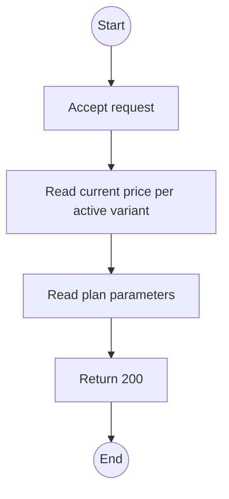
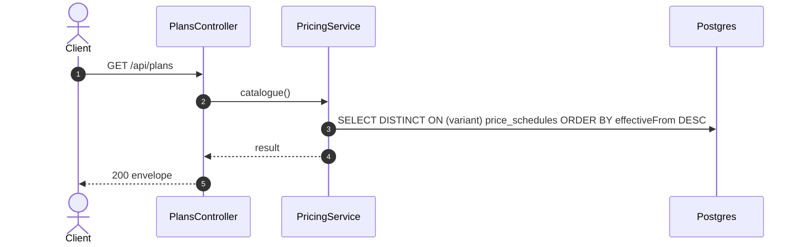

# GET /api/plans: Public plan catalogue

> Module `billing`. Generated from `scripts/specs/endpoints/billing.py` by `scripts/specs/build_api_design.py`; edit the catalog, not this file. Format: `02-templates/04-api-endpoint-template.md` with Mermaid (D-017). Envelope: D-002.

[TOC]

---
## Overview

What the website sells: every active hardware variant with its current monthly price per device, the day-plan lengths and premium, the holding-fee ratio and the minimum order quantity. All values come from configuration (BR-29).

## API Specification

| API | URL |
| --- | --- |
| GET | /api/plans |
| Permission | Public |
| Traces | UC-56, FR-BILL-01, FR-BILL-02, BR-02, BR-29 |

## Request sample

No body.

## Response sample

```json
{
  "result": {
    "minOrderQuantity": 5,
    "holdingFeeRatio": 0.5,
    "dayPlanLengths": [
      3,
      4,
      7
    ],
    "dayPremium": 1.5,
    "variants": [
      {
        "id": "a1b2c3d4-e5f6-4a7b-8c9d-0e1f2a3b4c5d",
        "code": "treklink-v3",
        "name": "TrekLink v3 (GPS, SOS button)",
        "monthlyPriceVnd": 450000,
        "dayPriceVnd": 22500
      }
    ],
    "sandbox": true
  },
  "isSuccess": true,
  "statusCode": 200,
  "message": "OK"
}
```

## Validation

<table>
    <th>Status code</th>
    <th>Description</th>
    <th>Examples</th>
    <tbody>
    </tbody>
</table>

## Activity Diagram



## Sequence Diagram


