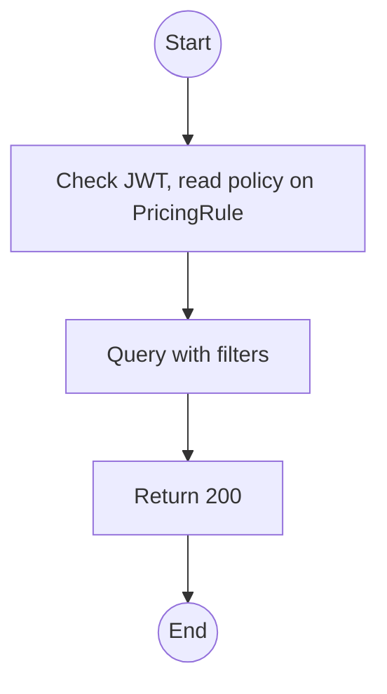
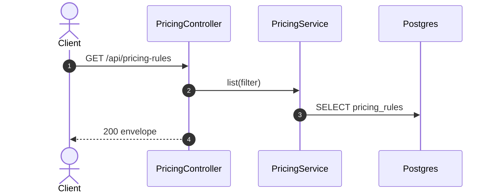

# GET /api/pricing-rules: List pricing rules

> Module `billing`. Format: `02-templates/04-api-endpoint-template.md`, with Mermaid in place of PlantUML (D-017). Envelope: D-002.

[TOC]

---
## Overview

All pricing rules with scope, channel, tier and validity, for the Admin pricing page and the Configuration Matrix.

## API Specification

| API        | URL             |
| ---------- | --------------- |
| GET | /api/pricing-rules |
| Permission | Admin, Operator (read) |
| Traces | US-067, UC-40 (new), FR-BILL-03 (new), BR-23 |

### Query parameters

| Field | Description | Data Type | Required | Examples |
| --- | --- | --- | --- | --- |
| component | TRIP_FEE, RENTAL_FEE, DEPOSIT | enum | no | `RENTAL_FEE` |
| packageId | Package | uuid | no | `pk-01...` |
| activeOn | Only rules valid at this time | datetime | no | `2026-10-10T00:00:00Z` |

## Request sample

No request body. Query string example:

```
GET /api/pricing-rules?component=DEPOSIT
```

## Response sample

```json
{
  "result": [
    {
      "id": "pr-1...",
      "name": "TN-PD rental fee, customer",
      "component": "RENTAL_FEE",
      "scope": "PACKAGE",
      "packageId": "pk-01...",
      "hardwareVariantId": null,
      "channel": "CUSTOMER",
      "unit": "PER_DEVICE_PER_TRIP",
      "amount": 150000,
      "minQuantity": 1,
      "priority": 0,
      "validFrom": "2026-09-01T00:00:00Z",
      "validTo": null,
      "isActive": true
    }
  ],
  "isSuccess": true,
  "statusCode": 200,
  "message": "Pricing rules retrieved"
}
```

## Validation

<table>
    <th>Status code</th>
    <th>Description</th>
    <th>Examples</th>
    <tbody>
        <tr>
            <td>401</td>
            <td>Missing, malformed or expired access token (<code>UNAUTHENTICATED</code>)</td>
<td>

```json
{
  "result": {
    "errorCode": "UNAUTHENTICATED"
  },
  "isSuccess": false,
  "statusCode": 401,
  "message": "Authentication required."
}
```
</td>
        </tr>
        <tr>
            <td>403</td>
            <td>Authenticated, but the caller's role or policy does not allow this action (<code>FORBIDDEN</code>)</td>
<td>

```json
{
  "result": {
    "errorCode": "FORBIDDEN"
  },
  "isSuccess": false,
  "statusCode": 403,
  "message": "You do not have permission to perform this action."
}
```
</td>
        </tr>
    </tbody>
</table>

## Activity Diagram



## Sequence Diagram


