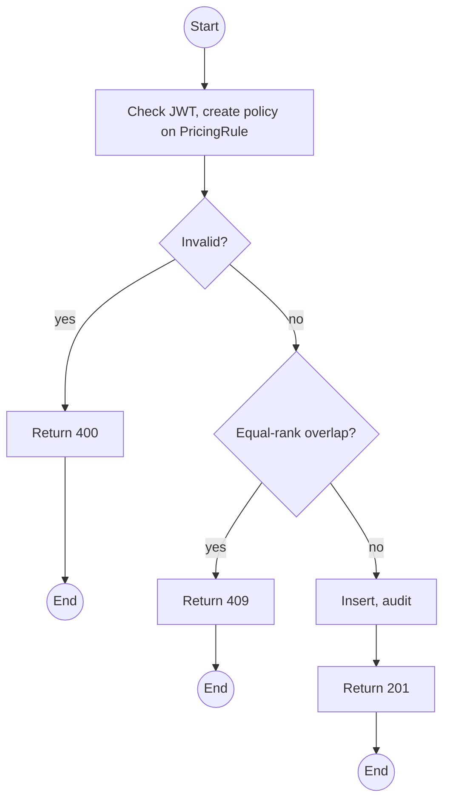
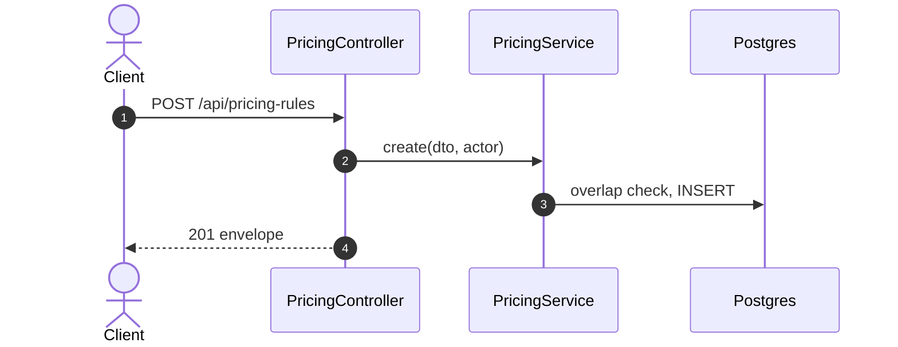

# POST /api/pricing-rules: Create a pricing rule

> Module `billing`. Format: `02-templates/04-api-endpoint-template.md`, with Mermaid in place of PlantUML (D-017). Envelope: D-002.

[TOC]

---
## Overview

Adds a price, deposit or trip fee rule. Quantity tiers are separate rules with a higher `minQuantity` (pack discounts); per-channel prices are rules with a `channel`. A rule equal in rank to an overlapping active rule is rejected so selection is never ambiguous.

## API Specification

| API        | URL             |
| ---------- | --------------- |
| POST | /api/pricing-rules |
| Permission | Admin |
| Traces | US-067, FR-BILL-03, BR-23, REQ-ERR-02, Q61, Q63 |

## Request sample

```json
{
  "name": "TN-PD deposit, v4, 5 or more",
  "component": "DEPOSIT",
  "scope": "PACKAGE_VARIANT",
  "packageId": "pk-01...",
  "hardwareVariantId": "hv-04...",
  "channel": null,
  "unit": "PER_DEVICE_PER_TRIP",
  "amount": 250000,
  "minQuantity": 5,
  "priority": 0,
  "validFrom": "2026-10-01T00:00:00Z",
  "validTo": null
}
```

| Field | Description | Data Type | Required | Examples |
| --- | --- | --- | --- | --- |
| name | Label | string | yes | `TN-PD deposit` |
| component | TRIP_FEE, RENTAL_FEE, DEPOSIT | enum | yes | `DEPOSIT` |
| scope | GLOBAL, PACKAGE, VARIANT, PACKAGE_VARIANT; ids must match the scope | enum | yes | `PACKAGE_VARIANT` |
| packageId | Required for PACKAGE scopes | uuid | no | `pk-01...` |
| hardwareVariantId | Required for VARIANT scopes | uuid | no | `hv-04...` |
| channel | CUSTOMER, GUIDE, STAFF, or null for any | enum | no | `null` |
| unit | PER_TRAVELLER for TRIP_FEE; device units otherwise | enum | yes | `PER_DEVICE_PER_TRIP` |
| amount | Non-negative VND | decimal | yes | `250000` |
| minQuantity | Tier threshold, 1 or more | int | no | `5` |
| priority | Tie-breaker | int | no | `0` |
| validFrom | Start | datetime | yes | `2026-10-01T00:00:00Z` |
| validTo | End, or null | datetime | no | `null` |

## Response sample

```json
{
  "result": {
    "id": "pr-9...",
    "name": "TN-PD rental fee, customer",
    "component": "DEPOSIT",
    "scope": "PACKAGE_VARIANT",
    "packageId": "pk-01...",
    "hardwareVariantId": "hv-04...",
    "channel": null,
    "unit": "PER_DEVICE_PER_TRIP",
    "amount": 250000,
    "minQuantity": 5,
    "priority": 0,
    "validFrom": "2026-09-01T00:00:00Z",
    "validTo": null,
    "isActive": true
  },
  "isSuccess": true,
  "statusCode": 201,
  "message": "Pricing rule created"
}
```

## Validation

<table>
    <th>Status code</th>
    <th>Description</th>
    <th>Examples</th>
    <tbody>
        <tr>
            <td>400</td>
            <td>Scope and ids disagree, unit invalid for component, negative amount (<code>VALIDATION_FAILED</code>)</td>
<td>

```json
{
  "result": {
    "errorCode": "VALIDATION_FAILED"
  },
  "isSuccess": false,
  "statusCode": 400,
  "message": "PACKAGE_VARIANT scope requires packageId and hardwareVariantId."
}
```
</td>
        </tr>
        <tr>
            <td>401</td>
            <td>Missing, malformed or expired access token (<code>UNAUTHENTICATED</code>)</td>
<td>

```json
{
  "result": {
    "errorCode": "UNAUTHENTICATED"
  },
  "isSuccess": false,
  "statusCode": 401,
  "message": "Authentication required."
}
```
</td>
        </tr>
        <tr>
            <td>403</td>
            <td>Authenticated, but the caller's role or policy does not allow this action (<code>FORBIDDEN</code>)</td>
<td>

```json
{
  "result": {
    "errorCode": "FORBIDDEN"
  },
  "isSuccess": false,
  "statusCode": 403,
  "message": "You do not have permission to perform this action."
}
```
</td>
        </tr>
        <tr>
            <td>409</td>
            <td>Equal-rank overlapping active rule (<code>PRICING_RULE_CONFLICT</code>)</td>
<td>

```json
{
  "result": {
    "errorCode": "PRICING_RULE_CONFLICT"
  },
  "isSuccess": false,
  "statusCode": 409,
  "message": "Rule pr-7 has the same scope, channel, tier and priority over overlapping dates."
}
```
</td>
        </tr>
    </tbody>
</table>

## Activity Diagram



## Sequence Diagram


