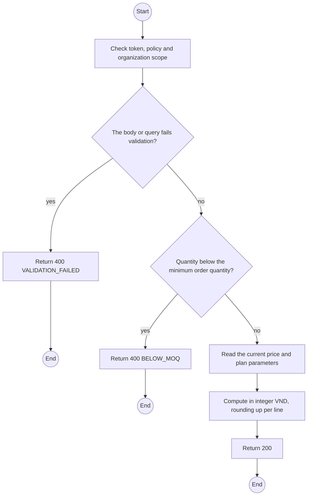
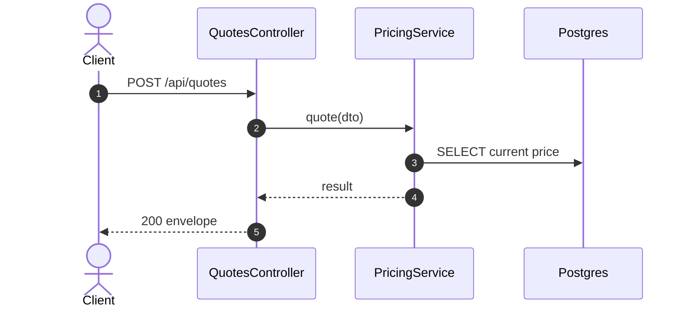

# POST /api/quotes: Quote a plan

> Module `billing`. Generated from `scripts/specs/endpoints/billing.py` by `scripts/specs/build_api_design.py`; edit the catalog, not this file. Format: `02-templates/04-api-endpoint-template.md` with Mermaid (D-017). Envelope: D-002.

[TOC]

---
## Overview

Prices a prospective contract before it is requested: first payment, term fee or day-plan total (FR-BILL-01, FR-BILL-02). Nothing is stored.

## API Specification

| API | URL |
| --- | --- |
| POST | /api/quotes |
| Permission | Org Manager: own; TrekLink Staff |
| Traces | UC-15, FR-BILL-01, FR-BILL-02, BR-06, BR-07 |

## Request sample

```json
{
  "planType": "DAY",
  "dayPlanDays": 4,
  "hardwareVariantId": "a1b2c3d4-e5f6-4a7b-8c9d-0e1f2a3b4c5d",
  "quantity": 8
}
```

| Field | Description | Data Type | Required | Examples |
| --- | --- | --- | --- | --- |
| planType | `MONTHLY` or `DAY` | enum | yes | `DAY` |
| dayPlanDays | DAY only | int | cond. | `4` |
| hardwareVariantId | Variant | uuid | yes | `a1b2c3d4-e5f6-4a7b-8c9d-0e1f2a3b4c5d` |
| quantity | Devices | int | yes | `8` |

## Response sample

```json
{
  "result": {
    "planType": "DAY",
    "quantity": 8,
    "unitPerDayVnd": 22500,
    "days": 4,
    "totalVnd": 720000,
    "firstPaymentVnd": 720000,
    "formula": "450000 / 30 x 1.5 x 4 x 8"
  },
  "isSuccess": true,
  "statusCode": 200,
  "message": "OK"
}
```

## Validation

<table>
    <th>Status code</th>
    <th>Description</th>
    <th>Examples</th>
    <tbody>
        <tr>
            <td>400</td>
            <td>The body or query fails validation (<code>VALIDATION_FAILED</code>)</td>
<td>

```json
{
  "result": {
    "errorCode": "VALIDATION_FAILED"
  },
  "isSuccess": false,
  "statusCode": 400,
  "message": "{field} is required."
}
```
</td>
        </tr>
        <tr>
            <td>401</td>
            <td>Missing, malformed or expired access token or API key (<code>UNAUTHENTICATED</code>)</td>
<td>

```json
{
  "result": {
    "errorCode": "UNAUTHENTICATED"
  },
  "isSuccess": false,
  "statusCode": 401,
  "message": "Authentication required."
}
```
</td>
        </tr>
        <tr>
            <td>403</td>
            <td>The caller's role, policy or organization does not allow this action (<code>FORBIDDEN</code>)</td>
<td>

```json
{
  "result": {
    "errorCode": "FORBIDDEN"
  },
  "isSuccess": false,
  "statusCode": 403,
  "message": "You do not have access to this."
}
```
</td>
        </tr>
        <tr>
            <td>400</td>
            <td>Quantity below the minimum order quantity (<code>BELOW_MOQ</code>)</td>
<td>

```json
{
  "result": {
    "errorCode": "BELOW_MOQ"
  },
  "isSuccess": false,
  "statusCode": 400,
  "message": "The minimum order is 5 devices."
}
```
</td>
        </tr>
    </tbody>
</table>

## Activity Diagram



## Sequence Diagram


