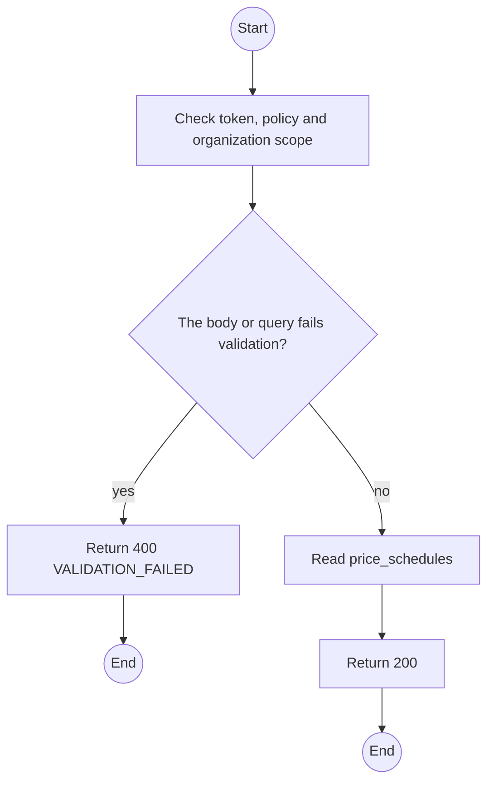
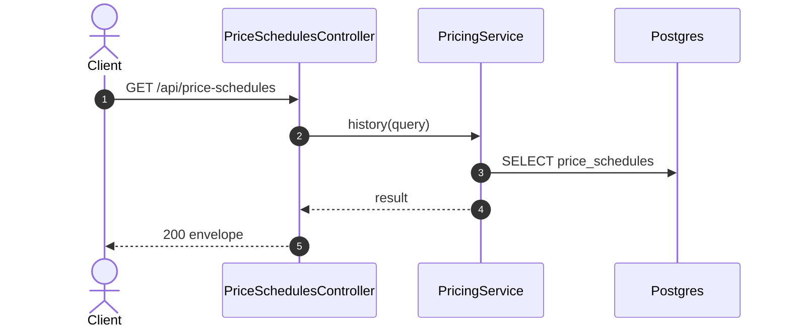

# GET /api/price-schedules: Price history

> Module `billing`. Generated from `scripts/specs/endpoints/billing.py` by `scripts/specs/build_api_design.py`; edit the catalog, not this file. Format: `02-templates/04-api-endpoint-template.md` with Mermaid (D-017). Envelope: D-002.

[TOC]

---
## Overview

Lists the append-only monthly price schedule per variant, current and future rows included.

## API Specification

| API | URL |
| --- | --- |
| GET | /api/price-schedules |
| Permission | TrekLink Admin |
| Traces | UC-56, FR-CFG-02 |

### Query parameters

| Field | Description | Data Type | Required | Examples |
| --- | --- | --- | --- | --- |
| hardwareVariantId | Variant | uuid | no | `a1b2c3d4-e5f6-4a7b-8c9d-0e1f2a3b4c5d` |
| pageNumber | 1-based page | int | no | `1` |
| pageSize | Items per page, at most MAX_PAGE_SIZE | int | no | `20` |

## Request sample

No body.

## Response sample

```json
{
  "result": {
    "items": [
      {
        "id": "ps-1",
        "hardwareVariantId": "a1b2c3d4-e5f6-4a7b-8c9d-0e1f2a3b4c5d",
        "monthlyPriceVnd": 450000,
        "effectiveFrom": "2026-10-01T00:00:00Z",
        "createdBy": "TrekLink Admin",
        "createdAt": "2026-10-20T03:15:00.000Z"
      }
    ],
    "pageNumber": 1,
    "pageSize": 20,
    "totalCount": 1,
    "totalPages": 1
  },
  "isSuccess": true,
  "statusCode": 200,
  "message": "OK"
}
```

## Validation

<table>
    <th>Status code</th>
    <th>Description</th>
    <th>Examples</th>
    <tbody>
        <tr>
            <td>400</td>
            <td>The body or query fails validation (<code>VALIDATION_FAILED</code>)</td>
<td>

```json
{
  "result": {
    "errorCode": "VALIDATION_FAILED"
  },
  "isSuccess": false,
  "statusCode": 400,
  "message": "{field} is required."
}
```
</td>
        </tr>
        <tr>
            <td>401</td>
            <td>Missing, malformed or expired access token or API key (<code>UNAUTHENTICATED</code>)</td>
<td>

```json
{
  "result": {
    "errorCode": "UNAUTHENTICATED"
  },
  "isSuccess": false,
  "statusCode": 401,
  "message": "Authentication required."
}
```
</td>
        </tr>
        <tr>
            <td>403</td>
            <td>The caller's role, policy or organization does not allow this action (<code>FORBIDDEN</code>)</td>
<td>

```json
{
  "result": {
    "errorCode": "FORBIDDEN"
  },
  "isSuccess": false,
  "statusCode": 403,
  "message": "You do not have access to this."
}
```
</td>
        </tr>
    </tbody>
</table>

## Activity Diagram



## Sequence Diagram


