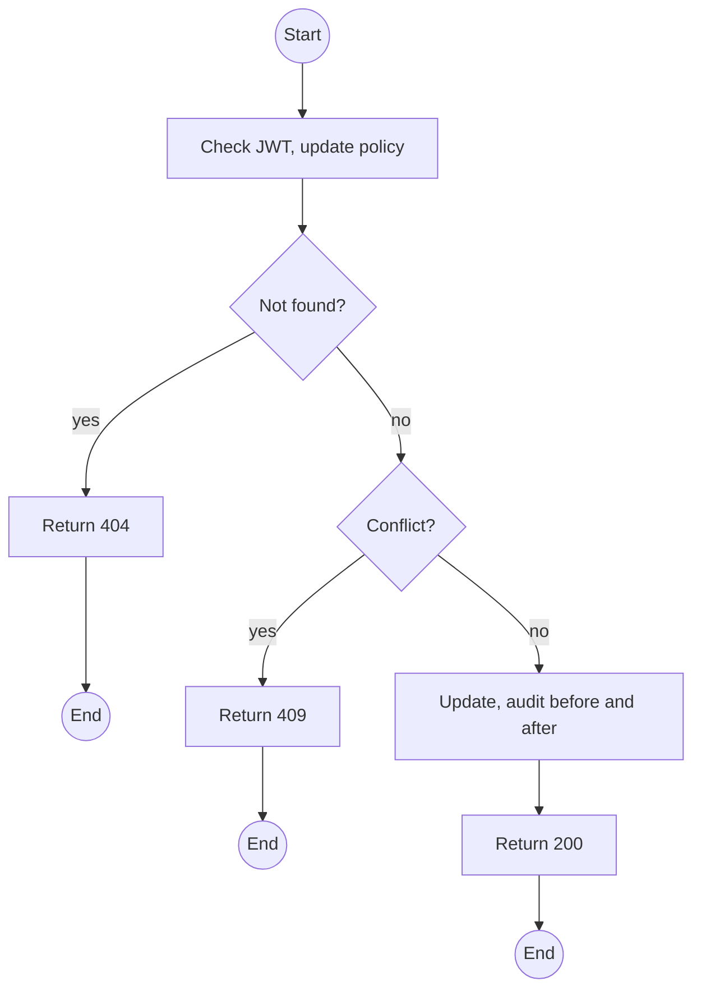
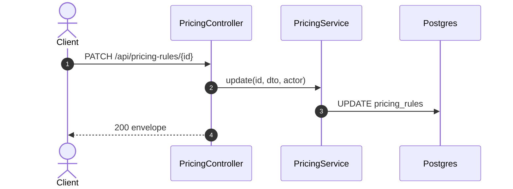

# PATCH /api/pricing-rules/:id: Edit or retire a pricing rule

> Module `billing`. Format: `02-templates/04-api-endpoint-template.md`, with Mermaid in place of PlantUML (D-017). Envelope: D-002.

[TOC]

---
## Overview

Changes amount, validity, priority or active flag. Issued invoices are immutable, so a change affects only quotes and invoices issued afterwards; to change a price from a date, end the old rule (`validTo`) and create a new one, which keeps history readable.

## API Specification

| API        | URL             |
| ---------- | --------------- |
| PATCH | /api/pricing-rules/:id |
| Permission | Admin |
| Traces | US-067, BR-23, D-015 |

### Path parameters

| Field | Description | Data Type | Examples |
| --- | --- | --- | --- |
| id | Rule id | uuid | `pr-1...` |

## Request sample

```json
{
  "amount": 170000
}
```

| Field | Description | Data Type | Required | Examples |
| --- | --- | --- | --- | --- |
| amount | Non-negative VND | decimal | no | `170000` |
| validTo | End date | datetime | no | `2026-12-31T23:59:59Z` |
| priority | Tie-breaker | int | no | `1` |
| isActive | Retire or reactivate | bool | no | `false` |

## Response sample

```json
{
  "result": {
    "id": "pr-1...",
    "name": "TN-PD rental fee, customer",
    "component": "RENTAL_FEE",
    "scope": "PACKAGE",
    "packageId": "pk-01...",
    "hardwareVariantId": null,
    "channel": "CUSTOMER",
    "unit": "PER_DEVICE_PER_TRIP",
    "amount": 170000,
    "minQuantity": 1,
    "priority": 0,
    "validFrom": "2026-09-01T00:00:00Z",
    "validTo": null,
    "isActive": true
  },
  "isSuccess": true,
  "statusCode": 200,
  "message": "Pricing rule updated"
}
```

## Validation

<table>
    <th>Status code</th>
    <th>Description</th>
    <th>Examples</th>
    <tbody>
        <tr>
            <td>401</td>
            <td>Missing, malformed or expired access token (<code>UNAUTHENTICATED</code>)</td>
<td>

```json
{
  "result": {
    "errorCode": "UNAUTHENTICATED"
  },
  "isSuccess": false,
  "statusCode": 401,
  "message": "Authentication required."
}
```
</td>
        </tr>
        <tr>
            <td>403</td>
            <td>Authenticated, but the caller's role or policy does not allow this action (<code>FORBIDDEN</code>)</td>
<td>

```json
{
  "result": {
    "errorCode": "FORBIDDEN"
  },
  "isSuccess": false,
  "statusCode": 403,
  "message": "You do not have permission to perform this action."
}
```
</td>
        </tr>
        <tr>
            <td>404</td>
            <td>No such rule (<code>NOT_FOUND</code>)</td>
<td>

```json
{
  "result": {
    "errorCode": "NOT_FOUND"
  },
  "isSuccess": false,
  "statusCode": 404,
  "message": "Pricing rule not found."
}
```
</td>
        </tr>
        <tr>
            <td>409</td>
            <td>Reactivation would create an equal-rank overlap (<code>PRICING_RULE_CONFLICT</code>)</td>
<td>

```json
{
  "result": {
    "errorCode": "PRICING_RULE_CONFLICT"
  },
  "isSuccess": false,
  "statusCode": 409,
  "message": "Rule pr-7 has the same rank over overlapping dates."
}
```
</td>
        </tr>
    </tbody>
</table>

## Activity Diagram



## Sequence Diagram


