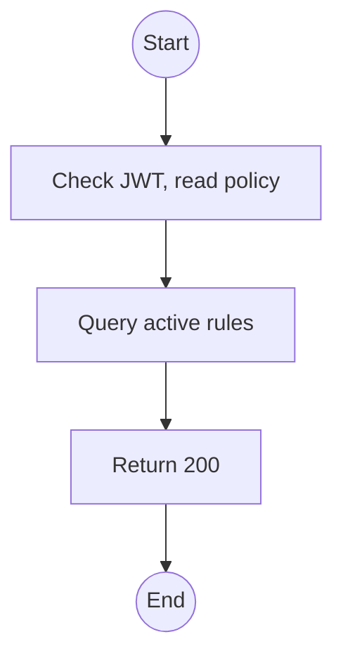
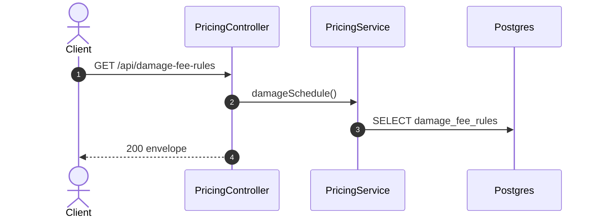

# GET /api/damage-fee-rules: Damage and loss fee schedule

> Module `billing`. Format: `02-templates/04-api-endpoint-template.md`, with Mermaid in place of PlantUML (D-017). Envelope: D-002.

[TOC]

---
## Overview

The fee per return condition, per variant or for any variant, including `LOST`.

## API Specification

| API        | URL             |
| ---------- | --------------- |
| GET | /api/damage-fee-rules |
| Permission | Admin, Operator (read) |
| Traces | UC-25, BR-20, E05-2, E05-3 |

## Request sample

No request body.

## Response sample

```json
{
  "result": [
    {
      "condition": "MINOR_DAMAGE",
      "hardwareVariantId": null,
      "amount": 150000
    },
    {
      "condition": "MAJOR_DAMAGE",
      "hardwareVariantId": "hv-03...",
      "amount": 700000
    },
    {
      "condition": "LOST",
      "hardwareVariantId": "hv-03...",
      "amount": 3500000
    }
  ],
  "isSuccess": true,
  "statusCode": 200,
  "message": "Damage fee schedule retrieved"
}
```

## Validation

<table>
    <th>Status code</th>
    <th>Description</th>
    <th>Examples</th>
    <tbody>
        <tr>
            <td>401</td>
            <td>Missing, malformed or expired access token (<code>UNAUTHENTICATED</code>)</td>
<td>

```json
{
  "result": {
    "errorCode": "UNAUTHENTICATED"
  },
  "isSuccess": false,
  "statusCode": 401,
  "message": "Authentication required."
}
```
</td>
        </tr>
        <tr>
            <td>403</td>
            <td>Authenticated, but the caller's role or policy does not allow this action (<code>FORBIDDEN</code>)</td>
<td>

```json
{
  "result": {
    "errorCode": "FORBIDDEN"
  },
  "isSuccess": false,
  "statusCode": 403,
  "message": "You do not have permission to perform this action."
}
```
</td>
        </tr>
    </tbody>
</table>

## Activity Diagram



## Sequence Diagram


