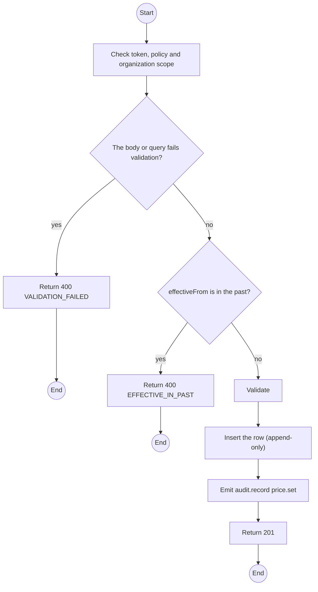
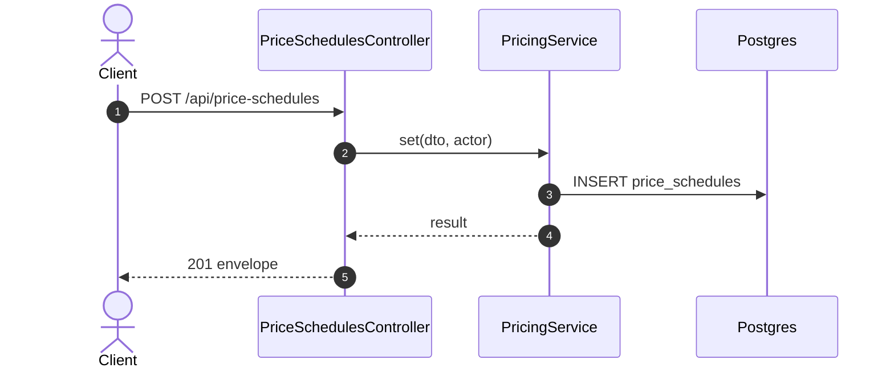

# POST /api/price-schedules: Set a monthly price

> Module `billing`. Generated from `scripts/specs/endpoints/billing.py` by `scripts/specs/build_api_design.py`; edit the catalog, not this file. Format: `02-templates/04-api-endpoint-template.md` with Mermaid (D-017). Envelope: D-002.

[TOC]

---
## Overview

Adds a monthly price per device for a variant, effective from a time not in the past. Contracts already requested keep their snapshot (FR-CFG-02).

## API Specification

| API | URL |
| --- | --- |
| POST | /api/price-schedules |
| Permission | TrekLink Admin |
| Traces | UC-56, FR-CFG-01, FR-CFG-02 |

## Request sample

```json
{
  "hardwareVariantId": "a1b2c3d4-e5f6-4a7b-8c9d-0e1f2a3b4c5d",
  "monthlyPriceVnd": 480000,
  "effectiveFrom": "2026-11-01T00:00:00Z"
}
```

| Field | Description | Data Type | Required | Examples |
| --- | --- | --- | --- | --- |
| hardwareVariantId | Variant | uuid | yes | `a1b2c3d4-e5f6-4a7b-8c9d-0e1f2a3b4c5d` |
| monthlyPriceVnd | Positive integer VND | int | yes | `480000` |
| effectiveFrom | Now or later | datetime | yes | `2026-11-01T00:00:00Z` |

## Response sample

```json
{
  "result": {
    "id": "ps-2",
    "hardwareVariantId": "a1b2c3d4-e5f6-4a7b-8c9d-0e1f2a3b4c5d",
    "monthlyPriceVnd": 480000,
    "effectiveFrom": "2026-11-01T00:00:00Z"
  },
  "isSuccess": true,
  "statusCode": 201,
  "message": "Price scheduled"
}
```

## Validation

<table>
    <th>Status code</th>
    <th>Description</th>
    <th>Examples</th>
    <tbody>
        <tr>
            <td>400</td>
            <td>The body or query fails validation (<code>VALIDATION_FAILED</code>)</td>
<td>

```json
{
  "result": {
    "errorCode": "VALIDATION_FAILED"
  },
  "isSuccess": false,
  "statusCode": 400,
  "message": "{field} is required."
}
```
</td>
        </tr>
        <tr>
            <td>401</td>
            <td>Missing, malformed or expired access token or API key (<code>UNAUTHENTICATED</code>)</td>
<td>

```json
{
  "result": {
    "errorCode": "UNAUTHENTICATED"
  },
  "isSuccess": false,
  "statusCode": 401,
  "message": "Authentication required."
}
```
</td>
        </tr>
        <tr>
            <td>403</td>
            <td>The caller's role, policy or organization does not allow this action (<code>FORBIDDEN</code>)</td>
<td>

```json
{
  "result": {
    "errorCode": "FORBIDDEN"
  },
  "isSuccess": false,
  "statusCode": 403,
  "message": "You do not have access to this."
}
```
</td>
        </tr>
        <tr>
            <td>400</td>
            <td>effectiveFrom is in the past (<code>EFFECTIVE_IN_PAST</code>)</td>
<td>

```json
{
  "result": {
    "errorCode": "EFFECTIVE_IN_PAST"
  },
  "isSuccess": false,
  "statusCode": 400,
  "message": "effectiveFrom must not be in the past."
}
```
</td>
        </tr>
    </tbody>
</table>

## Activity Diagram



## Sequence Diagram


