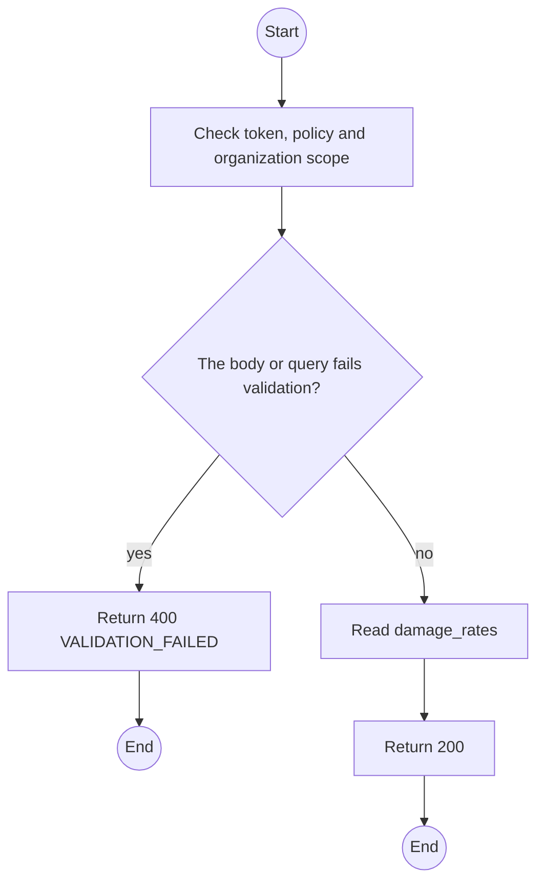
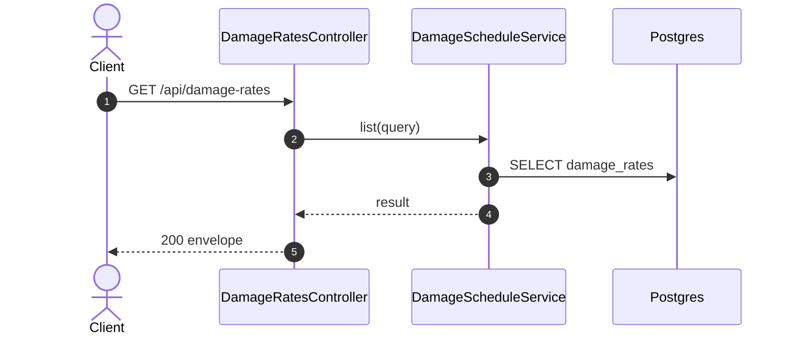

# GET /api/damage-rates: Damage schedule

> Module `billing`. Generated from `scripts/specs/endpoints/billing.py` by `scripts/specs/build_api_design.py`; edit the catalog, not this file. Format: `02-templates/04-api-endpoint-template.md` with Mermaid (D-017). Envelope: D-002.

[TOC]

---
## Overview

Lists the damage codes with their amount, generic or per variant (FR-BILL-04).

## API Specification

| API | URL |
| --- | --- |
| GET | /api/damage-rates |
| Permission | TrekLink Staff, TrekLink Admin |
| Traces | UC-47, FR-BILL-04 |

### Query parameters

| Field | Description | Data Type | Required | Examples |
| --- | --- | --- | --- | --- |
| hardwareVariantId | Variant; generic rows always included | uuid | no | `a1b2c3d4-e5f6-4a7b-8c9d-0e1f2a3b4c5d` |

## Request sample

No body.

## Response sample

```json
{
  "result": [
    {
      "id": "dr-1",
      "code": "ANTENNA_BROKEN",
      "label": "Antenna broken",
      "hardwareVariantId": null,
      "amountVnd": 300000,
      "isActive": true
    }
  ],
  "isSuccess": true,
  "statusCode": 200,
  "message": "OK"
}
```

## Validation

<table>
    <th>Status code</th>
    <th>Description</th>
    <th>Examples</th>
    <tbody>
        <tr>
            <td>400</td>
            <td>The body or query fails validation (<code>VALIDATION_FAILED</code>)</td>
<td>

```json
{
  "result": {
    "errorCode": "VALIDATION_FAILED"
  },
  "isSuccess": false,
  "statusCode": 400,
  "message": "{field} is required."
}
```
</td>
        </tr>
        <tr>
            <td>401</td>
            <td>Missing, malformed or expired access token or API key (<code>UNAUTHENTICATED</code>)</td>
<td>

```json
{
  "result": {
    "errorCode": "UNAUTHENTICATED"
  },
  "isSuccess": false,
  "statusCode": 401,
  "message": "Authentication required."
}
```
</td>
        </tr>
        <tr>
            <td>403</td>
            <td>The caller's role, policy or organization does not allow this action (<code>FORBIDDEN</code>)</td>
<td>

```json
{
  "result": {
    "errorCode": "FORBIDDEN"
  },
  "isSuccess": false,
  "statusCode": 403,
  "message": "You do not have access to this."
}
```
</td>
        </tr>
    </tbody>
</table>

## Activity Diagram



## Sequence Diagram


